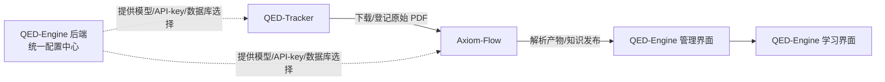

# QED-Engine

> 从公理到证明，重构你的数学认知边界。

QED-Engine 是一个个人高等数学学习系统，由三个独立项目组成：**QED-Tracker** 负责发现和下载
教材、习题集与论文，**Axiom-Flow** 负责把 PDF 一比一解析为可检索、可审阅、可追溯的结构化内容，
**QED-Engine** 提供学习界面与管理界面，并集中管理模型、API-key 与数据库配置。



## 三个项目

| 项目 | 职责 | 形态 | 仓库 |
| --- | --- | --- | --- |
| QED-Tracker | 教材/习题集/论文的发现、下载、校验、登记 | Python CLI | [README](https://github.com/swfswf1234/QED-Tracker) |
| Axiom-Flow | PDF 解析、OCR、公式/图表还原、质量审阅 | FastAPI + Worker + Web 工作台 | [README](https://github.com/swfswf1234/Axiom-Flow) |
| QED-Engine | 学习界面、管理界面、统一配置中心 | 待建设（本仓库） | 本仓库 |

子项目为独立 git 仓库，嵌入本仓库目录下，可独立开发、独立部署。

## 四个服务与独立性

| 服务 | 职责 |
| --- | --- |
| QED-Engine 前端 | 学习界面（知识点/练习/温故知新）、管理界面（解析进度、原始文档对照、追溯） |
| QED-Engine 后端 | 统一配置中心：模型/API-key/数据库选择，向子项目提供接口 |
| Axiom-Flow 服务 | 解析、OCR、质量审阅与知识发布 |
| QED-Tracker 服务 | 下载、校验、登记与交付 |

**独立性**：Axiom-Flow 与 QED-Tracker 未启动时，QED-Engine 前端对话/展示必须正常；QED-Engine
后端离线时，前两者用本地默认配置降级运行。

## 快速开始

QED-Engine 本体仍在建设中。当前可先体验两个子项目：

```powershell
# QED-Tracker：安装与下载教材/论文（详见其 README）
cd QED-Tracker
python -m pip install -e ".[dev]"
qed-tracker --help

# Axiom-Flow：安装并启动解析服务（详见其 README，需 Python 3.12 + MySQL 8）
cd Axiom-Flow
Copy-Item .env.example .env
python -m pip install -r requirements.txt
python -m uvicorn axiom_flow.main:app --host 127.0.0.1 --port 8000
```

## 仓库结构

| 路径 | 职责 |
| --- | --- |
| `Axiom-Flow/` | 子项目（独立 git 仓库，解析与质量审阅） |
| `QED-Tracker/` | 子项目（独立 git 仓库，下载与文件管理） |
| `dataset/` | 共享数据目录：原始文档 + 解析产物（不入版本控制） |
| `docs/` | 架构、设计、决策、规范、计划与学习资料 |
| `AGENTS.md` | Agent 执行总纲 |

## 文档

- [文档索引](docs/index.md)
- [任务台账](docs/trackers/todo.md)
- [能力路线图](docs/trackers/roadmap.md)

## License

MIT
