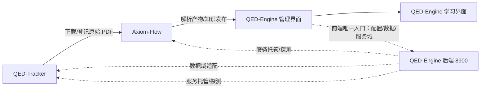

# QED-Engine

> 从公理到证明，重构你的数学认知边界。

QED-Engine 是一个个人图书馆（Personal Library）系统，由三个独立项目组成：**QED-Tracker**
负责图书、论文与各类资料的发现、下载和管理；**Axiom-Flow** 负责把文档解析、归档为可检索、
可追溯的结构化知识；**QED-Engine** 提供学习界面与管理界面，并集中管理模型、API-key 与数据库
配置。个人核心领域为数学与计算机科学（AI 方向），当前以高等数学学习起步；学习交互参考港大
DeepTutor 等智能学习项目。



## 学习中心（最终形态）

学习界面是项目的核心目标：**课程学习**与**知识问答**。当前学习界面为建设中占位，管理功能
（下载/解析/对照/服务控制）是它的准备工作，对用户透明。

## 三个项目

| 项目 | 职责 | 形态 | 仓库 |
| --- | --- | --- | --- |
| QED-Tracker | 教材/习题集/论文的发现、下载、校验、登记 | Python CLI + 服务（8901） | [README](https://github.com/swfswf1234/QED-Tracker) |
| Axiom-Flow | PDF 解析、OCR、公式/图表还原、质量审阅 | FastAPI + Worker + Web 工作台 | [README](https://github.com/swfswf1234/Axiom-Flow) |
| QED-Engine | 学习界面、管理界面、统一配置中心 | FastAPI（8900）+ 前端（8903） | 本仓库 |

子项目为独立 git 仓库，嵌入本仓库目录下，可独立开发、独立部署。

## 四个服务

| 服务 | 职责 |
| --- | --- |
| QED-Engine 前端（8903） | 学习界面 + 管理后台：仪表大盘 / 文档下载管理 / 文档解析管理（解析进度、原始文档对照）；**只连 8900**（ADR 0007） |
| QED-Engine 后端（8900） | 三域（ARCH-012）：控制域（配置五端点 + /services 启停托管 + /logs、/monitor/*、/self-restart 监控诊断）+ 数据域·QED-Tracker（目录/三表/任务适配 8901）+ 数据域·Axiom-Flow（预留）；密钥不下发 |
| Axiom-Flow（8000 → 8902 迁移中） | 解析、OCR、质量审阅与知识发布 |
| QED-Tracker（8901） | 下载、校验、登记与交付 |

**独立性**：Axiom-Flow 与 QED-Tracker 未启动时，QED-Engine 前端对话/展示必须正常；QED-Engine
后端离线时，前两者用本地默认配置降级运行。

## 快速开始

### QED-Engine 后端（本仓库）

```powershell
# 0. 使用 conda 环境（Python 3.12）；需要本机 MySQL 8 实例并创建三项目共用的 qed 库
conda activate QED_env

# 1. 准备密钥：复制模板并填入真实 API key 与 QED_DB_* 数据库配置
Copy-Item .env.example .env

# 2. 安装与启动（⚠️ 必须在 backend/ 目录下执行）
cd backend
python -m pip install -e ".[dev]"
python -m uvicorn qed_engine.api.main:app --host 127.0.0.1 --port 8900

# 3. 验证
Invoke-RestMethod http://127.0.0.1:8900/api/v1/health
Invoke-RestMethod http://127.0.0.1:8900/api/v1/config/models
```

接口契约见 [配置中心 API 契约](docs/architecture/api-contracts.md)
（配置域 + 数据域 + 服务域）。后台运行、常见启动错误与故障排查清单见
[开发指南](docs/guides/development.md)。

### 统一启停（控制中心）

```powershell
# 8900 手动启动（backend/ 目录，QED_env 环境；唯一需手动常驻的服务）
python -m uvicorn qed_engine.api.main:app --host 127.0.0.1 --port 8900
# 8901/8902/8903 经 8900 服务域接口启停（详见 docs/design/service-hosting.md）
Invoke-RestMethod -Method Post http://127.0.0.1:8900/api/v1/services/tracker/start
# 8903 前端独立启停脚本（生命周期脚本，PID + 优雅停止 + 强杀兜底）
python scripts/qed_web_service.py start --wait   # --wait 等待健康就绪
python scripts/qed_web_service.py status         # 查状态
python scripts/qed_web_service.py stop           # 停止
```

### QED-Engine 前端（8903）

React 单页应用（web-ui/，构建产物 dist/），浏览器直连 8900 读取数据（唯一入口，不直连 8901/8902）：

```powershell
# 构建前端（web-ui/，首次或改前端后）
cd web-ui; npm run build; cd ..
# 启动 8903（推荐经 8900 服务域 web 单元或 scripts/qed_web_service.py）
python scripts/qed_web_service.py start --wait

# 打开 http://127.0.0.1:8903
# 主体学习界面 → 右上角「管理后台」→ 控制台 / 仪表盘 / 文档下载管理 / 文档解析进度 / 原始文档对照
```

前端信息架构与视觉规范见 [前端架构](docs/architecture/frontend-architecture.md)。

> 四服务启动顺序建议（后端 → 子项目 → 前端）与「前端改版需重建 dist」「端口占用排查」
> 等常见坑，见 [开发指南 · 启动章节](docs/guides/development.md)。

### 两个子项目

```powershell
# QED-Tracker：安装并启动下载服务（详见其 README）
cd QED-Tracker
python -m pip install -e ".[dev]"
qed-tracker serve

# Axiom-Flow：安装并启动解析服务（详见其 README，需 Python 3.12 + MySQL 8）
cd Axiom-Flow
Copy-Item .env.example .env
python -m pip install -r requirements.txt
python scripts/axiom_flow_service.py start
```

## 仓库结构

| 路径 | 职责 |
| --- | --- |
| `Axiom-Flow/` | 子项目（独立 git 仓库，解析与质量审阅） |
| `QED-Tracker/` | 子项目（独立 git 仓库，下载与文件管理） |
| `dataset/` | 共享数据目录：原始文档 + 解析产物（不入版本控制） |
| `backend/qed_engine/` | QED-Engine 后端：控制域 + 数据域·Tracker + 数据域·Axiom（预留）（FastAPI，端口 8900） |
| `backend/database/` | qed 库建库与运维：建库脚本（init-qed.sql）、备份脚本（backup-qed.ps1）与备份产物（表结构由子项目 Alembic 管理） |
| `web-ui/` | QED-Engine 前端（8903，React 重构版：学习中心 + 管理后台；构建产物 dist/ 由 serve_web.py 托管） |
| `scripts/` | 服务生命周期脚本（`qed_web_service.py` 8903 前端启停；`serve_web.py` 8903 静态服务入口） |
| `logs/` | 服务运行日志（控制中心托管子服务输出） |
| `tmp/` | 运行时临时文件（PID 文件等，不入版本控制） |
| `tests/` | 后端测试（pytest + ruff 门禁） |
| `docs/` | 架构、设计、决策、规范、计划与学习资料 |
| `AGENTS.md` | Agent 执行总纲 |

## 文档

- [文档索引](docs/index.md)
- [任务台账](docs/trackers/todo.md)
- [能力路线图](docs/trackers/roadmap.md)

## License

MIT
