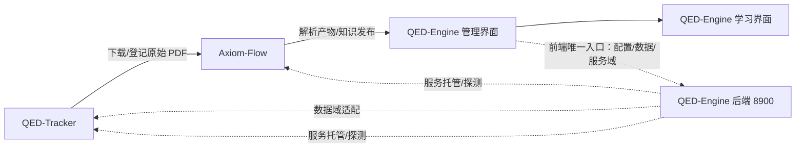

# QED-Engine

> 从公理到证明，重构你的数学认知边界。

QED-Engine 是一个个人图书馆（Personal Library）系统，由三个独立项目组成：**QED-Tracker**
负责图书、论文与各类资料的发现、下载和管理；**Axiom-Flow** 负责把文档解析、归档为可检索、
可追溯的结构化知识；**QED-Engine** 提供学习界面与管理界面，并集中管理模型、API-key 与数据库
配置。个人核心领域为数学与计算机科学（AI 方向），当前以高等数学学习起步；学习交互参考港大
DeepTutor 等智能学习项目。



## 学习中心（最终形态）

学习界面是项目的核心目标：**课程学习**与**知识问答**。当前学习界面为建设中占位，管理功能
（下载/解析/对照/服务控制）是它的准备工作，对用户透明。

## 三个项目

| 项目 | 职责 | 形态 | 仓库 |
| --- | --- | --- | --- |
| QED-Tracker | 教材/习题集/论文的发现、下载、校验、登记 | Python CLI + 服务（8901） | [README](https://github.com/swfswf1234/QED-Tracker) |
| Axiom-Flow | PDF 解析、OCR、公式/图表还原、质量审阅 | FastAPI + Worker + Web 工作台 | [README](https://github.com/swfswf1234/Axiom-Flow) |
| QED-Engine | 学习界面、管理界面、统一配置中心 | FastAPI（8900）+ 前端（8903） | 本仓库 |

子项目为独立 git 仓库，嵌入本仓库目录下，可独立开发、独立部署。

## 四个服务

| 服务 | 职责 |
| --- | --- |
| QED-Engine 前端（8903） | 学习界面 + 管理后台：仪表大盘 / 文档下载管理 / 文档解析进度 / 原始文档对照；**只连 8900**（ADR 0007） |
| QED-Engine 后端（8900） | 配置域（模型/API-key/数据库选择与状态探测）+ 数据域网关（目录/资源/任务适配 8901）+ 服务域（服务启停托管，控制中心） |
| Axiom-Flow（8000 → 8902 迁移中） | 解析、OCR、质量审阅与知识发布 |
| QED-Tracker（8901） | 下载、校验、登记与交付 |

**独立性**：Axiom-Flow 与 QED-Tracker 未启动时，QED-Engine 前端对话/展示必须正常；QED-Engine
后端离线时，前两者用本地默认配置降级运行。

## 快速开始

### QED-Engine 后端（本仓库）

```powershell
# 0. 使用 conda 环境（Python 3.12）；需要本机 MySQL 8 实例并创建三项目共用的 qed 库
conda activate QED_env

# 1. 准备密钥：复制模板并填入真实 API key 与 QED_DB_* 数据库配置
Copy-Item .env.example .env

# 2. 安装与启动（根仓库目录）
python -m pip install -e ".[dev]"
python -m uvicorn qed_engine.api.main:app --host 127.0.0.1 --port 8900

# 3. 验证
Invoke-RestMethod http://127.0.0.1:8900/api/v1/health
Invoke-RestMethod http://127.0.0.1:8900/api/v1/config/models
```

接口契约见 [配置中心 API 契约](docs/design/config-center-api.md)
（配置域 + 数据域 + 服务域）。

### 统一启停（控制中心）

```powershell
# 一键启动本仓库 8900/8903（scripts/start-all.ps1），并探测 8901/8902 提示显式启停
.\scripts\start-all.ps1
# 停止 8900/8903（按 tmp/ 下 PID 文件）
.\scripts\stop-all.ps1
# 8900 服务域接口启停子服务（详见 docs/design/service-control.md）
Invoke-RestMethod -Method Post http://127.0.0.1:8900/api/v1/services/tracker/start
```

### QED-Engine 前端（8903）

原生静态单页应用（无构建步骤），浏览器直连 8900 读取数据（唯一入口，不直连 8901/8902）：

```powershell
# 在根仓库目录启动（QED_env 环境）
python -m http.server 8903 --directory web

# 打开 http://127.0.0.1:8903
# 主体学习界面 → 右上角「管理后台」→ 仪表大盘 / 文档下载管理 / 文档解析进度 / 原始文档对照
```

前端信息架构与视觉规范见 [8903 前端契约](docs/design/web-frontend.md)。

### 两个子项目

```powershell
# QED-Tracker：安装并启动下载服务（详见其 README）
cd QED-Tracker
python -m pip install -e ".[dev]"
qed-tracker serve

# Axiom-Flow：安装并启动解析服务（详见其 README，需 Python 3.12 + MySQL 8）
cd Axiom-Flow
Copy-Item .env.example .env
python -m pip install -r requirements.txt
python -m uvicorn axiom_flow.main:app --host 127.0.0.1 --port 8000
```

## 仓库结构

| 路径 | 职责 |
| --- | --- |
| `Axiom-Flow/` | 子项目（独立 git 仓库，解析与质量审阅） |
| `QED-Tracker/` | 子项目（独立 git 仓库，下载与文件管理） |
| `dataset/` | 共享数据目录：原始文档 + 解析产物（不入版本控制） |
| `backend/qed_engine/` | 统一配置中心 + 数据域网关 + 控制中心（FastAPI，端口 8900） |
| `web/` | QED-Engine 前端（8903，主体学习界面 + 后台管理，原生单页应用） |
| `database/` | 根仓库数据目录：建库脚本（init-qed.sql）、备份脚本（backup-qed.ps1）与备份产物 |
| `scripts/` | 辅助与运维脚本（`load-env.ps1` 过渡映射层；`check_api_keys.py` 密钥真实检查；`start-all.ps1` / `stop-all.ps1` 统一启停 8900/8903） |
| `logs/` | 服务运行日志（控制中心托管子服务输出） |
| `tmp/` | 运行时临时文件（PID 文件等，不入版本控制） |
| `tests/` | 后端测试（pytest + ruff 门禁） |
| `docs/` | 架构、设计、决策、规范、计划与学习资料 |
| `AGENTS.md` | Agent 执行总纲 |

## 文档

- [文档索引](docs/index.md)
- [任务台账](docs/trackers/todo.md)
- [能力路线图](docs/trackers/roadmap.md)

## License

MIT
