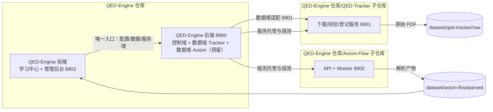

# 四服务架构与边界

设计状态：Accepted
实现状态：In Progress
最后更新：2026-08-16
关联代码：配置中心代码见[配置中心 API 契约](../design/config-center-api.md)
关联测试：`tests/contract/test_architecture_documents.py`
关联 ADR：`docs/adr/0002-frontend-and-port-centralization.md`、`docs/adr/0003-shared-qed-database-independence.md`、`docs/adr/0004-personal-library-positioning.md`、`docs/adr/0005-control-center-service-hosting.md`、`docs/adr/0007-qed-engine-backend-gateway.md`

## 服务视图

QED-Engine 由四个独立服务组成，分别位于三个独立 git 仓库：

## 服务职责与端口

| 服务 | 仓库 | 端口 | 职责 |
| --- | --- | --- | --- |
| QED-Engine 前端 | 根仓库 `web-ui/`（构建产物 dist/ 由 serve_web.py 托管） | 8903（已运行） | 学习中心（建设中）+ 管理后台（控制台 / 仪表盘 / 文档下载管理 / 文档解析进度 / 原始文档对照）；**只连 8900**（ADR 0007） |
| QED-Engine 后端 | 根仓库 `backend/qed_engine/` | 8900（已运行） | **三域组织（ARCH-012）**：控制域（配置五端点 + /services 启停托管 + /logs 日志 + /monitor/gpu、lmstudio、mineru 监控 + /self-restart，路由 `api/control.py`，能力 `services/`）+ 数据域·QED-Tracker（catalogs/三表/tasks 语义 API 适配 8901，`api/tracker.py` + `clients/tracker_client.py`）+ 数据域·Axiom-Flow（预留）。密钥不下发 |
| Axiom-Flow | `Axiom-Flow/` 子仓库 | 8902（已迁移，2026-08-11 ALN-002/REQ-001；8000 兼容保留，ADR 0002） | PDF 解析、OCR、质量审阅与知识发布；前端工作台迁入根仓库后只保留 API + Worker |
| QED-Tracker | `QED-Tracker/` 子仓库 | 8901（已服务化） | 教材/习题集/论文的发现、下载、校验、登记；写操作后台任务 + 轮询 |

端口规划（8900 配置中心 / 8901 QED-Tracker / 8902 Axiom-Flow / 8903 前端）见
[ADR 0002](../adr/0002-frontend-and-port-centralization.md)；前端唯一入口与 8900 网关化见
[ADR 0007](../adr/0007-qed-engine-backend-gateway.md)；服务接口契约见
[服务契约](../design/service-contracts.md)。

## 三中心产品形态

- **学习中心**：前端主界面（`#/`）的最终形态——课程学习 + 知识问答，向用户展示的核心功能
  （[学习中心设计](../design/learning-center.md)，探索中）。
- **管理中心**：后台内容管理——文档下载管理 / 解析进度 / 原始文档对照（8903 已运行）。
- **控制中心**：后台运行控制——8900 对 8901/8902 服务启停托管
  （[服务控制设计](../design/service-control.md)，Accepted / **Implemented（2026-08-11，ADR 0007 轮）**；
  [ADR 0005](../adr/0005-control-center-service-hosting.md)；容器化依赖只进规划不展示）。

## 独立性铁律

- Axiom-Flow 与 QED-Tracker 未启动时，QED-Engine 前端对话/展示必须正常，管理界面显示服务离线。
- QED-Engine 配置中心离线时，Axiom-Flow 与 QED-Tracker 用本地默认配置降级运行。
- 三个项目各自独立部署、独立升级，不共享 Python 包或代码仓库；MySQL 例外为共享 `qed` 库实例
  （[ADR 0003](../adr/0003-shared-qed-database-independence.md)），以 `qt_*`/`af_*` 表命名空间
  隔离。
- 跨项目传递只通过：HTTP 接口、共享 dataset 目录、环境变量与表隔离的共享 qed 库（见
  [统一配置与密钥规范](../design/configuration-and-secrets.md)）。

## 前端统一路线

现状：

1. ~~Axiom-Flow 自带 `web/` 原生工作台（8000 端口同源服务）~~ → 已退役（v1 时代）。
2. ~~QED-Engine 根仓库 `web/` 原生三文件版（8903）~~ → 已于 2026-08-17 随前端重构切换退役
   （web-ui React 版接管，旧三文件 git 历史保留，见[8903 前端契约](../design/web-frontend.md) v2）。

目标：

3. Axiom-Flow 独立保留（8902 API 服务 + 生命周期脚本），前端统一于根仓库 web-ui；CORS 收窄
   为后续可选请求（ADR 0007 决定 6）。

端口：

4. Axiom-Flow 由 8000 迁移至 8902；QED-Tracker 已服务化使用 8901；QED-Engine 前端使用 8903。

## 架构符合度

| Accepted 约束 | 当前状态 | 证据与跟踪 |
| --- | --- | --- |
| 配置中心四接口任何时刻可用 | 符合 | `backend/qed_engine/api/control.py`，`tests/test_api.py`（health/models/keys/database 启动快照；/config/llm-status 已删除，ARCH-014） |
| 密钥绝不下发 | 符合 | `tests/test_api.py` 验证响应无密钥值 |
| 前端唯一入口 8900（ADR 0007） | 符合 | `web-ui/.env.production` VITE_API_BASE=8900 + api 封装；`tests/test_web.py` 守护无 8901/8902 直连 |
| 数据域语义 API（8900 自有契约） | 符合 | `backend/qed_engine/api/tracker.py` + `clients/tracker_client.py`，`tests/test_api.py`（透传/503/409）；三表契约待 QED-031 新端点冻结后更新 |
| 服务控制端实装（ADR 0005/0007） | 符合 | `backend/qed_engine/services/service_manager.py`（能力层）+ `api/control.py`（路由），`tests/test_api.py`（启停/窗口/409/404） |
| 监控诊断域（/logs、/monitor/*、/self-restart） | 符合（ARCH-012） | `backend/qed_engine/services/log_viewer.py`、`services/monitor.py`，`tests/test_log_viewer.py`、`tests/test_monitor.py`、`tests/test_self_restart.py` |
| Axiom-Flow 端口 8902 | 符合 | 已迁移（2026-08-11 ALN-002，REQ-001 关闭）；8000 兼容保留（ADR 0002），CORS 白名单含 8000 |
| QED-Tracker 服务化 8901 | 已服务化 | 2026-08 完成（子仓库 QED-008~010 服务化轮），写操作后台任务 + 轮询 |
| 前端统一于根仓库（8903） | 已运行 | 2026-08-17 web-ui React 重构版接管 8903（旧 web/ 退役，git 保留） |
| 数据子域布局（dataset/qed-tracker、dataset/axiom-flow） | 骨架已建 | 见 [dataset 目录约定](../design/dataset-conventions.md) 与 REQ-003/REQ-004 |
| 三中心形态（学习/管理/控制） | 学习建设中 + 管理已运行 + 控制已实装 | [ADR 0004](../adr/0004-personal-library-positioning.md)；控制中心见 [服务控制设计](../design/service-control.md)（Implemented） |
