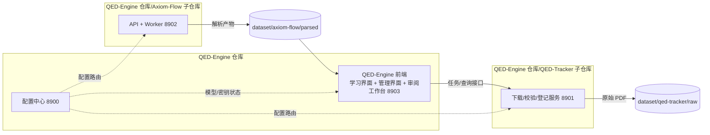

# 四服务架构与边界

设计状态：Accepted
实现状态：In Progress
最后更新：2026-08-04
关联代码：根 `scripts/check_api_keys.py`、`scripts/load-env.ps1`（配置中心代码见[配置中心 API 契约](../design/config-center-api.md)）
关联测试：`tests/contract/test_architecture_documents.py`
关联 ADR：`docs/adr/0002-frontend-and-port-centralization.md`

## 服务视图

QED-Engine 由四个独立服务组成，分别位于三个独立 git 仓库：

## 服务职责与端口

| 服务 | 仓库 | 端口 | 职责 |
| --- | --- | --- | --- |
| QED-Engine 前端 | 根仓库 `web/` | 8903（规划） | 学习界面（知识点/练习/温故知新）、管理界面（解析进度、原始文档对照、追溯、配置状态） |
| QED-Engine 配置中心 | 根仓库 `src/qed_engine/` | 8900（已运行） | 读取根 `.env`，提供健康检查与模型路由，密钥不下发 |
| Axiom-Flow | `Axiom-Flow/` 子仓库 | 8902（规划迁移） | PDF 解析、OCR、质量审阅与知识发布；前端工作台迁入根仓库后只保留 API + Worker |
| QED-Tracker | `QED-Tracker/` 子仓库 | 8901（服务化轮） | 教材/习题集/论文的发现、下载、校验、登记；写操作后台任务 + 轮询 |

端口规划（2026-08-04 用户裁决）：8900 配置中心 / 8901 QED-Tracker / 8902 Axiom-Flow /
8903 前端。服务接口契约见[服务契约](../design/service-contracts.md)。

## 独立性铁律

- Axiom-Flow 与 QED-Tracker 未启动时，QED-Engine 前端对话/展示必须正常，管理界面显示服务离线。
- QED-Engine 配置中心离线时，Axiom-Flow 与 QED-Tracker 用本地默认配置降级运行。
- 三个项目各自独立部署、独立升级，不共享 Python 包、数据库或代码仓库。
- 跨项目传递只通过：HTTP 接口、共享 dataset 目录、环境变量（见
  [统一配置与密钥规范](../design/configuration-and-secrets.md)）。

## 前端统一路线

1. 现状：Axiom-Flow 自带 `web/` 原生工作台（8000 端口同源服务）。
2. 规划：QED-Engine 建立统一 `web/`，学习界面、管理界面与审阅工作台共同维护（8903）。
3. 迁移：Axiom-Flow `web/` 迁入根仓库（API base 指向 8902），子项目退役 `web/`；两侧 CORS 调整。
4. 端口：Axiom-Flow 由 8000 迁移至 8902；QED-Tracker 服务化后使用 8901；QED-Engine 前端使用 8903。

## 架构符合度

| Accepted 约束 | 当前状态 | 证据与跟踪 |
| --- | --- | --- |
| 配置中心三接口任何时刻可用 | 符合 | `src/qed_engine/api/main.py`，`tests/test_api.py` |
| 密钥绝不下发 | 符合 | `tests/test_api.py` 验证响应无密钥值 |
| Axiom-Flow 端口 8902 | 未迁移 | 当前仍为 8000，见 [任务台账](../trackers/todo.md) REQ-001 |
| QED-Tracker 服务化 8901 | 未开始 | 纯 CLI，见 [任务台账](../trackers/todo.md) REQ-004 |
| 前端统一于根仓库（8903） | 未开始 | 见 [任务台账](../trackers/todo.md) REQ-005、REQ-006 |
| 数据子域布局（dataset/qed-tracker、dataset/axiom-flow） | 骨架已建 | 见 [dataset 目录约定](../design/dataset-conventions.md) 与 REQ-003/REQ-004 |
