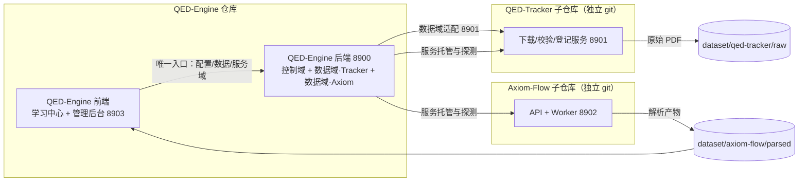

# 三项目四服务总体架构

设计状态：Accepted
实现状态：In Progress
最后更新：2026-08-20
确认状态：已确认
关联代码：服务各自代码见服务架构文档（前端/后端见本目录，Axiom-Flow/QED-Tracker 见各自仓库）
关联测试：`tests/contract/test_architecture_documents.py`
关联 ADR：`../history/adr/v0.1/0002-frontend-and-port-centralization.md`、`../history/adr/v0.1/0003-shared-qed-database-independence.md`、`../history/adr/v0.1/0004-personal-library-positioning.md`、`../history/adr/v0.1/0005-control-center-service-hosting.md`、`../history/adr/v0.1/0007-qed-engine-backend-gateway.md`

## 服务视图

QED-Engine 由四个独立服务组成，分别位于三个独立 git 仓库。本文件只描述**总体架构**：
服务边界、端口、三中心形态、独立性铁律与跨服务交互拓扑；每个服务的内部架构见各自的
服务架构文档。

## 服务职责与端口

| 服务 | 仓库 | 端口 | 职责 | 服务架构文档 |
| --- | --- | --- | --- | --- |
| QED-Engine 前端 | 根仓库 `web-ui/`（构建产物 dist/ 由 serve_web.py 托管） | 8903（已运行） | 学习中心 + 管理后台（控制台 / 仪表盘 / 文档下载管理 / 文档解析管理）；**只连 8900**（ADR 0007） | [前端架构](frontend-architecture.md) |
| QED-Engine 后端 | 根仓库 `backend/qed_engine/` | 8900（已运行） | **三域组织**：控制域（配置五端点 + /services 启停托管 + 监控诊断 + LLM 网关）+ 数据域·QED-Tracker 透传 + 数据域·Axiom-Flow 透传；密钥不下发 | [后端架构](backend-architecture.md) |
| Axiom-Flow | `Axiom-Flow/` 子仓库 | 8902（已迁移，8000 兼容保留，ADR 0002） | PDF 解析、OCR、质量审阅与知识发布；只保留 API + Worker | Axiom-Flow `docs/architecture/` |
| QED-Tracker | `QED-Tracker/` 子仓库 | 8901（已服务化） | 教材/习题集/论文的发现、下载、校验、登记；写操作后台任务 + 轮询 | QED-Tracker `docs/architecture/` |

端口规划见 [ADR 0002](../history/adr/v0.1/0002-frontend-and-port-centralization.md)；前端唯一入口与 8900
网关化见 [ADR 0007](../history/adr/v0.1/0007-qed-engine-backend-gateway.md)。

## 项目定位

本项目是长期演进中的**个人图书馆（Personal Library）**系统，当前以高等数学学习起步；个人核心
领域为数学与计算机科学（AI 方向），后续随学习需求扩展。资料类型覆盖教材、习题集、论文、博客与
官方文档；学习交互参考港大 DeepTutor 等前沿智能学习项目。项目仍处探索阶段，形态随学习需求
持续演进（源自 [ADR 0004](../history/adr/v0.1/0004-personal-library-positioning.md)）。

## 三中心产品形态

- **学习中心**：前端主界面（`#/`）的最终形态——课程学习（按知识节点推进）+ 知识问答
  （多 Agent），向用户展示的核心功能（[学习功能现状](../plans/2026-09-10-learning-center-current-state.md)）。
- **管理中心**：后台内容管理——文档下载管理 / 文档解析管理（左树右对照：书目同步、块级判定）。
- **控制中心**：后台运行控制——8900 对 8901/8902/8903 服务启停托管
  （[服务控制设计](../design/service-hosting.md)，Accepted / Implemented；容器化依赖只进规划）。

## 独立性铁律

- Axiom-Flow 与 QED-Tracker 未启动时，QED-Engine 前端对话/展示必须正常，管理界面显示服务离线。
- QED-Engine 配置中心离线时，Axiom-Flow 与 QED-Tracker 用本地默认配置降级运行。
- 三个项目各自独立部署、独立升级，不共享 Python 包或代码仓库；MySQL 例外为共享 `qed` 库实例
  （[ADR 0003](../history/adr/v0.1/0003-shared-qed-database-independence.md)），以 `qt_*`/`af_*` 表命名空间
  隔离、`qed_*` 共享表族例外（[ADR 0009](../history/adr/v0.1/0009-shared-qed-tables.md)）。
- 跨项目传递只通过：HTTP 接口、共享 dataset 目录、环境变量与表隔离的共享 qed 库（见
  [统一配置与密钥规范](../design/project-configuration.md)）。

## 跨服务交互

- **前端 → 8900（唯一入口）**：浏览器只连 8900，数据域/服务域/监控诊断全部经 8900 适配
  8901/8902（ADR 0007）；契约见 [8900 API 接口文档](api-contracts.md)。
- **8900 → 8901/8902（数据域透传）**：8900 提供语义化端点，内部经 clients/ 适配子项目 API；
  8901/8902 契约事实源在各子项目仓库 `docs/architecture/`。
- **8900 → 8901/8902/8903（服务托管）**：/services 启停托管经生命周期脚本黑盒管理
  （[服务控制设计](../design/service-hosting.md)）。
- **dataset 数据流**：QED-Tracker 产出原始 PDF（dataset/qed-tracker/raw）→ Axiom-Flow
  产出解析产物（dataset/axiom-flow/parsed）→ 前端消费（经 8900 代理）。
