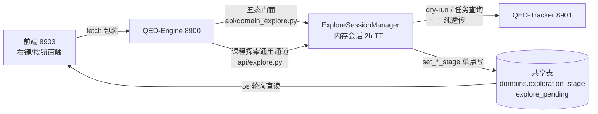
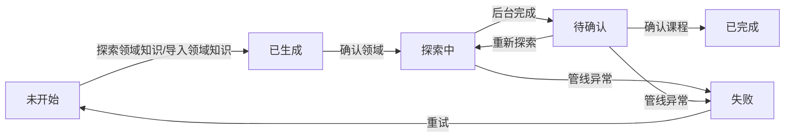
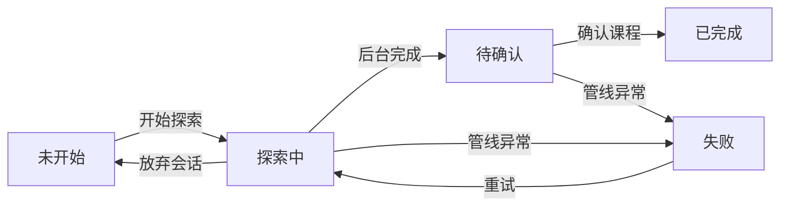

# 文档下载管理·后台全链路设计（downloads-flow）

设计状态：Accepted
实现状态：Implemented
最后更新：2026-09-10
确认状态：暂定
关联代码：backend/qed_engine/api/domain_explore.py、backend/qed_engine/api/explore.py、backend/qed_engine/services/explore_sessions.py、backend/qed_engine/services/shared_tables.py、backend/qed_engine/clients/tracker_client.py、web-ui/src/pages/Downloads.tsx、web-ui/src/components/{DownloadsTree,DomainCard,DomainConfirmModal,CourseConfirmModal,ExploreFlowModal}.tsx、web-ui/src/api/{tracker,explore-helpers}.ts、web-ui/src/stores/downloads.ts（端点请求/返回细节见 [api-contracts](../architecture/api-contracts.md)，不重复登记）
关联测试：tests/test_domain_explore.py、tests/test_explore_sessions.py、web-ui/src/pages/Downloads.test.tsx、web-ui/src/components/DownloadsTree.state.test.tsx
关联 ADR：[ADR 0011](../history/adr/v0.1/0011-pending-design-location.md)（设计晋升位置）、[ADR 0007](../history/adr/v0.1/0007-qed-engine-backend-gateway.md)（8900 网关唯一入口）
关联文档：[downloads-ui.md](downloads-ui.md)（UI 展示层唯一事实源）、[api-contracts](../architecture/api-contracts.md)（8900 端点请求/返回细节唯一事实源）；8901 原生契约以 QED-Tracker `docs/architecture/api.md` 为事实源（不复制）
关联计划：[2026-09-08-arch019-explore-ui-logic](../history/plans/2026-09/2026-09-08-arch019-explore-ui-logic.md)（PLAN-033 晋升来源）、[2026-09-08-arch019-explore-backend-chain](../history/plans/2026-09/2026-09-08-arch019-explore-backend-chain.md)（PLAN-034 晋升来源）、[2026-09-07-exploration-state-machine](../history/plans/2026-09/2026-09-07-exploration-state-machine.md)（被 PLAN-033 吸收）

> **本文档定位**：文档下载管理页（`#/admin/downloads`）领域探索的设计事实源——统一状态机口径、
> 右侧四层展示规范、8900 后端链路与终态写点。由 PLAN-033（前端 UI 逻辑）与 PLAN-034（后端链路）
> 于 2026-09-08 实现完成后合并晋升。

## 1. 背景与定位

单管理员在下载管理页发起领域探索/导入，8900 负责会话编排、状态落库与 8901 透传。
设计取向（PLAN-023）：等待可观测（5s 轮询）、中断可恢复（刷新直读共享表）、失败可重试
（异常态落库）。8900 对 8901 **纯透传 + 信任**，缺口整理移交（REQ-068）。

链路总图：

要点：8900 是唯一写点；前端与 8901 无直连；共享表是唯一恢复源（8900 重启后轮询直读库态，
内存会话丢失由 `active_session=false` 承接，不自动回写）。

## 2. 探索状态机（唯一口径）

> **领域与课程不混用**（2026-09-11 用户裁决）：领域 **6 态**、课程 **5 态**；课程**无「已生成」**。
> 两套值域均落在 `qed_domain.exploration_stage` / `qed_course.exploration_stage`，
> 常量定义见 `services/shared_tables.py` 的 `STAGE_*`。

### 2.1 领域探索状态机（6 态）

| 状态 | 字段值 | 含义 |
| --- | --- | --- |
| 未开始 | `未开始` | 领域刚创建，尚未探索/导入 |
| 已生成 | `已生成` | 领域知识已生成（探索第一轮 domain@v4，或手动导入），等待人工确认；可再次发起探索（PLAN-041） |
| 探索中 | `探索中` | 第一轮已确认，第二轮 courses@v8 后台生成中 |
| 待确认 | `待确认` | 课程知识生成完成，等待人工确认 |
| 已完成 | `已完成` | 领域探索全流程完成（终态） |
| 失败 | `失败` | 管线异常（可重试），`explore_pending={kind:'error', error}` |

### 2.2 课程探索状态机（5 态）

| 状态 | 字段值 | 含义 |
| --- | --- | --- |
| 未开始 | `未开始` | 课程刚创建，尚未探索 |
| 探索中 | `探索中` | 课程探索会话执行中（tutorials@v2） |
| 待确认 | `待确认` | 教程方案生成完成，等待人工确认 |
| 已完成 | `已完成` | 课程探索确认（终态） |
| 失败 | `失败` | 管线异常（可重试），可重新发起探索 |

### 2.3 操作×状态×接口统一表

| 操作 | 层级 | 起始状态 | 目标状态 | 前端调用 | 落库写点 |
| --- | --- | --- | --- | --- | --- |
| 探索领域知识 | 领域 | 未开始 / 已生成 / 失败 | 探索中（成功后上游写已生成） | `POST /domains/{id}/explore-knowledge` | 8901 `domain_explore` handler 写已生成 |
| 导入领域知识 | 领域 | 未开始 | 已生成 | 文件选择器 → `POST /domains/import` | `import_domain_manual`（只写 domains.json + 已生成） |
| 添加课程 | 领域 | 待确认 / 已完成 / 失败 | 不变 | 手工表单 → `POST /domains/{id}/courses` | 课程行创建（`未开始`/`已生成` 禁用，用户裁决 2026-09-11） |
| 确认领域 | 领域 | 已生成 | 探索中 | `POST /domains/{id}/confirm-domain` | `confirm_domain_info` 写 RUNNING |
| 领域后台完成 | 领域 | 探索中 | 待确认 | 5s 轮询感知 | courses.json 落盘 + 状态置 PENDING |
| 确认课程名单 | 领域 | 待确认 | 已完成 | `POST /domains/{id}/confirm-knowledge` | apply 成功写 COMPLETED |
| 课程探索 | 课程 | 未开始 / 失败 | 探索中 | `POST /courses/{id}/explore-knowledge` | 会话启动写 RUNNING |
| 课程后台完成 | 课程 | 探索中 | 待确认 | 5s 轮询感知 | 会话 ready 写 PENDING |
| 确认课程 | 课程 | 待确认 | 已完成 | `POST /courses/{id}/confirm` | `set_course_stage` 写 COMPLETED |
| 管线异常 | 领域/课程 | 探索中 / 待确认 | 失败 | 轮询感知 | `_write_failure` 写 FAILED + `explore_pending={kind:'error', error}` |

历史四口径（PLAN-023 / PLAN-025 §B8 / 2026-09-07 文档 / PLAN-028 前端直写）已按本表消解：
PLAN-023 与 PLAN-025 §B8 作废、前端直写作废（§2.4）。

### 2.4 前端禁写原则

前端**禁止**直写 `exploration_stage`，一律由 8900 写点驱动；`PATCH /domains` 仅允许更新
描述/学科知识/课程方向等维护字段（课程 `exploration_stage` 经 REQ-077 由 8901
`PATCH /courses` 支持）。领域 6 态与课程 5 态分别按 §2.1/§2.2 流转，不互相推断。

## 3. 展示层（指向）

右侧四层展示规范（领域 DomainCard / 课程操作条 / 教程行 / 书目卡，教程与书目详情弹窗、
筛选规则）由 [downloads-ui.md](downloads-ui.md)（UI 设计文档）承载，
本文件只定义状态机、后端链路与写点。历史 §3 内容已于 2026-09-10（REQ-070 重组轮）并入该文档。

## 4. 后端链路与终态写点矩阵

### 4.1 双栈收敛

- `api/domain_explore.py` = **五态门面**（6 端点，委托 `ExploreSessionManager`）；
- `api/explore.py` = 课程探索通用通道（explore-sessions 会话 CRUD）；
- 两栈共用同一 Manager 实例与写点。

6 端点：`POST /domains/{id}/explore-knowledge`（202）、`POST /domains/{id}/confirm-domain`、
`POST /domains/{id}/confirm-knowledge`、`POST /courses/{id}/explore-knowledge`（202）、
`POST /courses/{id}/confirm`、`GET /domains/{id}/explore-status`。
`POST /domains/import` 与 `POST /domains/{id}/commit-import` 属 `tracker.py` 透传层（非门面）。

### 4.2 终态写点矩阵（全部经 `set_*_stage` 单点门面，前端禁写）

**领域（6 态）**

| 目标态 | 写入点 |
| --- | --- |
| 未开始 | 领域创建默认；放弃探索会话回退 |
| 已生成 | `_finish_ready`（领域会话 ready）+ `import_domain_manual`（导入） |
| 探索中 | `explore-knowledge` 提交任务；`confirm_domain_info` 写 RUNNING |
| 待确认 | courses.json 落盘后置 PENDING；`_apply_domain` 写 PENDING |
| 已完成 | `confirm_course_knowledge` → apply；`commit_import_courses` 写 COMPLETED |
| 失败 | `_write_failure` 异常分支写 FAILED + `explore_pending={kind:'error', error}` |

**课程（5 态）**

| 目标态 | 写入点 |
| --- | --- |
| 未开始 | 课程创建默认；放弃探索会话回退 |
| 探索中 | 课程探索会话启动写 RUNNING |
| 待确认 | `_finish_ready`（课程会话 ready）写 PENDING；`import_course_knowledge` 后写 PENDING |
| 已完成 | `POST /courses/{id}/confirm` → `set_course_stage` 写 COMPLETED |
| 失败 | `_write_failure` 写 FAILED |

confirm-knowledge 会话定位顺序：显式 `session_id` → `_active_by_domain[domain_id]` → 404；
`selected` 缺省取 report 全量课程清单（一键全收）。8901 离线时 409 降级：仅写本地 COMPLETED
+ `explore_pending` 留存。

### 4.3 explore-status 口径

`active_session = (exploration_stage == 探索中)`（与 [api-contracts](../architecture/api-contracts.md) 一致）；
8900 重启后内存会话丢失 → `task_id=null`，库态直读永远可用，前端据 `active_session=false` 提示
「探索会话已失效，请重试」，不做自动回写。8901 离线兜底：跳过 task 查询仅返回库态。

### 4.4 降级链路规则

| 场景 | 8900 行为 |
| --- | --- |
| 8901 离线 + 导入领域 | `import_domain_manual` 本地已生成（手动导入只写 domains.json + 状态，不写 pending；六步流程由 confirm-domain→confirm-knowledge 收口） |
| 8901 离线 + 确认课程 | 409 降级本地 COMPLETED + 待同步 |
| 8901 离线 + explore-status | 库态直读兜底 |
| 探索管线失败 | 失败 + `explore_pending={kind:'error', error}` |
| 8900 重启（会话丢失） | 不自动回写；active_session=false 承接 |

### 4.5 对齐缺口与请求（REQ-068 / REQ-076~078）

- **书籍状态机**：✅ 已完成（PLAN-040，2026-09-11）——8900 路由集对齐：`POST /books` 换
  `book_id`+`title`（201）、新增 `cancel`、删除 `decide/retry/complete/reject/supersede`；
  退役（`retired + retire_reason`）写入端点待 REQ-079。
- **`PATCH /courses` 支持 `exploration_stage`**：拆 REQ-077（请求：QED-Tracker）。
- **`GET /courses/{domain_id}`**：8901 已提供，残余为 8900 透传（根仓库代码跟进）。
- **`explore_pending.kind` 归一**：统一为 `review_results` / `name_confirmation` / `error`，
  拆 REQ-076（请求：QED-Tracker）。
详见 todo.md REQ-068 / REQ-076 / REQ-077 行。

## 5. 异常与降级（前端表现）

| 场景 | 用户可见行为 |
| --- | --- |
| 8900 不可达 | 页面顶部错误横幅 + 重试 |
| 8901 离线 | 「降级模式」横幅；树/领域维护/导入可用，探索与教程/书目操作禁用 |
| 探索会话失效 | `active_session=false` → 提示「探索会话已失效，请重试」 |
| 管线失败 | `explore_pending.kind='error'` → DomainCard 红色提示条 + 失败原因 + 重试 |
| 刷新页面 | 未终态领域由 5s 轮询直读共享表恢复感知 |
| API 失败 | toast 透出服务端 detail；乐观更新禁用，以服务端返回为准 |

## 6. 业务流程规则（课程收集五阶段）

> 自 course-acquisition-flow.md（2026-09-10 REQ-070 重组轮）并入，术语对齐书籍状态机
> （QED-050-D + QED-060）：选用态 `candidate/decided/parallel/retired` + 生命周期
> `downloading/downloaded/verified/failed`（`failed` 可重试，`retired` 留痕退出）。
> UI 筛选 5 档（待下载/下载中/待验证/已完成/失败）见 [downloads-ui.md](downloads-ui.md) §3.2。
> 当前聚焦数学课程体系（13 门），后续轮次扩展计算机科学（AI 方向），五阶段规则通用。

### 阶段 0：先验课程体系

- 课程体系先于教材收集确定，不仅包含课程清单，还包含**学习顺序**（先修的在前、依赖的在后）。
- 来源：参考顶尖高校课程安排（Top 10 US Math PhD Qualifying Exams 水准），事实源为
  [学习资料《突破朗道位垒》](../learning/突破朗道位垒.txt) 与前端 `COURSE_ORDER`。
- 课程体系变更属内容维护，直接更新数据，不视为架构变更。

### 阶段 1：第一轮评估（选书）

按课程搜索教程及附属习题集，选择经典教程。**版本偏好顺序**：

1. **美版经典教材的中文翻译版本**为第一优先（详细、便于自学、便于解析）；搜得到英文原版
   一并下载作为对照。
2. **其他经典美版教程**作为补充。
3. 无合适美版时，搜索**苏版经典教程（中文翻译版本）**（如菲赫金哥尔茨、吉米多维奇体系）。

**套数底线**：每课程固定两套；有其他优质选择可到三套；**最多不超过四套**（不可突破）。
**一套 = 教材 + 配套习题集**（同作者/同系列配套；英文原版对照单独计为英文套）。

评估动作：候选人工三态（确定 / 备选 / 否定，可带评审建议）——在探索会话与教程/书目
操作中执行（确认下载/否决等操作见 §3.1 教程详情弹窗，端点见 api-contracts.md）。

### 阶段 2：下载

- **当前课程的书籍全部按套下载完成后，才进入下一课程**（逐课程推进）。
- 下载动作：书目经自动下载任务（`POST /books/{id}/fetch`，8901 书库化链路）或
  **人工导入登记**（`POST /books/{id}/register`，数据根内相对路径）；成品落
  `dataset/<QED_DATA_ROOT>/raw/<领域>/<课程>/`（目录约定见 [dataset-conventions.md](dataset-conventions.md)）。

### 阶段 3：第二轮评估（人工审核）

- **系统预检**：下载完成时自动校验 PDF 完整性（sha256 / 页数 / 大小）。
- **人工审核**：打开本地下载目录/预览 PDF，确认版本（书名、语言、版次、内容完整性）；
  验收通过（`verify` → verified 终态）或否定（`retired` + `retire_reason` 留痕；旧 `reject`
  端点已随 QED-060 删除，退役端点对齐见 PLAN-038 附录）。
- **版本核对（规划中，跨项目请求）**：系统预检增加「登记版本 vs PDF 首页标题」自动核对，
  已登记 todo REQ-019（请求：QED-Tracker）。

### 阶段 4：一轮课程完成

- 完成判定：课程下 **≥2 套全部 verified**（每套含教材与习题集；英文对照套可计入）。
- 完成后该课程进入维护态：只接受补充资料（补充的习题集/勘误等），不改变完成状态。
- 剩余候选若未达完成，可继续补充至三套/四套上限；超出底线的候选经 `retired` 留痕退出。

### 相关榜单（QED-Tracker 侧执行）

找资料权威性榜单（教材权威性排序）与找书找得率榜单（渠道命中率统计）为执行任务，
已登记 REQ-020（请求：QED-Tracker）；产出回填阶段 1 选书规则与 QED-Tracker 来源评估矩阵，
根仓库不建界面、不重复登记数据。

## 7. 验证口径

- 后端：`conda run -n QED_env python -m pytest tests -q` 全量绿（含 test_domain_explore.py 14 用例、
  test_api_endpoint_inventory 契约双向一致）。
- 前端：`cd web-ui && npm run build && npm test` 全绿（tsc 零错）。
- 冒烟：手动导入全链路（添加领域 → 添加课程 → 导入教程 → 新增书目 → 书行导入 register）在
  浏览器走通；LLM 探索轮后续单独验证。

## 维护规则

状态机/写点矩阵/展示规范变更须先改本文档再改代码；端点请求/返回细节以 api-contracts.md 为唯一
事实源（8900 路由集待对齐项见其 §③.9）。对齐缺口（REQ-068 / REQ-076~078）回执后更新 §4.5。
