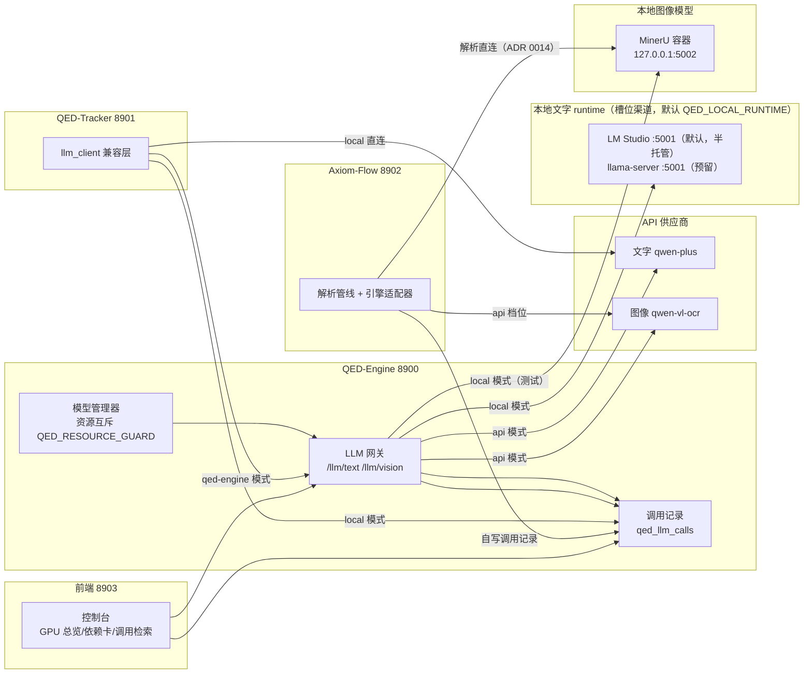

# LLM 统一网关设计（llm-gateway）

设计状态：Accepted
实现状态：In Progress
最后更新：2026-09-21
确认状态：已确认
关联代码：`backend/qed_engine/services/llm/gateway.py`、`backend/qed_engine/services/llm/registry.py`、`backend/qed_engine/services/llm/clients.py`、`backend/qed_engine/services/llm/call_log.py`、`scripts/qed_engine_service.py`、`scripts/text-model/`、`scripts/image-model/`、根 `.env.example`（`config.py`/`monitor.py`/`control.py` 的改动另归其主设计文档，`model_manager.py` 与本地模型生命周期操作归 [local-model-management.md](local-model-management.md)，本设计只在正文引用）
关联测试：`tests/test_llm_gateway.py`、`tests/test_llm_registry.py`、`tests/test_llm_clients.py`、`tests/test_llm_model_manager.py`、`tests/test_llm_call_log.py`、`tests/test_llm_endpoints.py`、`tests/test_qed_engine_service.py`、`tests/test_qed_qwen_service.py`、`tests/test_qed_mineru_service.py`
关联 ADR：[ADR 0002](../history/adr/v0.1/0002-frontend-and-port-centralization.md)、[ADR 0005](../history/adr/v0.1/0005-control-center-service-hosting.md)、[ADR 0007](../history/adr/v0.1/0007-qed-engine-backend-gateway.md)、[ADR 0014](../adr/0014-parsing-ownership-and-model-boundary.md)
关联计划：[PLAN-046](../history/plans/2026-09/2026-09-16-llm-registry-unification.md)（定档来源）

## 背景与目的

本设计定义三项目统一的**模型调用网关**：8900 提供 LLM 网关端点（文字/图像/向量），负责
槽位路由、资源互斥与调用记录。分工：本地模型生命周期与 runtime 适配归
[local-model-management.md](local-model-management.md)；配置变量唯一事实源归
[project-configuration.md](project-configuration.md)；控制台 UI 展示归 [admin-console.md](admin-console.md)；
文档解析不归本网关（[ADR 0014](../adr/0014-parsing-ownership-and-model-boundary.md)）——解析管线
归 Axiom-Flow 并经引擎适配器直连本地模型服务，`/llm/vision` 只服务控制台测试与通用视觉用途。

核心约束与约定：

- 根 `.env` 是密钥唯一事实源（`API_KEY` 唯一密钥 + `QED_API_PROVIDER` 选厂商），子项目公共键
  经「向上查找父目录 `.env`」由根兜底、不重复持有；统一 `QED_API_SELECT` + `API_KEY` +
  `QED_API_PROVIDER` 三个核心变量，QED-Tracker 与 Axiom-Flow 参照执行。
- 硬件约束：本机 4080（16GB 显存），文字模型与图像模型不能同时进 GPU，由此产生单活互斥设计。
- QED-Engine 模式（`QED_API_SELECT=qed-engine`）下三项目统一经网关调用；local 模式下子项目用
  自身 `API_KEY` 直连供应商，不依赖 8900 在线（独立性铁律）。
- 调用记录（prompt 模板/提问/回答/耗时/调用时间/成败）落 qed 库单表 `qed_llm_calls`，三项目均可
  写入（local 直连也记录，用于 prompt 与工具调用调优），8900 提供检索端点。
- 前端控制台布局：服务管理四卡 + 基础设施（MySQL）+ 资源监控（GPU 总览 + 文字/图像/向量
  三槽位卡）+ 调用记录检索页（见下文与 [admin-console.md](admin-console.md)）。

## 来源、渠道与调用拓扑



- **来源（source）**：`api` | `local`，槽位级运行态选择（控制台每卡独立，写 `manifest.source`）；
  全局 `QED_API_SELECT` 仅为该槽位未选择时的默认值。
  - `api`（默认）：走 API key 调用供应商（文字/向量按身份解析，当前 qwen 系），不启动本地模型。
  - `local`：文字走槽位渠道所选本地 runtime、图像走 MinerU（5002）。
- **本地渠道（runtime）**：`lmstudio`（默认，半托管）/ `llamacpp`（llama-server）/
  `docker`（MinerU / 未来 llama.cpp 打包服务复用），同为槽位级运行态（`manifest.runtime`），
  全局 `QED_LOCAL_RUNTIME` 仅为默认值。runtime 同化语义见
  [local-model-management.md](local-model-management.md)。三项目经网关的调用透明性由注册表解析保证。
- **QED-Engine 模式（子项目视角）**：QED-Tracker / Axiom-Flow 的 `QED_API_SELECT=qed-engine` 时，
  LLM 调用一律 HTTP 走 8900 网关，不接触密钥；网关按 QED-Engine 自身模式（api/local）路由。
- **local 模式（子项目视角）**：子项目用自身 `.env` 的 `API_KEY` 直连供应商；此时**不依赖 8900 在线**。
- **Axiom-Flow 与 MinerU**：MinerU 编排与模型文件归 QED-Engine 管理；文档解析不经本网关——
  Axiom-Flow 解析管线经引擎适配器直连本地模型服务（MinerU 5002 等），模型选择在 Axiom-Flow
  配置（`AXIOM_OCR_ENGINE`），换模型不改调用链
  （[ADR 0014](../adr/0014-parsing-ownership-and-model-boundary.md)）。
- 子项目各自维护一个**兼容 LLM 客户端文件**（`llm_client.py`）：对外提供统一调用接口，内部按
  模式切换 `direct`（local 直连）/ `gateway`（HTTP 调 8900），业务调用方代码不变。

## .env 变量与网关约定（唯一事实源见 project-configuration.md）

### 通用变量（三项目 `.env` 均含）

```ini
# ============ 模型模式与密钥 ============
# 默认来源（槽位未选择时生效；控制台槽位级选择写 manifest.source）
# api（默认，API key 调用）| local（本地模型）| qed-engine（仅子项目，经 8900 网关）
QED_API_SELECT=api
# 唯一供应商 key（逐厂商 key 已取消）
API_KEY=
# 厂商选择（api 模式）：qwen（默认）/ deepseek / glm（注册表预留）
QED_API_PROVIDER=qwen
# qed-engine 模式读取；local/api 模式忽略
QED_LLM_GATEWAY_URL=http://127.0.0.1:8900
```

- **密钥收敛**：逐厂商 key（`QWEN_API_KEY` / `DEEPSEEK_API_KEY` / `GLM_API_KEY`）已取消，
  `API_KEY` 唯一 + `QED_API_PROVIDER` 选厂商，**没有旧变量别名回退**。子项目侧存量别名
  （`AXIOM_API_KEY` / `DASHSCOPE_API_KEY`）由其执行侧按自身门禁决定退役，本设计不要求一次性删光旧变量。
- 三项目各自的非密钥私有配置（端口、数据目录、模型名、`QED_DB_*` 等）继续由各自 `.env` 承载。

### 根 `.env`（QED-Engine）额外变量

```ini
# ============ 本地模型与资源互斥 ============
QED_LOCAL_RUNTIME=lmstudio                  # 本地渠道默认值：lmstudio（默认）/ llamacpp / docker
QED_MODEL_URL=http://127.0.0.1:5001/v1      # 文字模型地址（lmstudio / llamacpp 共用）
QED_OCR_MODEL_URL=http://127.0.0.1:5002    # 图像模型地址（MinerU 容器，健康端点 /health）
QED_LMSTUDIO_TOKEN=                         # 仅 lmstudio 渠道需鉴权（密钥类）
QED_RESOURCE_GUARD=true                     # 单活仲裁开关：启动一方前先停其他在跑本地模型
```

- 根仓库私有本地模型变量即上表五个（四段式：渠道默认 / 文字地址 / 图像地址 / 鉴权 + 互斥开关）；
  `QED_MODEL_URL` 合并 LM Studio 与 llama.cpp 地址。旧名 `QED_LMSTUDIO_URL` / `QED_QWEN_URL` /
  `QED_MINERU_URL` 已删除不用。跨项目变量（`QED_API_SELECT` / `QED_API_PROVIDER` / `API_KEY` /
  `QED_LLM_GATEWAY_URL` / `QED_MODEL` 等）保持原名，子项目零改动（MinerU 直连的 Axiom-Flow 除外，
  其直连地址读 `QED_OCR_MODEL_URL`，见 [project-configuration.md](project-configuration.md)）。
- `QED_LOCAL_RUNTIME`：槽位未在控制台选择渠道时的默认值；槽位级选择写运行态
  `manifest.runtime`（见 [local-model-management.md](local-model-management.md)）。
- **资源互斥语义（单活仲裁）**（`QED_RESOURCE_GUARD=true` 时，由模型管理器执行）：

  - 启动/调用任一本地模型前：遍历注册表其他全部本地候选槽位，在跑的一律停止（LM Studio 卸载
    模型释放显存；llamacpp/docker 停进程/容器）——本地同时最多一个模型进 GPU（4080 16GB）。
  - 批处理方向：文字批处理期间图像模型保持停止，图像批处理期间文字模型保持停止，不在同一批内
    交叉；互斥在模型服务启动时自动完成，批任务天然分阶段。
  - `QED_RESOURCE_GUARD=false` 时跳过自动互斥，模型共存由用户自行负责。

### 模型身份变量（每槽位一个，值不分 api/local）

```ini
# ============ 模型身份（值 = 注册表身份名，解析规则见下节）============
QED_MODEL=qwen-plus               # 文字槽位身份（运行态 manifest.active 优先）
QED_OCR_MODEL=qwen-vl-plus        # 图像槽位身份
QED_EMBEDDING_MODEL=text-embedding-v4   # 向量槽位身份
```

- 身份变量值统一为**模型身份**（模型参数不区分 API 还是本地两套）；身份 → api 引用 / 本地引用
  的映射归注册表，运行态覆盖经 `manifest.active`（见 [local-model-management.md](local-model-management.md)）。

## 模型身份注册表（`services/llm/registry.py`，唯一事实源）

注册表 = **身份目录**（模型身份 → api 引用 / 本地引用 / 备注）+ **槽位解析**（来源 × 渠道 ×
身份 → 具体端点与模型名）。api 侧地址解析层为 `clients.PROVIDERS`（降级为注册表 api 引用的
解析实现），本地侧由 runtime 适配器承载（见 [local-model-management.md](local-model-management.md)）；
两端统一经注册表解析，不分 api/local 双表。

**首版身份目录**：

| 槽位 | 身份 | 备注（description，控制台一句话） | api 引用 | 本地引用（runtime: 标识） |
| --- | --- | --- | --- | --- |
| `text` | `qwen-plus` | 通义千问 Plus，云端通用文本模型 | qwen@dashscope | 无 |
| `text` | `deepseek-v4-flash-0731` | DeepSeek V4 Flash（0731），DashScope 兼容模式托管 | qwen@dashscope | 无 |
| `text` | `qwen3.8-27b` | Qwen3.8 27B，本机 LM Studio 已下载 | 无 | lmstudio: qwen3.8-27b |
| `text` | `qwen3.5-9b` | Qwen3.5 9B，轻量本地模型 | 无 | lmstudio: qwen/qwen3.5-9b |
| `vision` | `qwen-vl-plus` | 通义千问 VL Plus，云端视觉模型 | qwen@dashscope | 无 |
| `vision` | `mineru` | MinerU 文档解析模型，本机 Docker 已部署 | 无 | docker: mineru |
| `embedding` | `text-embedding-v4` | 通义文本向量模型 v4 | qwen@dashscope | 无（预留） |

**来源与渠道（槽位级）**：

- **来源（source）**：`api` | `local`。取值优先级 `manifest.source`（运行态，控制台选择）
  > 全局 `QED_API_SELECT`（默认）> 槽位默认 `api`。
- **渠道（runtime，仅 local）**：`lmstudio` | `llamacpp` | `docker`。取值优先级
  `manifest.runtime`（运行态）> 槽位默认 runtime（`text` = `QED_LOCAL_RUNTIME`，`vision` = `docker`，
  `embedding` 无）。`api` 来源下渠道恒为「直连」（`direct`）。
- **渠道选项**（控制台下拉，按槽位从注册表派生）：某 runtime 在槽位下有至少一个身份引用 =
  `available`（登记可用）；否则 `pending`（待上线）。text：lmstudio 可用 / llamacpp·docker 待上线；
  vision：docker 可用 / lmstudio·llamacpp 待上线；embedding：无本地候选（全待上线）。
- **模型选项**（控制台下拉，按「来源 × 渠道」过滤）：`api` → 有 api 引用的身份；`local` →
  有该 runtime 本地引用的身份。

**解析规则**（`registry.resolve(settings)`，gateway / model_manager / 端点层统一消费）：

1. 身份取值优先级：`manifest.active`（运行态，控制台选择）> `.env` 身份变量 > 槽位默认身份。
2. `api` 来源：身份的 api 引用；无 api 引用 → 回退 `.env` 身份变量对应的已注册 api 身份 >
   槽位厂商默认模型（告警一次，不阻断）。
3. `local` 来源：身份的本地引用（按生效 runtime 匹配）；身份无该 runtime 引用 → 回退槽位默认
   本地身份（告警一次，不阻断）；**槽位无本地候选（embedding）→ 来源固定 `api`**，不随全局
   `QED_API_SELECT=local` 切换（解析恒成功，避免必失败槽位）。
4. `description` 供控制台「备注」行展示；`ready`（探针/配置）供「可用」行展示，不阻断解析。

- **插拔约定**：新增本地模型 = 注册表加身份条目（+ 对应 runtime 引用），不改 gateway/clients
  调用链；新增厂商 = api 引用加条目；未来 AGENT/MCP 统一配置以同一注册表为准（反代面为
  roadmap 预留）。

## 脚本布局

### 根仓库 `scripts/`

根仓库脚本目录布局与生命周期脚本范式（含 `text-model/`、`image-model/` 编排）由
[project-configuration.md](project-configuration.md)「脚本目录管理」节统一管理，
本设计不再重复登记。本地模型与网关相关的脚本事实：

- `qed_engine_service.py` 的 `--mode api|local` 写入运行状态，重启可换模式；模型管理器经
  生命周期脚本执行本地模型启停，脚本调用失败返回明确原因。
- 前端脚本不需要 .env（8903 纯静态文件服务，构建期配置在 `web-ui/.env.production`）。

### QED-Tracker 侧适配（请求方：QED-Tracker 仓库）

- 自身 `.env`：`QED_API_SELECT=local`（默认）、`API_KEY`、`QED_LLM_GATEWAY_URL`、`QED_MODEL`、`QED_DB_*`、`QED_TRACKER_PORT` 等。
- `scripts/qed_tracker_service.py` 的 `--mode local|qed-engine`：start/restart 可传，持久化（logs/ 状态文件），默认读自身 `.env` 的 `QED_API_SELECT`；重启可更改模式。
- `src/qed_tracker/llm_client.py` 兼容层：`direct`（用自身 `API_KEY` 直连 dashscope 文字模型）/ `gateway`（HTTP 调 8900 `/llm/text`）。
- `config.py` 读自身 `.env`（直读根 `.env` 的 `QED_*` 逻辑保留为兜底）；local 模式调用记录写 `qed_llm_calls` 表（`service=qed_tracker`）。

### Axiom-Flow 侧适配（请求方：Axiom-Flow 仓库）

- 自身 `.env`：`QED_API_SELECT=local`（默认）、`API_KEY`（`AXIOM_API_KEY` 降为别名）、`QED_LLM_GATEWAY_URL`、`QED_DB_*`（调用记录落库）、保留 `AXIOM_VISION_MODEL` 等私有变量。
- `scripts/axiom_flow_service.py` 的 `--mode local|qed-engine`，语义同 QED-Tracker。
- `src/axiom_flow/llm_client.py` 兼容层：`direct`（自身 `API_KEY` 直连 qwen-vl-ocr）/ `gateway`（HTTP 调 8900 `/llm/vision`；MinerU 仅经网关可达）。
- **MinerU 编排不归 Axiom-Flow**（`compose.yaml`、`infra-*.ps1`、`docker/Dockerfile` 由 QED-Engine 根仓库承载，Axiom-Flow 删除本地 mineru 直连调用）。
- local 模式调用记录写 `qed_llm_calls` 表（`service=axiom_flow`）。

## 后端能力（8900，根仓库实现）

### 模块布局（主流程内独立文件夹）

```
backend/qed_engine/services/llm/
├── __init__.py
├── gateway.py          # 网关路由：/llm/text、/llm/vision、/llm/embedding
├── registry.py         # 身份目录 + 槽位解析（唯一事实源，见上节）
├── runtimes/           # runtime 同化适配器（lmstudio/llamacpp/docker，见 local-model-management.md）
├── model_manager.py    # 槽位生命周期编排 + 单活互斥（QED_RESOURCE_GUARD）
├── call_log.py         # qed_llm_calls 写入与查询
└── clients.py          # api 引用地址解析（原厂商注册表 PROVIDERS）+ qwen(OpenAI 兼容) / mineru / embeddings HTTP 客户端
```

### 端点契约（挂 `api/control.py`，前缀 /api/v1）

| 端点 | 语义 |
| --- | --- |
| `POST /llm/text` | 文字模型调用：`{prompt, system?, prompt_template?, max_tokens?}` → 按**槽位来源**路由（api：注册表解析身份 api 引用，按 `QED_API_PROVIDER` 选厂商；local：槽位渠道所选 runtime）；记录调用；`{reply, call_id}`。`max_tokens` 非 None 时透传上游写入请求体，不静默丢弃 |
| `POST /llm/vision` | 图像模型调用：`{image_url 或 base64, prompt?, prompt_template?, max_tokens?}` → 按**槽位来源**路由（api：注册表解析身份 api 引用，qwen-vl / glm-vl；local：MinerU PDF 解析，deepseek 无视觉）；记录调用；`{reply, call_id}`。`max_tokens` 语义同 text |
| `POST /llm/embedding` | 向量调用：`{input: [str], }` → 按模式路由（api：text-embedding-v4；local：槽位无本地候选报明确错误）；记录调用（response 记维度摘要，不存向量本体）；`{embeddings, model, call_id}` |
| `POST /llm/test/text` | 文字模型测试（控制台测试按钮）：小 prompt 真实调用，成功/失败 + 原因 |
| `POST /llm/test/vision` | 图像模型测试：健康探测 + 最小识别调用，成功/失败 + 原因 |
| `POST /llm/test/embedding` | 向量模型测试：最小 embedding 调用，成功/失败 + 原因 |
| `GET /llm/calls` | 调用记录检索：`service / mode / model / status / start / end / task / step / prompt_template / review_status / page / size`，分页返回 |
| `PATCH /llm/calls/{id}/review` | 审核标注：`{review_status, review_note?}` → `{ok, call_id}`；不存在 404 |
| `POST /database/test` | MySQL 即时连接探测（控制台测试按钮，替代启动快照只读） |
| `GET /monitor/gpu` | 扩展：原 nvidia-smi 字段 + 系统内存（psutil，兜底 wmic） |
| `GET /monitor/{slot}` | 槽位化探测：text 按槽位渠道探对应端点、vision 探 MinerU `/health`、embedding 无本地 runtime（报明确状态）；旧名 `/monitor/qwen`、`/monitor/mineru` 为别名（deprecated，过渡期保留） |

**上游调用超时**：网关向所有文字/视觉上游客户端透传 `Settings.qed_llm_timeout`
（env `QED_LLM_TIMEOUT`，默认 **300 秒**），覆盖长生成场景；`clients.DEFAULT_TIMEOUT`
仅为直连 client 函数时的兜底默认。

- 网关内部按**槽位来源**路由（运行态 `manifest.source` > 全局 `QED_API_SELECT` 默认）；密钥只在
  请求头，绝不下发、不入响应体。
- local 渠道调用前经 `model_manager.ensure_local_ready(slot)` 单活仲裁（先停其他在跑本地槽位再
  拉起当前身份，见 [local-model-management.md](local-model-management.md)）；文字经 OpenAI 兼容接口
  （模型名发现式取已加载模型），vision 走 MinerU PDF 解析（需 `pdf_bytes`）；向量槽位无本地候选，
  local 渠道报明确错误（仅 api）。
- 模型管理器经生命周期脚本（`scripts/text-model/`、`scripts/image-model/`）执行启停；脚本调用
  失败返回明确原因。
- 服务注册表（`/services`）四单元不变；本地模型属依赖组件，经 `/monitor/*` + 测试端点呈现，
  不占启停单元。

### 调用记录表 `qed_llm_calls`（qed 库，QED-Engine 拥有，三项目可写）

| 字段 | 类型 | 说明 |
| --- | --- | --- |
| `id` | BIGINT PK AUTO_INCREMENT | — |
| `service` | VARCHAR(32) | 调用方：`qed_engine` / `qed_tracker` / `axiom_flow` |
| `mode` | VARCHAR(16) | `api` / `local` |
| `provider` | VARCHAR(32) | `qwen` / `deepseek` / `glm` / `lmstudio` / `llamacpp` / `mineru` / `gateway`（api 模式按 `QED_API_PROVIDER` 记录实际厂商；local 模式按实际 runtime 记录） |
| `model` | VARCHAR(64) | 实际模型名 |
| `endpoint` | VARCHAR(16) | `text` / `vision` / `embedding` |
| `prompt_template` | VARCHAR(255) | 模板名/标识，可空 |
| `prompt` | MEDIUMTEXT | 实际提问 |
| `response` | MEDIUMTEXT | 实际回答 |
| `duration_ms` | INT | 耗时 |
| `status` | VARCHAR(16) | `success` / `error` |
| `error` | VARCHAR(500) | 失败原因，可空 |
| `created_at` | DATETIME | 调用时间 |
| `task` | VARCHAR(64) | 任务标识（如 paper-plan、book-eval），可空 |
| `step` | VARCHAR(32) | 步骤标识（如 plan、assess、propose），可空 |
| `review_status` | VARCHAR(16) | 审核状态：`unreviewed` / `passed` / `rejected` |
| `review_note` | VARCHAR(1000) | 审核备注，可空 |

- 表结构以根仓库 Alembic 迁移落地（qed 库）；三项目各自持有 `QED_DB_*` 写权限。
- 写入方约定：网关统一写（QED-Engine 模式天然覆盖三项目）；子项目 local 直连时由各自
  `llm_client.py` 自写（`service` 标识自身）。
- **prompt/response 调优用途**：记录完整提问与回答（响应体过大的可截断，策略实现时定），
  支撑后续 prompt 模板与工具调用调优。

## 前端控制台（8903，根仓库实现）

布局（自上而下，UI 细节归 [admin-console.md](admin-console.md)）：

1. **服务管理（四服务卡）**：8900 仅重启。
2. **基础设施（MySQL）**：测试按钮 → `POST /database/test` 即时连接探测，反馈成功/失败+原因。
3. **资源监控（GPU 总览 + 三槽位卡）**：GPU 条 `/monitor/gpu` → 显卡型号 / 显存使用（used/total）/
   利用率 / 模型进程占用（进程名+显存）/ 系统内存使用；不可用降级显示原因。
   文字/图像/向量三卡（`GET /models/{slot}` 取状态）五字段：**来源**（本地部署 / API 调用，下拉）→ **模型**（按来源 ×
     渠道过滤的身份下拉，带一句话备注）→ **渠道**（本地时可选 默认 / LM Studio / Docker，
     llama.cpp 待上线置灰；API 时显示「直连」）→ **可用**（探针判定 + 右侧「验证」按钮走
     `POST /llm/test/{slot}` 真实调用）→ **备注**（当前模型一句话介绍）。
   - 选择（来源/渠道/模型）经 `POST /models/{slot}/select` 写运行态 manifest；local 卡另有启停
     按钮（`POST /models/{slot}/{start|stop|restart}`，单活仲裁）；向量卡无本地候选（来源固定 api）。
4. **模型调用记录检索页**（`#/admin/llm-calls`）：读 `GET /llm/calls` 检索展示与审核标注；
   页面 UI 设计见 [admin-console.md](admin-console.md)「模型调用记录页」节。
