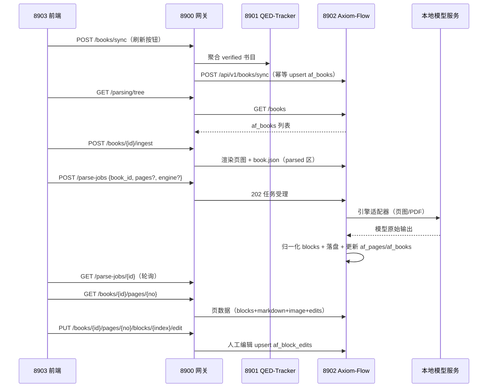

# 文档解析管理·全链路设计（parsing-flow）

设计状态：Accepted
实现状态：Implemented
最后更新：2026-09-23
确认状态：已确认
关联代码：8902 侧 `Axiom-Flow/src/axiom_flow/orchestrator/pipeline.py`、`Axiom-Flow/src/axiom_flow/engines/mineru.py`、`Axiom-Flow/src/axiom_flow/normalize/blocks.py`、`Axiom-Flow/src/axiom_flow/ingest/artifacts.py`；8900 侧适配层（api/axiom.py、clients/axiom_client.py）的模块映射与 DesignRef 登记在 [code-map.md](../architecture/code-map.md)，面向前端的端点契约事实源为 [api-contracts.md](../architecture/api-contracts.md) §④
关联测试：`tests/test_api.py`、`tests/contract/test_design_documents.py`（本文件入 CURRENT_DOCUMENTS）
关联 ADR：[ADR 0014](../adr/0014-parsing-ownership-and-model-boundary.md)（解析能力归属与模型边界）、[ADR 0007](../history/adr/v0.1/0007-qed-engine-backend-gateway.md)（前端唯一入口 8900）、[ADR 0017](../adr/0017-design-doc-structure-contract.md)（本文档结构契约与事实源唯一铁律）
关联设计：[parsing-ui.md](parsing-ui.md)（界面消费）、[dataset-conventions.md](dataset-conventions.md)（数据根三区与产物版本划分约定正文）、
[local-model-management.md](local-model-management.md)（模型生命周期与槽位）、[llm-gateway.md](llm-gateway.md)（网关与调用记录）、
[cross-project-contracts.md](cross-project-contracts.md)（三项目对接点总表）
关联架构：[api-contracts.md](../architecture/api-contracts.md) §④（8900 端点表事实源）、[database-design.md](../architecture/database-design.md)（af_* 登记清单）
关联计划：演进过程经 git 历史与 `history/plans/2026-09/` 各计划壳追溯

## 1. 定位与目标

本文档是「文档解析管理」**后端全链路**的设计事实源：8900（模型生命周期 + 数据域适配）、
8902 Axiom-Flow（解析管线）、本地模型服务三方的职责边界、全链路数据流（状态机与版本
规则）、统一 blocks 产物 schema 与引擎适配设计。它回答的是「一份 PDF 从入库到可在
对照页阅读，每一段责任归谁、状态如何流转、失败会怎样」。

- **目标**：解析能力归属与模型边界（ADR 0014）确立后，全链路职责、版本与状态口径、
  产物格式与降级行为可查、可测、可独立降级；前端界面设计归
  [parsing-ui.md](parsing-ui.md)。
- **成功标准**：读者能依据本文档回答——任一解析环节（同步/入库/提交/引擎调用/归一化/
  落盘/读取/编辑）由哪个服务负责；一个 job 从受控到终态经历哪些状态与规则；哪个版本
  生效、如何续跑、空白页算什么；模型服务或任一依赖离线时各环节的行为。

## 2. 范围与非目标

本档**不**维护以下内容，逐条给出唯一事实源指针（按 [ADR 0017](../adr/0017-design-doc-structure-contract.md) 事实源唯一铁律，design 文档不复制端点表/DDL/字段级契约）：

| 内容 | 唯一事实源 |
| --- | --- |
| 8900 面向前端的端点表（路径与请求/响应形状） | [api-contracts.md](../architecture/api-contracts.md) §④（含 8900 自有端点与错误映射） |
| `af_*` 四表结构（DDL/列/索引） | Axiom-Flow `docs/architecture/database-design.md` 与其 Alembic 迁移；根侧登记清单见 [database-design.md](../architecture/database-design.md) |
| 8902 原生 API 契约（全量端点与形状） | Axiom-Flow `docs/architecture/api.md` 与其契约测试 |
| `parsed/` 目录布局与产物版本划分约定正文 | [dataset-conventions.md](dataset-conventions.md) |
| 模型启停/探针/槽位/水位与运维约束 | [local-model-management.md](local-model-management.md) |
| 前端交互、组件与状态模型 | [parsing-ui.md](parsing-ui.md) |

## 3. 职责边界

| 服务 | 职责 |
| --- | --- |
| 8900 后端 | ① 前端唯一入口（ADR 0007）：Axiom 数据域适配透传 8902；② 共享表读取（领域→课程，`GET /parsing/tree`）；③ **OCR 模型生命周期**：模型槽位、`/models/{name}` 启停、探针、资源互斥；④ 控制台依赖组件展示。`/llm/vision` 降级为控制台测试与通用视觉用途 |
| 8902 Axiom-Flow | **完整解析管线**：af_books 同步/CRUD、ingest（PDF→页图）、解析编排（任务/页状态/重试/质量信号）、**引擎适配器**（直连模型服务）、后处理归一化、产物落盘（`parsed/`）、对照数据供给、人工编辑落库 |
| 本地模型服务 | MinerU 容器 5002（现成）；PaddleOCR-VL 服务（预留）；云端 qwen-vl（api 档位） |

参考范式（RAGFlow `deepdoc`、Docling `DocumentConverter` + 统一文档模型、MinerU 自身）：
**统一中间表示 + 可插拔引擎适配器 + 页级增量处理**。

## 4. 全链路数据流



数据流规则：

- 同步幂等键 `book_id`（同源 `qt_books.book_id`）；`af_books` 为只读快照语义，qt_books 后续
  变更/删除不影响已同步行；共享 `qed_*` 表只读，表结构变更先登记
  [database-design.md](../architecture/database-design.md)；
- ingest 只渲染页图 + `book.json`，不调模型；源 PDF 只读不复制；
- 解析任务受理即 `202`，任务状态机 `queued/running/completed/partial/failed/interrupted`
  （进度与结局分列：`af_books.parse_status` 只表达进度，`last_parse_result` 表达最近结局，
  两列与 `pages_done` 等进度字段均由 Axiom-Flow 自持维护）；
- **全本解析按窗口分块串行推进**（`AXIOM_PARSE_WINDOW_SIZE`），每块独立 deadline、块级失败
  隔离、块间模型服务探活失败即止；
- **续跑基线**：新 job 从当前生效版本的磁盘产物继承已解析页（而非页表行），跳过判定只认
  本 job 页行——跨版本续跑属设计如此，不隐式复用旧版本页状态；
- **空白页是合法产物**：引擎无结构化输出时产 `blocks=[]` 的合法页，质量标记
  `quality.blank_page=true`（`empty_block_ratio=1.0`），计为 parsed，不阻塞全本完成与激活；
- **版本激活**：job 终态且本 job 请求页全部成功（含 blank_page 合法页）才写
  `af_books.active_job_id` 生效指针；生效指针是「哪一版生效」的唯一事实源，读取方与端点
  契约不随版本布局变化；`active_job_id IS NULL` 时读取落到根视图存量（legacy 哨兵），
  旧产物不因升级而失明；
- 人工编辑绑定其所属解析版本（`job_id` 作用域），**不随版本继承**，不入产物文件；
  块下标随映射表版本变化，跨版本共用编辑键即污染编辑，故编辑唯一键含 `job_id`；
- 端点演进规则（消费假设）：8902 既有端点的路径与请求/响应形状保持稳定，版本布局与
  列表能力等扩展以**新增端点**承接（读取方无感）。

## 5. 解析产物布局（`QED_DATA_ROOT/parsed/`）

```text
<QED_DATA_ROOT>/parsed/<domain_id>/<course_id>/<book_id>/
├── book.json            # BookMeta：book_id/title/authors/page_count/sha256/source_file/engine/ingested_at
├── manifest.json        # 产物清单（路径 + 大小 + SHA-256）
└── pages/
    ├── p0001.png        # 原页图（150 DPI，对照左栏 + bbox 基准）
    ├── p0001.md         # 页级 Markdown（$$...$$ / $...$ 内嵌公式）
    └── p0001.blocks.json# 统一 blocks（结构化，含 bbox）
```

- `source_file`：源 PDF 的数据根相对路径（同源 `qt_books.file_path`），源 PDF 只读不复制；
- 页图渲染与产物落盘在 Axiom-Flow（[ADR 0014](../adr/0014-parsing-ownership-and-model-boundary.md) 决定 2）；
- 目录结构遵循 [dataset-conventions.md](dataset-conventions.md)（`parsed/` 区写入方 Axiom-Flow）；
- **版本划分**：每次解析 job 产物原子独立落 `<book_id>/versions/<job_id>/`，book_id 根目录
  保持「当前生效版本」视图（读取方与端点契约不变）；约定正文（生效指针、legacy 哨兵、
  清单语义）见 [dataset-conventions.md](dataset-conventions.md)。

## 6. 统一 blocks schema（页级）

```json
{
  "page": 1,
  "image_size": [1240, 1754],
  "source": "mineru",
  "blocks": [
    {"index": 0, "type": "heading", "level": 1, "text": "1. The Real and Complex Number Systems",
     "bbox": [72, 54, 540, 80], "order": 0, "confidence": 0.97},
    {"index": 1, "type": "formula", "latex": "x + y = y + x", "display": true,
     "bbox": [72, 150, 540, 175], "order": 1, "confidence": 0.97}
  ],
  "quality": {"empty_block_ratio": 0.0, "avg_formula_confidence": 0.95,
              "table_count": 1, "text_length_ratio": 0.98}
}
```

- 块类型沿用 10 种：`heading / paragraph / formula / table / image / list / caption / header /
  footer / page_number`；按类型强制必需字段（heading.text+level、formula.latex、table.html、
  image.path、list.items、其余 text）；
- `bbox`：原页图像素坐标 `[x0, y0, x1, y1]`（左上原点），基准为 `pages/pXXXX.png`；模型坐标系
  差异由适配层按 `image_size` 缩放归一；
- `order`：阅读顺序（0 基）；`source`：实际引擎标识（mineru / paddleocr-vl / qwen-vl）；
- `quality`：页级质量信号对象；空白合法页标记 `blank_page: true`（伴随 `empty_block_ratio`
  为 1.0），是前端「原页图直显、解析栏隐藏」的分显判据字段；
- 人工编辑不入文件（文件为模型产物事实源），由 `af_block_edits` 覆盖层承载，API 返回时合并。

## 7. 8900 适配层

- 数据域适配：8900 透传 8902 的解析链路端点（书目 CRUD/同步/ingest、解析任务提交与
  查询、页数据与编辑读写）；8902 端点全量清单与形状以 Axiom-Flow
  `docs/architecture/api.md` 为事实源，8900 面向前端的完整端点表（含 `GET /parsing/tree`
  聚合与 `GET /books/{id}/file` 源 PDF 本地端点两个 8900 自有端点）以
  [api-contracts.md](../architecture/api-contracts.md) §④ 为事实源，本文档不重复维护；
  消费面语义要点：页未解析读取返回 404（非错误）、任务受理后异步推进靠轮询；
- 超时分层：ingest/源 PDF 流等分钟级透传调用按
  [parsing-ui.md](parsing-ui.md) §6 登记的超时口径；普通透传走网关默认；
- 模型生命周期：`/models/{name}` 启停/重启、`/monitor/mineru` 等探针、模型槽位与资源互斥归
  [local-model-management.md](local-model-management.md)；解析在飞不重启 vision 槽位的运维
  约束见该文档已知约束节。

## 8. 引擎适配（模型无感知）

- 引擎由 Axiom-Flow 配置选择：`AXIOM_OCR_ENGINE=mineru|paddleocr-vl|qwen-vl`（默认 `mineru`）；
- 适配器统一输入（页图字节 / PDF 字节 + 页码）与输出（页级 blocks+markdown+bbox），模型差异
  （MinerU `content_list`/`middle.json`、PaddleOCR-VL JSON、qwen-vl markdown）在适配层归一；
- 逐页解析：页图 → 引擎单页识别；全本解析：PDF → 引擎整本解析（跨页表格/阅读序更优）→
  按窗口分块串行推进（§4）→ 逐页结果；
- 引擎名无回落默认：写入路径必须显式携带解析后的引擎名，缺名报错；
- 模型服务地址可配置（默认直连本地服务；部署形态需要时可指向 8900 代理地址，契约不变）；
- 直连成功路径由 Axiom-Flow 自写 `qed_llm_calls`（`service=axiom_flow`、`provider=<engine>`、
  `endpoint=vision`）。

## 9. 状态与降级矩阵

| 场景 | 行为 |
| --- | --- |
| 8902 离线 | 8900 数据域端点返回 503，前端降级显示；配置域不受影响 |
| 8901 离线 | `POST /books/sync` 返回 503（取数失败），其余端点不受影响 |
| 模型服务离线 | 提交期 8902 探活失败返回 503 **不创建任务**；受理后故障才逐页失败、job 记 `failed`（`error` 记原因）；只读端点正常；全本分块推进时块间探活失败即止 |
| 8900 离线 | 前端错误横幅；Axiom-Flow 可经脚本手动启停模型并独立解析（[ADR 0014](../adr/0014-parsing-ownership-and-model-boundary.md) 决定 5） |

## 10. 已知约束与维护规则

- 本档只承载链路设计口径：新增/变更端点形状、`af_*` 列级结构一律先落各自事实源
  （Axiom-Flow 文档与 Alembic；根侧指针见 §2），再回本档核对边界陈述是否仍成立；
- 解析产物对「大模型易消费 JSON」的优化方向由
  [ARCH-025 滚动壳](../plans/2026-09-22-axiom-flow-v1-parsing-knowledge-optimization.md) 跟踪，
  不改变本档职责边界。
