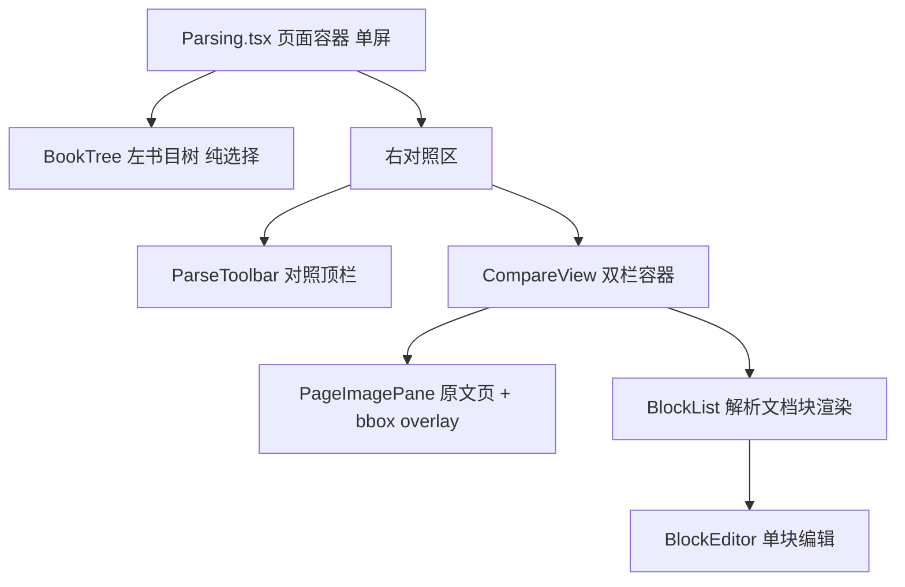

# 文档解析管理 UI 设计（parsing-ui）

设计状态：Accepted
实现状态：In Progress
最后更新：2026-09-21
确认状态：已确认
关联代码：`web-ui/src/pages/Parsing.tsx`、`web-ui/src/stores/parsing.ts`、`web-ui/src/api/axiom.ts`、
`web-ui/src/components/parsing/`（BookTree/ParseToolbar/CompareView/PageImagePane/BlockList/BlockEditor/blocks.ts）
关联测试：`web-ui/src/pages/Parsing.test.tsx`、`tests/contract/test_design_documents.py`（本文件入 CURRENT_DOCUMENTS）
关联 ADR：[ADR 0014](../adr/0014-parsing-ownership-and-model-boundary.md)（解析能力归属与模型边界）、[ADR 0007](../history/adr/v0.1/0007-qed-engine-backend-gateway.md)（前端唯一入口 8900）
关联设计：[frontend-architecture.md](../architecture/frontend-architecture.md)（8903 信息架构与视觉规范）、
[downloads-ui.md](downloads-ui.md)（左树与状态点风格参照）、
[local-model-management.md](local-model-management.md)（模型生命周期操作面）
关联计划：[PLAN-044](../plans/2026-09-14-parsing-management-axiom-flow-chain.md)（后端全链路契约事实源）；
界面形态演进经 git 历史与 `history/plans/2026-09/` 各计划壳追溯

> **本文档定位**：文档解析管理页（`#/admin/parsing`）的 UI 设计文档——信息架构、组件拆分、
> 状态模型、交互规范、态与降级、视觉。后端全链路（af_* 表、8902 契约、产物布局）归
> [与 Axiom-Flow 交互全链路](../plans/2026-09-14-parsing-management-axiom-flow-chain.md)；
> 模型启停/探针归 [local-model-management.md](local-model-management.md)。

## 1. 信息架构与路由（单屏：左树 + 右对照）

- 路由 `#/admin/parsing`（AdminLayout 嵌套，菜单项「文档解析管理」）；
- **一屏完成**：`Row`＝左 **书目树 lg=5**（§5，纯选择）＋ 右 **对照区 lg=19**（§6 顶栏 + §7 双栏）；
  点树中书名 → 右侧直接切到该书对照，**无列表态/工作台态切换**；
  URL hash 携带 `?book=<id>&page=<n>`，刷新/书签恢复；
- 页面容器：`Layout.Content`（`padding 24`、`maxWidth 2400`、`width 98%`、居中）
  + 顶部标题行（标题「文档解析管理」＋「刷新」（含同步书目））；
- **对照展示基准 = A4「Word 100%」纸面**（794×1123px @96dpi）：原文页与解析文档纸面
  同宽并排（各占对照区半幅），容器超宽出横向滚动条看全页；
- **原始文件优先**：未解析页隐藏解析模块、页图/PDF 直显（§7 态分流）。

## 2. 组件树与职责



| 文件 | 职责 |
| --- | --- |
| `web-ui/src/pages/Parsing.tsx` | 页面容器：单屏布局（左树 + 右对照）、URL hash 同步、全局横幅（8900 错误 / 8902 降级 / 同步结果） |
| `web-ui/src/components/parsing/BookTree.tsx` | 左书目树：领域→课程→书三级（数据源 `/parsing/tree`），**纯选择**，无状态徽标/筛选 |
| `web-ui/src/components/parsing/ParseToolbar.tsx` | 对照顶栏：书名、页码导航、滚动模式、同步滚动、缩放、解析本页/全本、书页入库、任务进度、审阅统计（**无 engine 选择**） |
| `web-ui/src/components/parsing/CompareView.tsx` | 双栏容器：态分流（§7）、单页模式 / 连续滚动模式、滚动同步 |
| `web-ui/src/components/parsing/PageImagePane.tsx` | 原文页 + bbox overlay（hover/选中联动） |
| `web-ui/src/components/parsing/BlockList.tsx` | 解析文档渲染（流式/版式两模式，KaTeX/Markdown/表格）+ 选中联动 |
| `web-ui/src/components/parsing/BlockEditor.tsx` | 单块编辑：文字修正（公式为 LaTeX 源码）+ 范围数值修正 + 判定/备注 Popover |
| `web-ui/src/components/parsing/blocks.ts` | 块渲染工具（`tryRenderKatex`/`renderInlineMath`/`blockText`/`TYPE_LABELS`） |
| `web-ui/src/stores/parsing.ts` | 树/选中书/页/任务/编辑状态与动作 |
| `web-ui/src/api/axiom.ts` | 8900 适配端点封装与类型 |

块渲染与判定为两套独立能力：渲染在 `BlockList`（+`blocks.ts`），判定/编辑在 `BlockEditor`，
旧 `BlockView.tsx` 已退役不存在。

## 3. 状态模型（stores/parsing.ts）

```ts
interface ParsingStore {
  // 书目树（数据源 /parsing/tree：领域→课程→书，纯选择）
  tree: ParsingTreeNode[];
  treeLoading: boolean;
  treeError: string | null;
  // 书目元数据（GET /books，用于选中书的 ingest/parse/file_path/page_count）
  books: BookMeta[];
  booksLoading: boolean;
  // 全局降级
  error: string | null;        // 8900 不可达
  dataError: string | null;    // 8902 离线（503）
  syncMessage: string | null;
  syncError: string | null;
  // 对照区选中
  compareBookId: string | null;
  comparePageNo: number;
  compareBook: BookMeta | null;
  pages: Record<number, PageEntry>;  // 页数据缓存（连续滚动窗口）
  selectedBlock: number;       // -1 无选中
  hoveredBlock: number;        // -1 无 hover
  editMode: boolean;           // 只读 / 编辑
  viewMode: 'compare' | 'original' | 'parsed';
  scrollMode: 'single' | 'continuous';
  renderMode: 'stream' | 'layout';
  syncScroll: boolean;
  zoom: number;
  // 解析任务
  activeJob: ParseJob | null;
  jobError: string | null;
  ingestBusy: Record<string, boolean>;
  edits: Record<string, BlockEdit>;   // editKey(bookId,pageNo,index)
  editSubmitting: boolean;
  engine: string;              // 固定默认（UI 不暴露选择）
  // 动作
  fetchTree: () => Promise<void>;
  fetchBooks: (sync?: boolean) => Promise<void>;  // 刷新按钮：sync=true 先 POST /books/sync
  openWorkbench: (bookId: string, pageNo?: number) => Promise<void>; // 点树选书（含未 ingest 态分流）
  loadPage: (pageNo: number) => Promise<void>;
  ensurePage: (pageNo: number) => Promise<void>;   // 连续滚动窗口预取
  gotoPage: (delta: number) => void;
  selectBlock: (index: number) => void;
  setEditMode: (on: boolean) => void;
  setViewMode / setScrollMode / setRenderMode / setSyncScroll / setZoom / setEngine;
  submitEdit: (blockIndex: number, input: BlockEditInput) => Promise<boolean>;
  ingestBook: (bookId: string) => Promise<void>;
  createParseJob: (pages?: number[]) => Promise<void>;  // 本页 [n] / 全本 undefined / 失败页 [..]
  clearCompare: () => void;
}
```

规则：

- 树中点选书即 `openWorkbench(bookId, pageNo)`，无视图态分支；
- 「刷新」按钮 = `fetchBooks(true)`（`POST /books/sync` → 重拉 `GET /books` → `fetchTree()`）：
  同步失败不阻塞查看（`syncError` 提示）；
- `openWorkbench`：`GET /books/{id}` 判 `ingest_status`，未 ingest 走 §7 分流
  （iframe PDF 直显 + 顶栏「书页入库」按钮）；
- `loadPage` 并发保护；404 = 未解析（非错误）；切页/切书清空 `selectedBlock` 并作废
  任务轮询令牌；
- 运行中任务轮询 `GET /parse-jobs/{id}`，终态自动刷新当前书 + 当前页（进度回显于顶栏）；
- 编辑提交后以响应合并回 `edits`（不整页重拉），保证回显；
- `compareBookId/comparePageNo` 双向同步 URL hash（`?book&page`），支持刷新恢复。

## 4. 数据契约（8900 端点映射）

| UI 动作 | 端点 | 请求/响应要点 |
| --- | --- | --- |
| 书目元数据 | `GET /books` | `BookMeta[]`（af_books：`ingest_status`/`parse_status`/`pages_done`/`page_count`/`file_path`/课程归属）——选中书状态与 ingest/解析按钮判据 |
| 同步书目 | `POST /books/sync` | `SyncResult`；成功后重拉 `GET /books` + 树（顶部「刷新」按钮） |
| 书目树数据 | `GET /parsing/tree` | `ParsingTreeNode[]`（领域→课程→书三级；8902 离线 → 仅领域→课程） |
| 打开书目 | `GET /books/{id}` | `BookMeta`（`ingest_status`/`parse_status`/`pages_done`） |
| 书页入库（ingest） | `POST /books/{id}/ingest` | `{book_id,page_count,sha256,ingest_status}`（8900 透传 8902）；页图渲染分钟级 → 请求超时 8903/8900→8902 均 300s |
| 载入页 | `GET /books/{id}/pages/{no}` | `{blocks, markdown, image_url, edits}`（edits 已合并）；404=未解析 |
| 原页图 | `GET /books/{id}/pages/{no}/image` | `image/png`（8900 代理，浏览器只连 8900） |
| 解析本页/全本/失败页 | `POST /parse-jobs` | `202` `{book_id, pages?}`（单页=`pages:[n]`，全本=省略 pages；engine 不选=服务端默认） |
| 轮询任务 | `GET /parse-jobs/{id}` | `ParseJob{status, progress:{parsed,total,error}}` |
| 保存编辑 | `PUT /books/{id}/pages/{no}/blocks/{index}/edit` | `{verdict?, note?, corrected_text?, corrected_bbox?}` → 编辑记录 |
| 页内编辑列表 | `GET /books/{id}/pages/{no}/edits` | `EditRecord[]`（用于独立刷新编辑态） |

类型（`api/axiom.ts`）：

- `BookMeta`：`ingest_status`（`none|ingesting|ingested|failed`）、`parse_status`
  （`pending|parsing|completed|failed`）、`pages_done`、`page_count`、`authors`、`part`、
  `display_title`；旧 `author`/`strategy` 兼容可选。
- `PageData`：`{ page_no, image_url, markdown, blocks: BlocksPage | Block[] | null, edits: BlockEdit[] }`。
- `BlockEdit`：`{ verdict: '' | 'ok' | 'bad', note, corrected_text?, corrected_bbox?, edited_at, updated_at }`。
- `ParseJob`：`{ id, book_id, pages, engine, status, progress: {parsed,total,error}, created_at, started_at, finished_at }`（主键 `id`，与 8902 schema 对齐）。
- 端点封装：`syncBooks`、`getParsingTree`、`getBook`、`ingestBook`、`getBookPage`、
  `putBlockEdit`、`getPageEdits`、`createParseJob`、`getParseJob`。
- 8900 侧另有 `/review` 兼容门面（内部转 `/edit`），仅存量兼容，本设计消费面一律 `/edit`。

## 5. 左侧栏：书目树（BookTree，纯选择）

- 三级折叠树：**领域 → 课程 → 书目**，数据源 `GET /parsing/tree`（8902 离线时仅领域→课程，
  黄色降级横幅 + 树空态）；
- **只做选择**：点书名片段 → `openWorkbench(book_id)`，右侧对照区切换；当前选中书高亮；
  无状态 Tag、无进度徽标、无筛选行、无搜索框（侧栏保持干净）；
- 树样式沿用 `downloads.css` 的 `dl-tree-*` 类（与文档下载管理左树同风格）；
- **书节点展示名**（`parsingBookLabel`，顶栏§6 同用）：`display_title` 非空直用（其契约= title + part），
  否则 `title + ' ' + part` 空格连接——保证「微积分学教程 Vol.1/2/3」「数分习题课讲义 上/下册」等
  同名多卷可区分（口径同下载管理 `bookDisplayName`）；
- 默认展开：第一个领域 + 其下所有课程；
- 「刷新」（含同步书目）按钮放在**页面顶部标题行**（不属于树本体）。

## 6. 对照区顶栏（ParseToolbar）

一行内完成（选中书后常驻；**无 engine/模型选择**——引擎固定服务端默认）：

- **书名**（§5 `parsingBookLabel` 口径，带卷标识）＋ **页码导航**：输入框「n / 总页数」（数字 + Enter 跳页）＋上一页/下一页按钮；
  键盘 `←`/`→` 翻页（编辑弹层打开时禁用）；连续滚动模式下页码随视口联动显示；
- **滚动模式** Segmented：`单页`（默认，翻页式）｜`连续`（整本书纵向页流，见 §7）；
  单页模式两列各自滚动 + **滚动同步** Switch；
- **渲染模式** Segmented：`流式`｜`版式`（§7）；
- **视图恒为对照**：无「仅原文/仅解析」切换——未解析页由 §7 态分流天然只显示书页图；
- **缩放** Slider：适配宽度 / 100%（A4 794px 基准）/ 自定义百分比；
- **解析操作区**（右侧）：**「书页入库」**（= ingest：PDF 逐页转书页图并登记页数，解析前置，
  界面文案全中文；未入库/失败时可点）＋「解析本页」（`POST /parse-jobs {pages:[当前页]}`）
  ＋「全本解析」（省略 pages）；提交后轮询 `GET /parse-jobs/{id}` 显示
  `progress.parsed/total` 进度条，完成自动刷新当前页；运行中禁用重复提交；失败显示错误
  文本 + 重试；
- **审阅统计**：「已判定 x / 共 y 块」（当前页）；编辑模式开关：只读 / 编辑（避免浏览时误改）。

## 7. 双栏对照区（CompareView）

态分流（**原始文件优先**；`pageParsed` = 页数据 200 且含 blocks；页图一律 URL 直构、
**不依赖页数据请求成功**）：

1. **已解析页** → 双栏对照：左原文页 + 右解析文档（各占半幅 A4 纸面）；
2. **已 ingest 未解析页**（页数据 404）→ 左原页图占满，**解析栏隐藏**、不出误导性错误横幅；
   顶栏「解析本页/全本解析」为主操作引导；
3. **未 ingest 有 `file_path`** → `iframe` 直显源 PDF（`GET /books/{id}/file`）+「书页入库」引导；
4. **无 `file_path`** → 明确空态「暂无原始文件（书目未登记 PDF 路径）」；
5. 页加载失败（非「未解析」404）：`Alert` + 重试。

**滚动模式**（§6 切换）：

- **单页模式**（默认）：当前页双栏并排，两列各自滚动，「滚动同步」开启时按容器高度比例联动；
- **连续滚动模式**：整本书页纵向流，每页一个「左原文页｜右解析文档」双栏单元（A4 纸面同宽）；
  懒加载预取当前视口 ±2 页 + 虚拟滚动（486 页量级不卡）；滚轮连续翻页，顶栏页码随视口
  所在页联动；未解析/未 ingest 页在其单元内按上述 2/3/4 态呈现。

`PageImagePane`：

- 原文页图（`GET /books/{id}/pages/{no}/image`）+ **bbox 方框叠加**（每块一框，按块类型着色）；
- hover 高亮、点击选中（与 `BlockList` **双向联动**：右栏 hover 块 → 左图高亮对应框；
  左页点击区域 → 右栏定位并选中最近块）。

`BlockList` + `BlockEditor`：

- **两种渲染模式**（顶栏切换）：**流式**=按块顺序排版（可读性优先）；
  **版式**=块按 bbox 绝对定位到页面尺寸（字号取 bbox 高度），呈现与原页接近的还原，
  便于逐块判定「解析文档是否准确还原原页」；
- 块级渲染复用 `blocks.ts`（heading 分级、formula KaTeX、table HTML、list、image、caption 等）；
  formula 块渲染前先经 `unwrapMathDelimiters` **剥成对数学定界符**（`$$…$$`/`\[…\]`/`$…$`）再交
  KaTeX——防御 ARCH-018 修复前的老代产物（`latex` 字段自带引擎定界符，KaTeX 视 `$` 为解析错误、
  整块回退原文显示）；剥后内部仍含同种定界符则保留原文不误剥（BUGFIX-011）；
- 点击块与左图联动选中；选中块高亮并滚动到可视区；
- `BlockEditor`：文字修正（公式编辑 LaTeX 源码）+ 范围修正（bbox 数值输入
  `x0,y0,x1,y1`）+ 判定/备注 Popover；
- 保存：`PUT /books/{id}/pages/{no}/blocks/{index}/edit`，
  `{verdict, note, corrected_text, corrected_bbox}`；
- 回显：进入页时拉取页数据（blocks + 已合并 edits），刷新后保持；有编辑的块显示标记
  （判定 Tag + 修正角标）。

## 8. bbox 规范

- **坐标系**：原页图像素坐标 `[x0, y0, x1, y1]`（左上原点），基准为 `pages/pXXXX.png`；
  overlay 用相对百分比定位（`left/top/width/height` = 坐标 / `image_size`），随图自适应缩放；
- **颜色**：按块类型固定色板（heading/paragraph/formula/table/image/…），半透明填充 + 实线边框；
  选中态加粗高亮（`#1677ff`），hover 态提升透明度；
- **编辑**：`editMode` 下经 `BlockEditor` 数值输入修改范围；提交前夹紧到
  `[0,0,image_size]`，最小尺寸约束（如 8px）防退化，保证 x0<x1、y0<y1；
  图上拖拽/缩放手柄为预留增强（见 todo ARCH-020-E 承载）；
- **无 bbox 块**：不在图上画框（仅列表可选中），标注「无坐标」。

## 9. 状态与降级矩阵

| 场景 | 判定 | 表现 |
| --- | --- | --- |
| 8900 不可达 | 请求失败（非上游 503） | 顶部错误横幅 + 「刷新」重试；树/页显示空态 |
| 8902 离线（503） | 数据域请求 503 | 黄色降级横幅；树仅显示领域→课程、对照不可用 |
| 8901 离线 | `POST /books/sync` 503 | 同步失败提示（不阻塞查看已同步书目） |
| 未入库（ingest） | `ingest_status != ingested` | 对照区 `iframe` 直显源 PDF、解析栏隐藏（§7）；顶栏「书页入库」按钮 |
| 未解析页 | `pageParsed=false`（页数据 404 / blocks 空） | **解析栏整体隐藏**，原页图占满，无错误横幅；解析入口在顶栏 |
| 解析任务进行中 | `activeJob.status ∈ queued/running` | 顶栏进度条 + 「已判定/页数据」完成后自动刷新；禁用重复提交 |
| 解析失败 | `pageError` / `job.status=failed` | 顶栏错误提示 + 重试入口 |
| 模型服务离线 | 8902 返回 503 | 解析任务 failed（错误原因由后端给出） |

## 10. 视觉规范

- 配色与对比度遵循[前端架构](../architecture/frontend-architecture.md)（蓝白主体、状态色配同色系浅底、
  字体与背景大区分、响应式栅格、theme token 统一）；
- bbox 方框按块类型固定色板，选中态加粗高亮；状态提示复用 downloads 的状态色 token；
- 左树沿用 `downloads.css` `dl-tree-*` 样式；对照两栏纸面 `overflowX auto`
  （沿用容器滚动条样式基调）。
