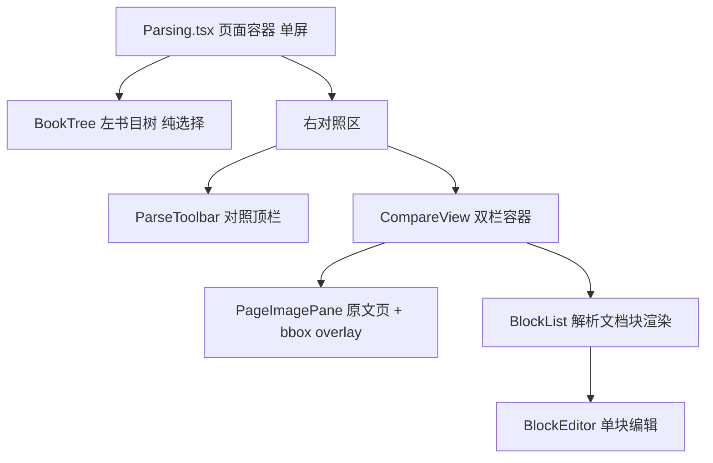

# 文档解析管理 UI 设计（parsing-ui）

设计状态：Accepted
实现状态：In Progress
最后更新：2026-09-20
确认状态：已确认
关联代码：`web-ui/src/pages/Parsing.tsx`、`web-ui/src/stores/parsing.ts`、`web-ui/src/api/axiom.ts`、
`web-ui/src/components/parsing/`（BookTree/ParseToolbar/CompareView/PageImagePane/BlockList/BlockEditor/blocks.ts）
关联测试：`web-ui/src/pages/Parsing.test.tsx`、`tests/contract/test_design_documents.py`（本文件入 CURRENT_DOCUMENTS）
关联 ADR：[ADR 0014](../adr/0014-parsing-ownership-and-model-boundary.md)（解析能力归属与模型边界）、[ADR 0007](../history/adr/v0.1/0007-qed-engine-backend-gateway.md)（前端唯一入口 8900）
关联设计：[frontend-architecture.md](../architecture/frontend-architecture.md)（8903 信息架构与视觉规范）、
[downloads-ui.md](downloads-ui.md)（左树与状态点风格参照）、
[local-model-management.md](local-model-management.md)（模型生命周期操作面）

> **本文档定位**：文档解析管理页（`#/admin/parsing`）的 **UI 设计文档**——信息架构、组件拆分、
> 状态模型、交互规范、态与降级、视觉。后端全链路（af_* 表、8902 契约、产物布局）归
> [与 Axiom-Flow 交互全链路](../plans/2026-09-14-parsing-management-axiom-flow-chain.md)；
> 模型启停/探针归 [local-model-management.md](local-model-management.md)。
> 2026-09-14（ARCH-020 重构轮）由 PLAN-043 定稿晋升。

## 1. 背景与演进

- 2026-08-18：解析进度页改名「文档解析管理」，落地「左树右对照」单视图（书目树 + 原页图 +
  块级判定，落库 `af_block_reviews`）。
- 2026-09-14（ARCH-020，[ADR 0014](../adr/0014-parsing-ownership-and-model-boundary.md)）：
  模型生命周期归 8900、解析管线归 Axiom-Flow；块判定扩展为**块编辑**（判定/备注/文字修正/
  范围修改，落库 `af_block_edits`）；原页图叠加语义 bbox 方框与双向联动；工具栏「同步」与
  「刷新」合并为单一按钮。旧 `BlockView.tsx` 退役。
- 2026-09-20（ARCH-020-UI 展示轮，[parsing-display-round](../history/plans/2026-09/2026-09-20-parsing-display-round.md)
  用户四点裁决，已落地）：28 寸屏扩大展示（§2 布局改 2400 / 5:19）；**原始文件优先**——
  未解析页隐藏解析模块，页图/PDF 直显（§8 态分流重写）；对照视图 A4「Word 100%」纸面
  （794×1123px @96dpi）+ 横向滚动（§2/§8）；产物按解析版本划分（归
  [dataset-conventions.md](dataset-conventions.md) / REQ-080，不在本 UI 范围）。
- 2026-09-20（工作台重设计，[parsing-workbench-redesign](../history/plans/2026-09/2026-09-20-parsing-workbench-redesign.md)
  用户四点裁决，设计先行、实现归 ARCH-020-D）：界面改**单页两级视图**——默认**书目列表态**
  （数据源=数据库表 af_books，经 `GET /books`；点击进入）⇄ **对照工作台态**（原文页 vs
  解析还原文档；单页/全本解析按钮、页码导航、单页/连续滚动、对照视图模式切换、bbox 双向联动）；
  用户裁决「翻译文档」=**PDF 解析还原后的可准确渲染文档**（非 AI 翻译，无新链路）；
  左树布局退役为列表态筛选器。
- 2026-09-20（**单屏回调轮 ARCH-020-G**，[parsing-sidebar-single-view](../history/plans/2026-09/2026-09-20-parsing-sidebar-single-view.md)
  用户裁决，**取代上一条的两级视图设计**）：列表态两级切换不符合预期，回到
  **「左侧书目树 + 右侧对照」一屏完成**——树只做选择（无状态徽标/无筛选行），
  顶部筛选栏与 engine（模型）选择全部去除；D 轮实现的对照能力（bbox 双向联动、
  块编辑弹层+判定、流式/版式、连续滚动、解析按钮+进度、URL 恢复）**全部保留**，
  操作收敛进对照区顶栏（§7）。

## 2. 信息架构与路由（单屏：左树 + 右对照）

- 路由保持 `#/admin/parsing`（AdminLayout 嵌套，菜单项「文档解析管理」不变）；
- **一屏完成**（ARCH-020-G 回调，2026-09-20）：`Row`＝左 **书目树 lg=5**（§6，纯选择）＋
  右 **对照区 lg=19**（§7 顶栏 + §8 双栏）；点树中书名 → 右侧直接切到该书对照，
  **无列表态/工作台态切换**；URL hash 仍携带 `?book=<id>&page=<n>`，刷新/书签恢复；
- 页面容器：`Layout.Content`（`padding 24`、`maxWidth 2400`、`width 98%`、居中）
  + 顶部标题行（标题「文档解析管理」＋「刷新」（含同步书目），§6）；
- **对照展示基准 = A4「Word 100%」纸面**（794×1123px @96dpi）：原文页与解析文档纸面
  同宽并排（各占对照区半幅），容器超宽出横向滚动条看全页（2026-09-20 展示轮裁决保留）。

## 3. 组件树与职责



| 文件 | 职责 | 状态 |
| --- | --- | --- |
| `web-ui/src/pages/Parsing.tsx` | 页面容器：单屏布局（左树 + 右对照）、URL hash 同步、全局横幅（8900 错误 / 8902 降级 / 同步结果） | 改造 |
| `web-ui/src/components/parsing/BookTree.tsx` | 左书目树：领域→课程→书三级（数据源 `/parsing/tree`），**纯选择**，无状态徽标/筛选 | 改造（G 轮，自 D 轮列表态退役回树） |
| `web-ui/src/components/parsing/ParseToolbar.tsx` | 对照顶栏：书名、页码导航、滚动模式、同步滚动、缩放、解析本页/全本、书页入库、任务进度、审阅统计（**无返回列表、无 engine 选择**） | 改造 |
| `web-ui/src/components/parsing/CompareView.tsx` | 双栏容器：态分流（§8）、单页模式 / 连续滚动模式、滚动同步 | 新增 |
| `web-ui/src/components/parsing/PageImagePane.tsx` | 原文页 + bbox overlay（hover/选中/编辑拖拽缩放） | 新增 |
| `web-ui/src/components/parsing/BlockList.tsx` | 解析文档渲染（流式/版式两模式，KaTeX/Markdown/表格）+ 选中联动 | 新增 |
| `web-ui/src/components/parsing/BlockEditor.tsx` | 单块编辑：文字修正（公式为 LaTeX 源码）+ 判定/备注 Popover | 新增 |
| `web-ui/src/components/parsing/blocks.ts` | 块渲染工具（`tryRenderKatex`/`renderInlineMath`/`blockText`/`TYPE_LABELS`） | 新增 |
| `web-ui/src/stores/parsing.ts` | 树/选中书/页/任务/编辑状态与动作（**无列表视图态与筛选**） | 重构 |
| `web-ui/src/api/axiom.ts` | 8900 适配端点封装与类型 | 扩展 |

复用与退役：KaTeX 渲染逻辑从 `components/BlockView.tsx` 抽到 `components/parsing/blocks.ts`；
`BlockView.tsx` 退役（判定迁入 `BlockEditor`，渲染迁入 `BlockList`）。

## 4. 状态模型（stores/parsing.ts）

```ts
interface ParsingStore {
  // 书目树（数据源 /parsing/tree：领域→课程→书，纯选择）
  tree: ParsingTreeNode[];
  treeLoading: boolean;
  treeError: string | null;
  // 书目元数据（GET /books，用于选中书的 ingest/parse/file_path/page_count；非列表态数据源）
  books: BookMeta[];
  booksLoading: boolean;
  // 全局降级
  error: string | null;        // 8900 不可达
  dataError: string | null;    // 8902 离线（503）
  syncMessage: string | null;
  syncError: string | null;
  // 对照区选中
  compareBookId: string | null;
  comparePageNo: number;
  compareBook: BookMeta | null;
  pages: Record<number, PageEntry>;  // 页数据缓存（连续滚动窗口）
  selectedBlock: number;       // -1 无选中
  hoveredBlock: number;        // -1 无 hover
  editMode: boolean;           // 只读 / 编辑
  viewMode: 'compare' | 'original' | 'parsed';
  scrollMode: 'single' | 'continuous';
  renderMode: 'stream' | 'layout';
  syncScroll: boolean;
  zoom: number;
  // 解析任务
  activeJob: ParseJob | null;
  jobError: string | null;
  ingestBusy: Record<string, boolean>;
  edits: Record<string, BlockEdit>;   // editKey(bookId,pageNo,index)
  editSubmitting: boolean;
  engine: string;              // 固定默认（UI 不再暴露选择）
  // 动作
  fetchTree: () => Promise<void>;
  fetchBooks: (sync?: boolean) => Promise<void>;  // 刷新按钮：sync=true 先 POST /books/sync
  openWorkbench: (bookId: string, pageNo?: number) => Promise<void>; // 点树选书（含未 ingest 态分流）
  loadPage: (pageNo: number) => Promise<void>;
  ensurePage: (pageNo: number) => Promise<void>;   // 连续滚动窗口预取
  gotoPage: (delta: number) => void;
  selectBlock: (index: number) => void;
  setEditMode: (on: boolean) => void;
  setViewMode / setScrollMode / setRenderMode / setSyncScroll / setZoom / setEngine;
  submitEdit: (blockIndex: number, input: BlockEditInput) => Promise<boolean>;
  ingestBook: (bookId: string) => Promise<void>;
  createParseJob: (pages?: number[]) => Promise<void>;  // 本页 [n] / 全本 undefined / 失败页 [..]
  clearCompare: () => void;
}
```

规则：

- **无 `view` 视图态与筛选状态**（G 轮回调：列表态/filters 全部退役）；点树选书即
  `openWorkbench(bookId, pageNo)`；
- 「刷新」按钮 = `fetchBooks(true)`（`POST /books/sync` → 重拉 `GET /books` → `fetchTree()`）：
  同步失败不阻塞查看（`syncError` 提示）；
- `openWorkbench`：`GET /books/{id}` 判 `ingest_status`，未 ingest 走 §8 分流
  （iframe PDF 直显 + 顶栏「书页入库」按钮）；
- `loadPage` 并发保护；404 = 未解析（非错误）；切页/切书清空 `selectedBlock` 并作废
  任务轮询令牌；
- 运行中任务轮询 `GET /parse-jobs/{id}`，终态自动刷新当前书 + 当前页（进度回显于顶栏）；
- 编辑提交后以响应合并回 `edits`（不整页重拉），保证回显；
- `compareBookId/comparePageNo` 双向同步 URL hash（`?book&page`），支持刷新恢复。

## 5. 数据契约（8900 端点映射）

> 过渡说明（2026-09-20 联调最小打通轮）：8902 v2 已以 `/edit` + 页级 `/edits` 取代
> `af_block_reviews`，8900 对现有前端保持 `/review` 门面（内部转 `/edit`，见
> [api-contracts.md §④](../architecture/api-contracts.md)）；下表 `/edit` 契约为本设计
> 实施（ARCH-020-D）时的目标形态，届时前端随 `af_block_reviews` 旧封装一并切换。

| UI 动作 | 端点 | 请求/响应要点 |
| --- | --- | --- |
| 书目元数据 | `GET /books` | `BookMeta[]`（af_books：`ingest_status`/`parse_status`/`pages_done`/`page_count`/`file_path`/课程归属）——选中书状态与 ingest/解析按钮判据（G 轮起不再是列表态数据源） |
| 同步书目 | `POST /books/sync` | `SyncResult`；成功后重拉 `GET /books` + 树（顶部「刷新」按钮） |
| 书目树数据 | `GET /parsing/tree` | `ParsingTreeNode[]`（领域→课程→书三级；8902 离线 → 仅领域→课程） |
| 刷新（工作台） | `GET /books/{id}/pages/{no}` | 重载当前页数据 |
| 打开书目 | `GET /books/{id}` | `BookMeta`（`ingest_status`/`parse_status`/`pages_done`） |
| ingest | `POST /books/{id}/ingest` | `{book_id,page_count,sha256,ingest_status}`（**8900 透传待 ARCH-020-B，高优先**） |
| 载入页 | `GET /books/{id}/pages/{no}` | `{blocks, markdown, image_url, edits}`（edits 已合并） |
| 原页图 | `GET /books/{id}/pages/{no}/image` | `image/png`（8900 代理，浏览器只连 8900） |
| 解析本页/全本/失败页 | `POST /parse-jobs` | `202` `{book_id, pages?}`（单页=`pages:[n]`，全本=省略 pages；engine 不选=服务端默认，UI 无模型下拉） |
| 轮询任务 | `GET /parse-jobs/{id}` | `ParseJob{status, progress:{parsed,total,error}}` |
| 保存编辑 | `PUT /books/{id}/pages/{no}/blocks/{index}/edit` | `{verdict?, note?, corrected_text?, corrected_bbox?}` → 编辑记录 |
| 页内编辑列表 | `GET /books/{id}/pages/{no}/edits` | `EditRecord[]`（可选，用于独立刷新编辑态） |

类型新增/调整（`api/axiom.ts`）：

- `BookMeta` 更新：`ingest_status`（`none|ingesting|ingested|failed`）、`parse_status`
  （`pending|parsing|completed|failed`）、`pages_done`、`page_count`、`authors`、`part`、
  `display_title`；旧 `author`/`strategy` 兼容保留可选。
- `PageData`：`{ page_no, image_url, markdown, blocks: BlocksPage | Block[] | null, edits: BlockEdit[] }`。
- `BlockEdit`：`{ verdict: '' | 'ok' | 'bad', note, corrected_text?, corrected_bbox?, edited_at, updated_at }`。
- `ParseJob`：`{ id, book_id, pages, engine, status, progress: {parsed,total,error}, created_at, started_at, finished_at }`（主键 `id`，与 8902 `ParseJob` schema 对齐）。
- 端点封装：`syncBooks`、`getParsingTree`、`getBook`、`ingestBook`、`getBookPage`、
  `putBlockEdit`、`getPageEdits`、`createParseJob`、`getParseJob`（旧 `putBlockReview`/
  `getBlockReview` 随 `af_block_reviews` 退役）。

## 6. 左侧栏：书目树（BookTree，纯选择）

- 三级折叠树：**领域 → 课程 → 书目**，数据源 `GET /parsing/tree`（8902 离线时仅领域→课程，
  黄色降级横幅 + 树空态）；
- **只做选择**：点书名片段 → `openWorkbench(book_id)`，右侧对照区切换；当前选中书高亮；
  无状态 Tag、无进度徽标、无筛选行、无搜索框（用户 2026-09-20 裁决：侧栏保持干净）；
- 树样式沿用 `downloads.css` 的 `dl-tree-*` 类（与文档下载管理左树同风格）；
- 默认展开：第一个领域 + 其下所有课程；
- 「刷新」（含同步书目）按钮放在**页面顶部标题行**（不属于树本体），同步后重拉 `GET /books`
  + 树；

> 演变说明：D 轮（2026-09-20 上午）曾把树退役为「书目列表态 + 级联筛选」，同日
> **ARCH-020-G 回调**恢复本树并彻底移除列表态（BookList/BookTable 组件退役）。

## 7. 对照区顶栏（ParseToolbar）

一行内完成（选中书后常驻，**无返回列表按钮、无 engine/模型选择**——引擎固定服务端默认）：

- **书名** ＋ **页码导航**：输入框「n / 总页数」（数字 + Enter 跳页）＋上一页/下一页按钮；
  键盘 `←`/`→` 翻页（编辑弹层打开时禁用）；连续滚动模式下页码随视口联动显示；
- **滚动模式** Segmented：`单页`（默认，翻页式）｜`连续`（整本书纵向页流，见 §8）；
  单页模式两列各自滚动 + **滚动同步** Switch（对照视图联动开关）；
- **渲染模式** Segmented：`流式`｜`版式`（§8）；
- **视图模式**：G 轮裁决**取消切换**（原 `对照｜仅原文｜仅解析` Segmented 移除），恒为对照——
  未解析页由 §8 态分流天然只显示书页图；
- **缩放** Slider：适配宽度 / 100%（A4 794px 基准）/ 自定义百分比；
- **解析操作区**（右侧）：**「书页入库」**（= ingest：PDF 逐页转书页图并登记页数，解析前置，
  界面文案全中文，2026-09-20 G 轮裁决；未入库/失败时可点）＋「解析本页」
  （`POST /parse-jobs {pages:[当前页]}`）＋「全本解析」（省略 pages）；提交后轮询
  `GET /parse-jobs/{id}` 显示 `progress.parsed/total` 进度条，完成自动刷新当前页；
  运行中禁用重复提交；失败显示错误文本 + 重试；
- **审阅统计**：「已判定 x / 共 y 块」（当前页）；编辑模式开关：只读 / 编辑
  （避免浏览时误改）。

## 8. 双栏对照区（CompareView）

态分流（**原始文件优先**，2026-09-20 展示轮裁决 + 工作台重设计叠加解析动作引导；
`pageParsed` = 页数据 200 且含 blocks；页图一律 URL 直构、**不依赖页数据请求成功**——
延续展示轮「解析未完成 → 404 → 暂无页图」误示修复）：

1. **已解析页** → 双栏对照：左原文页 + 右解析文档（各占半幅 A4 纸面）；
2. **已 ingest 未解析页**（页数据 404）→ 左原页图占满，**解析栏隐藏**、不出误导性错误横幅；
   顶栏「解析本页/全本解析」为主操作引导；
3. **未 ingest 有 `file_path`** → `iframe` 直显源 PDF（`GET /books/{id}/file`）+「书页入库」引导
   （依赖 ARCH-020-B `POST /books/{id}/ingest` 透传）；
4. **无 `file_path`** → 明确空态「暂无原始文件（书目未登记 PDF 路径）」；
5. 页加载失败（非「未解析」404）：`Alert` + 重试。

**滚动模式**（§7 切换）：

- **单页模式**（默认）：当前页双栏并排，两列各自滚动，「滚动同步」开启时按容器高度比例联动；
- **连续滚动模式**：整本书页纵向流，每页一个「左原文页｜右解析文档」双栏单元（A4 纸面同宽）；
  懒加载预取当前视口 ±2 页 + 虚拟滚动（486 页量级不卡）；滚轮连续翻页，顶栏页码随视口
  所在页联动；未解析/未 ingest 页在其单元内按上述 2/3/4 态呈现。

`PageImagePane`：

- 原文页图（`GET /books/{id}/pages/{no}/image`）+ **bbox 方框叠加**（每块一框，按块类型着色）；
- hover 高亮、点击选中（与 `BlockList` **双向联动**：右栏 hover 块 → 左图高亮对应框；
  左页点击区域 → 右栏定位并选中最近块）；
- 编辑模式下选中框可拖拽移动、四角/四边缩放改范围；坐标夹紧页图边界，最小尺寸约束。

`BlockList` + `BlockEditor`：

- **两种渲染模式**（顶栏切换）：**流式**=按块顺序排版（现状呈现，可读性优先）；
  **版式**=块按 bbox 绝对定位到页面尺寸（字号取 bbox 高度），呈现与原页接近的还原，
  便于逐块判定「解析文档是否准确还原原页」；
- 块级渲染复用 `blocks.ts`（heading 分级、formula KaTeX、table HTML、list、image、caption 等）；
- 点击块与左图联动选中；选中块高亮并滚动到可视区；
- `BlockEditor` 提供文字修正（公式编辑 LaTeX 源码）+ 判定/备注 Popover；
- 保存：`PUT /books/{id}/pages/{no}/blocks/{index}/edit`，`{verdict, note, corrected_text, corrected_bbox}`；
- 回显：进入页时拉取页数据（blocks + 已合并 edits），刷新后保持；有编辑的块显示标记（判定 Tag + 修正角标）。

## 9. bbox 交互规范

- **坐标系**：原页图像素坐标 `[x0, y0, x1, y1]`（左上原点），基准为 `pages/pXXXX.png`；
  overlay 用相对百分比定位（`left/top/width/height` = 坐标 / `image_size`），随图自适应缩放；
- **颜色**：按块类型固定色板（heading/paragraph/formula/table/image/…），半透明填充 + 实线边框；
  选中态加粗高亮（`#1677ff`），hover 态提升透明度；
- **编辑**：`editMode` 下选中框显示 8 个手柄（四角 + 四边）；拖拽/缩放实时更新草稿，
  松手不自动保存（由「保存」提交）；
- **约束**：夹紧到 `[0,0,image_size]`；最小尺寸（如 8px）防止退化；x0<x1、y0<y1；
- **无 bbox 块**：不在图上画框（仅列表可选中），标注「无坐标」。

## 10. 状态与降级矩阵

| 场景 | 判定 | 表现 |
| --- | --- | --- |
| 8900 不可达 | 请求失败（非上游 503） | 顶部错误横幅 + 「刷新」重试；树/页显示空态 |
| 8902 离线（503） | 数据域请求 503 | 黄色降级横幅；树仅显示领域→课程、对照不可用 |
| 8901 离线 | `POST /books/sync` 503 | 同步失败提示（不阻塞查看已同步书目） |
| 未入库（ingest） | `ingest_status != ingested` | 对照区 `iframe` 直显源 PDF、解析栏隐藏（§8）；顶栏「书页入库」按钮 |
| 未解析页 | `pageParsed=false`（页数据 404 / blocks 空） | **解析栏整体隐藏**，原页图占满，无错误横幅；解析入口在顶栏 |
| 解析任务进行中 | `activeJob.status ∈ queued/running` | 顶栏进度条 + 「已判定/页数据」完成后自动刷新；禁用重复提交 |
| 解析失败 | `pageError` / `job.status=failed` | 顶栏错误提示 + 重试入口 |
| 模型服务离线 | 8902 返回 503 | 解析任务 failed（错误原因由后端给出） |

## 11. 视觉规范

- 配色与对比度遵循[前端架构](../architecture/frontend-architecture.md)（蓝白主体、状态色配同色系浅底、
  字体与背景大区分、响应式栅格、theme token 统一）；
- bbox 方框按块类型固定色板，选中态加粗高亮；状态提示复用 downloads 的状态色 token；
- 左树沿用 `downloads.css` `dl-tree-*` 样式（与文档下载管理左树同风格，G 轮恢复使用）；
  对照两栏纸面 `overflowX auto`（沿用容器滚动条样式基调）；列表态 antd Table 风格随
  BookList/BookTable 退役。

## 12. 与现有实现的差异（改造清单）

| 现状 | 目标 | 处理 |
| --- | --- | --- |
| 展示轮实况（maxWidth 2400 / A4 纸面 794px / 原始文件优先三态分流 / 横滚） | **已落地**（2026-09-20，`Parsing.tsx` 内联）；对照区两栏继续沿用同基准 | D 轮组件拆分时保持展示基准与态分流 |
| 「左树 lg=5 + 对照 lg=19」单页直进对照 | 曾改「单页两级：列表态⇄工作台态」（D 轮）→ **G 轮回调：恢复单屏左树+右对照**，树纯选择，列表态退役 | 2026-09-20 工作台轮设计 → 同日 G 轮回调（用户裁决） |
| 无书目列表视图 | ~~`BookTable`（状态 Tag/进度/操作，行点击进工作台）~~ **G 轮裁决不做**（用户只要树选择） | 曾新增（D 轮）→ 退役删除（G 轮） |
| `Parsing.tsx` 内联左树与对照布局 | 拆为 `components/parsing/*` | 重构 |
| `BlockView.tsx` 渲染 + 判定耦合 | 渲染迁 `BlockList`（+流式/版式两模式），判定迁 `BlockEditor` | 退役 `BlockView.tsx` |
| `af_block_reviews`（`verdict/note`） | `af_block_edits`（+ `corrected_text/corrected_bbox`） | store/api 改造 |
| 无 bbox overlay | `PageImagePane` bbox 叠加 + 双向联动 + 拖拽缩放 | 新增 |
| 无 ingest / 解析任务 | 顶栏「书页入库」（ingest）+ `createParseJob`（单页/全本/失败页）+ 轮询 | 新增（ingest 依赖 ARCH-020-B 透传） |
| 页码仅 Select | 页码导航（输入跳页/上下页/键盘）+ 连续滚动 + 滚动同步 | 新增 |
| `pages_done` 由 manifest 推导 | 用 `af_books.pages_done`（manifest 兜底） | 调整 |

**D 轮实施实况（2026-09-20）**：上表全部落地（`components/parsing/*` 八件套 + store/api 重构 +
8900 ingest/`/edit` 门面），`BlockView.tsx` 已退役。两处首轮偏差（后续轮补齐）：
① bbox 编辑以 `BlockEditor` **数值输入**替代拖拽/缩放手柄（§8/§9「编辑」条目待实施）；
② 「重解析失败页」按钮暂缓——8902 契约暂无页级失败清单（`GET /books` 只有 `pages_done`），
提交侧 `pages:[..]` 已就绪，待失败页数据源确认。

**G 轮回调实况（2026-09-20，用户裁决）**：列表态两级切换不符合预期，界面回到
「左树（纯选择）+ 右对照」单屏；`BookList.tsx`/`BookTable.tsx` 退役删除，新增
`BookTree.tsx`；顶栏删「返回列表」与 engine 选择；对照能力（bbox 联动/块编辑判定/
流式版式/连续滚动/解析进度/URL 恢复）全部保留。

## 13. 验收

- 前端门禁：`cd web-ui && npx tsc -b`（零错）+ `npm test`（vitest）+ `npm run build`（成功）；
- 后端契约：`pytest tests/test_api.py -q`（8900 适配端点用例）；
- 浏览器手动验收（8902 在线，`qed-frontend-check`）：
  1. 落地即单屏：左侧树三级齐（领域/课程/书），点书名右侧对照区直接切换，URL hash
     带 `book&page`，刷新回原书原页；
  2. 顶部「刷新」同步书目后树/对照状态回显新数据；
  3. 「解析本页」`pages:[n]` 与「全本解析」提交后顶栏进度可见，完成后当前页自动刷新；
  4. 页码输入跳页 / `←`/`→` 翻页 / 连续滚动懒加载（页窗口预取）与页码联动；
  5. 原页图 bbox 与解析块双向联动选中；流式/版式两渲染模式切换；
  6. 判定/备注/文字修正保存后刷新回显；
  7. 未 ingest 书目：对照区 iframe 直显源 PDF + 顶栏「书页入库」引导；
  8. 8902 离线降级：黄色横幅 + 树仅领域/课程 + 空态正常。

## 14. 增强清单（缺口分析，排期随轮次）

| 增强 | 说明 | 排期 |
| --- | --- | --- |
| 任务中心抽屉 | 进行中/失败 job 列表（书 × 进度 × 重试）；依赖 8902「running jobs 列表」端点确认——未有前前端本地记录已提交 job_id 轮询过渡 | 暂缓（G 轮无列表态承载） |
| 失败页可视化 | 顶栏显示 failed pages +「重解析失败页」（`pages:[..]`，契约天然支持，待页级失败数据源） | 暂缓 |
| URL 可恢复 | hash 带 book/page，刷新/书签回原位 | **已落地（D 轮，G 轮保留）** |
| 批量操作 | 多选 → 批量 ingest/提交解析 | **不做**（G 轮裁决移除列表态，无承载面） |
| 质量信号展示 | 引擎质量信号（PLAN-044 解析编排）进对照顶栏 + 块角标 | 随 ARCH-020-E 验收 |
| 页内搜索 | 解析文本检索 → 定位跳转 | 暂缓 |

## 15. 回滚与演进

- 回滚：恢复 `Parsing.tsx` / `stores/parsing.ts` / `api/axiom.ts` 到重构前版本，删除
  `components/parsing/`；`BlockView.tsx` 从 Git 锚点恢复；影响范围仅解析管理页。
- 演进：实现状态随 ARCH-020-D 推进更新；后端全链路契约以
  [与 Axiom-Flow 交互全链路](../plans/2026-09-14-parsing-management-axiom-flow-chain.md) 为准，
  其定稿后与本文档合并评估归属（`parsing-flow` 位）。
