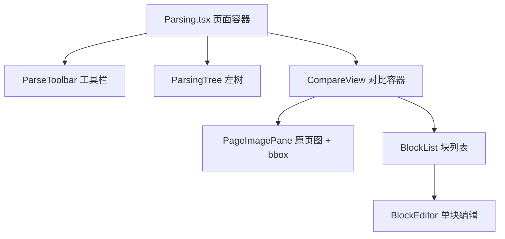

# 文档解析管理 UI 设计（parsing-ui）

设计状态：Accepted
实现状态：Not Started
最后更新：2026-09-14
确认状态：已确认
关联代码：`web-ui/src/pages/Parsing.tsx`、`web-ui/src/stores/parsing.ts`、`web-ui/src/api/axiom.ts`、
`web-ui/src/components/parsing/`（待新增：ParsingTree/ParseToolbar/CompareView/PageImagePane/BlockList/BlockEditor）
关联测试：`web-ui/src/pages/Parsing.test.tsx`、`tests/contract/test_design_documents.py`（本文件入 CURRENT_DOCUMENTS）
关联 ADR：[ADR 0014](../adr/0014-parsing-ownership-and-model-boundary.md)（解析能力归属与模型边界）、[ADR 0007](../history/adr/v0.1/0007-qed-engine-backend-gateway.md)（前端唯一入口 8900）
关联设计：[frontend-architecture.md](../architecture/frontend-architecture.md)（8903 信息架构与视觉规范）、
[downloads-ui.md](downloads-ui.md)（左树与状态点风格参照）、
[local-model-management.md](local-model-management.md)（模型生命周期操作面）

> **本文档定位**：文档解析管理页（`#/admin/parsing`）的 **UI 设计文档**——信息架构、组件拆分、
> 状态模型、交互规范、态与降级、视觉。后端全链路（af_* 表、8902 契约、产物布局）归
> [与 Axiom-Flow 交互全链路](../plans/2026-09-14-parsing-management-axiom-flow-chain.md)；
> 模型启停/探针归 [local-model-management.md](local-model-management.md)。
> 2026-09-14（ARCH-020 重构轮）由 PLAN-043 定稿晋升。

## 1. 背景与演进

- 2026-08-18：解析进度页改名「文档解析管理」，落地「左树右对照」单视图（书目树 + 原页图 +
  块级判定，落库 `af_block_reviews`）。
- 2026-09-14（ARCH-020，[ADR 0014](../adr/0014-parsing-ownership-and-model-boundary.md)）：
  模型生命周期归 8900、解析管线归 Axiom-Flow；块判定扩展为**块编辑**（判定/备注/文字修正/
  范围修改，落库 `af_block_edits`）；原页图叠加语义 bbox 方框与双向联动；工具栏「同步」与
  「刷新」合并为单一按钮。旧 `BlockView.tsx` 退役。

## 2. 信息架构与路由

- 路由保持 `#/admin/parsing`（AdminLayout 嵌套，菜单项「文档解析管理」不变）；
- 页面容器沿用现有外层：`Layout.Content`（`padding 24`、`maxWidth 1600`、`width 96%`、居中）
  + 顶部标题行（`文档解析管理` + 右侧工具栏）；
- 单视图左右分栏：左树 `Col lg=7`、右侧对比 `Col lg=17`（xs 断点单列堆叠）。

## 3. 组件树与职责



| 文件 | 职责 | 状态 |
| --- | --- | --- |
| `web-ui/src/pages/Parsing.tsx` | 页面容器：布局、顶部标题、工具栏挂载、全局横幅（8900 错误 / 8902 降级 / 同步结果） | 改造 |
| `web-ui/src/components/parsing/ParseToolbar.tsx` | 工具栏：页码选择、上/下页、解析本页/全书、刷新、编辑模式开关 | 新增 |
| `web-ui/src/components/parsing/ParsingTree.tsx` | 左树：领域→课程→书目（进度徽标 + 状态点），默认展开与选中态 | 新增 |
| `web-ui/src/components/parsing/CompareView.tsx` | 右侧容器：书目标题、页数据编排、态分流 | 新增 |
| `web-ui/src/components/parsing/PageImagePane.tsx` | 原页图 + bbox overlay（hover/选中/编辑拖拽缩放） | 新增 |
| `web-ui/src/components/parsing/BlockList.tsx` | 块列表渲染（KaTeX/Markdown/表格）+ 选中联动 | 新增 |
| `web-ui/src/components/parsing/BlockEditor.tsx` | 单块编辑：文字修正（公式为 LaTeX 源码）+ 判定/备注 Popover | 新增 |
| `web-ui/src/components/parsing/blocks.ts` | 块渲染工具（`tryRenderKatex`/`renderInlineMath`/`blockText`/`TYPE_LABELS`） | 新增 |
| `web-ui/src/stores/parsing.ts` | 树/页/任务/编辑状态与动作 | 重构 |
| `web-ui/src/api/axiom.ts` | 8900 适配端点封装与类型 | 扩展 |

复用与退役：KaTeX 渲染逻辑从 `components/BlockView.tsx` 抽到 `components/parsing/blocks.ts`；
`BlockView.tsx` 退役（判定迁入 `BlockEditor`，渲染迁入 `BlockList`）。

## 4. 状态模型（stores/parsing.ts）

```ts
interface ParsingStore {
  // 树
  tree: ParsingTreeNode[];
  treeLoading: boolean;
  treeError: string | null;
  // 全局降级
  error: string | null;        // 8900 不可达
  dataError: string | null;    // 8902 离线（503）
  syncing: boolean;
  syncMessage: string | null;
  syncError: string | null;
  // 选中
  compareBookId: string | null;
  comparePageNo: number | null;
  selectedBlock: number;       // -1 无选中
  editMode: boolean;           // 只读 / 编辑
  // 页数据
  pageData: PageData | null;   // { page_no, image_url, markdown, blocks, edits }
  pageLoading: boolean;
  pageError: string | null;
  // 解析任务
  activeJob: ParseJob | null;
  jobPolling: boolean;
  // 编辑
  editSubmitting: boolean;
  // 动作
  fetchTree: () => Promise<void>;
  refresh: () => Promise<void>;               // 同步书目 + 重载树 + 重载当前页
  openBook: (bookId: string) => Promise<void>; // ingest（未 ingest 时）+ 载入第 1 页
  loadPage: (bookId: string, pageNo: number) => Promise<void>;
  selectBlock: (index: number) => void;
  setEditMode: (on: boolean) => void;
  submitEdit: (input: BlockEditInput) => Promise<void>;
  createParseJob: (pages?: number[]) => Promise<void>;  // 本页/全书
  clearCompare: () => void;
}
```

规则：

- `refresh` 是唯一同步入口：`POST /books/sync` → `GET /parsing/tree` → 重载当前页；同步失败不
  阻塞树与页展示（`syncError` 提示）；
- `openBook`：先 `GET /books/{id}` 判 `ingest_status`，非 `ingested` 时 `POST /books/{id}/ingest`
  并等待，再 `loadPage(id, 1)`；
- `loadPage` 并发保护（`pageLoading` 时忽略重复调用）；切页时清空 `selectedBlock`；
- 编辑提交后以响应合并回 `pageData.edits`（不整页重拉），保证回显。

## 5. 数据契约（8900 端点映射）

| UI 动作 | 端点 | 请求/响应要点 |
| --- | --- | --- |
| 加载树 | `GET /parsing/tree` | `ParsingTreeNode[]`（8902 离线 → 仅领域→课程） |
| 刷新 | `POST /books/sync` → `GET /parsing/tree` → `GET /books/{id}/pages/{no}` | `SyncResult` → 树 → 页数据 |
| 打开书目 | `GET /books/{id}` | `BookMeta`（`ingest_status`/`parse_status`/`pages_done`） |
| 自动 ingest | `POST /books/{id}/ingest` | `{book_id,page_count,sha256,ingest_status}` |
| 载入页 | `GET /books/{id}/pages/{no}` | `{blocks, markdown, image_url, edits}`（edits 已合并） |
| 原页图 | `GET /books/{id}/pages/{no}/image` | `image/png`（8900 代理，浏览器只连 8900） |
| 解析本页/全书 | `POST /parse-jobs` | `202` `{book_id, pages?, engine?}` → `ParseJob` |
| 轮询任务 | `GET /parse-jobs/{id}` | `ParseJob{status, progress:{parsed,total,error}}` |
| 保存编辑 | `PUT /books/{id}/pages/{no}/blocks/{index}/edit` | `{verdict?, note?, corrected_text?, corrected_bbox?}` → 编辑记录 |
| 页内编辑列表 | `GET /books/{id}/pages/{no}/edits` | `EditRecord[]`（可选，用于独立刷新编辑态） |

类型新增/调整（`api/axiom.ts`）：

- `BookMeta` 更新：`ingest_status`（`none|ingesting|ingested|failed`）、`parse_status`
  （`pending|parsing|completed|failed`）、`pages_done`、`page_count`、`authors`、`part`、
  `display_title`；旧 `author`/`strategy` 兼容保留可选。
- `PageData`：`{ page_no, image_url, markdown, blocks: BlocksPage | Block[] | null, edits: BlockEdit[] }`。
- `BlockEdit`：`{ verdict: '' | 'ok' | 'bad', note, corrected_text?, corrected_bbox?, edited_at, updated_at }`。
- `ParseJob`：`{ job_id, book_id, pages, engine, status, progress: {parsed,total,error}, created_at, started_at, finished_at }`。
- 端点封装：`syncBooks`、`getParsingTree`、`getBook`、`ingestBook`、`getBookPage`、
  `putBlockEdit`、`getPageEdits`、`createParseJob`、`getParseJob`（旧 `putBlockReview`/
  `getBlockReview` 随 `af_block_reviews` 退役）。

## 6. 左侧树（ParsingTree）

- 数据源：`GET /parsing/tree`（8900 聚合共享表领域/课程 + 8902 af_books）；
- 层级与节点：
  - 领域节点：名称 + `N 门课程`；
  - 课程节点：名称 + `N 本`；
  - 书目节点：`display_title || title` + 进度徽标 `pages_done/page_count` + 状态点
    （`pending` 灰 / `parsing` 蓝 / `completed` 绿 / `failed` 红）；
- 默认展开首个领域及其全部课程；点击书目 → `openBook(book_id)`；选中态高亮；
- 树为空时按原因显示空态（加载失败 / 8902 离线 / 无数据）；
- 降级：8902 离线时仅展示领域→课程（书目为空 + 黄色横幅）。

## 7. 工具栏（ParseToolbar）

- 页码选择器（`Select`，`第 N 页`，范围 `1..page_count`）+ 上一页/下一页；
- 「解析本页」：`POST /parse-jobs {book_id, pages:[current]}`；
  「解析全书」：`POST /parse-jobs {book_id}`；提交后轮询 `GET /parse-jobs/{id}`，显示
  `progress.parsed/progress.total`，完成后刷新当前页与树进度；
- 「刷新」：`refresh()`——**同步与刷新同一按钮**，不单设「同步」按钮；
- 编辑模式开关：只读 / 编辑（避免浏览时误改）；关闭编辑模式时放弃未保存草稿。

## 8. 对比区（CompareView）

态分流（按优先级）：

1. 未选书目：`Empty`「请选择书目」；
2. `ingest_status != ingested`：原页图占位 + 「正在准备页图…」/「解析本页」入口（自动 ingest）；
3. 已 ingest 未解析（`pageData.blocks` 为空且 `parse_status=pending`）：原页图 + 空态
   「该页尚未解析」+ 「解析本页」入口；
4. 已解析：`PageImagePane` + `BlockList` 并排（`lg=11 / lg=13`）；
5. 页加载失败：`Alert` + 重试。

`PageImagePane`：

- 原页图（`GET /books/{id}/pages/{no}/image`）+ bbox 方框叠加（每块一框，按块类型着色）；
- hover 高亮、点击选中（与 `BlockList` 联动）；
- 编辑模式下选中框可拖拽移动、四角/四边缩放改范围；坐标夹紧页图边界，最小尺寸约束。

`BlockList` + `BlockEditor`：

- 块级渲染复用 `blocks.ts`（heading 分级、formula KaTeX、table HTML、list、image、caption 等）；
- 点击块与左图联动选中；选中块高亮并滚动到可视区；
- `BlockEditor` 提供文字修正（公式编辑 LaTeX 源码）+ 判定/备注 Popover；
- 保存：`PUT /books/{id}/pages/{no}/blocks/{index}/edit`，`{verdict, note, corrected_text, corrected_bbox}`；
- 回显：进入页时拉取页数据（blocks + 已合并 edits），刷新后保持；有编辑的块显示标记（判定 Tag + 修正角标）。

## 9. bbox 交互规范

- **坐标系**：原页图像素坐标 `[x0, y0, x1, y1]`（左上原点），基准为 `pages/pXXXX.png`；
  overlay 用相对百分比定位（`left/top/width/height` = 坐标 / `image_size`），随图自适应缩放；
- **颜色**：按块类型固定色板（heading/paragraph/formula/table/image/…），半透明填充 + 实线边框；
  选中态加粗高亮（`#1677ff`），hover 态提升透明度；
- **编辑**：`editMode` 下选中框显示 8 个手柄（四角 + 四边）；拖拽/缩放实时更新草稿，
  松手不自动保存（由「保存」提交）；
- **约束**：夹紧到 `[0,0,image_size]`；最小尺寸（如 8px）防止退化；x0<x1、y0<y1；
- **无 bbox 块**：不在图上画框（仅列表可选中），标注「无坐标」。

## 10. 状态与降级矩阵

| 场景 | 判定 | 表现 |
| --- | --- | --- |
| 8900 不可达 | 请求失败（非上游 503） | 顶部错误横幅 + 「刷新」重试；树/页显示空态 |
| 8902 离线（503） | 数据域请求 503 | 黄色降级横幅；树仅领域→课程；书目/页不可用 |
| 8901 离线 | `POST /books/sync` 503 | 同步失败提示（不阻塞查看已同步书目） |
| 未 ingest | `ingest_status != ingested` | 自动 ingest + 进度；失败显示原因与重试 |
| 未解析页 | `blocks` 为空 | 原页图 + 「该页尚未解析」+ 解析入口 |
| 解析任务进行中 | `activeJob.status ∈ queued/running` | 工具栏进度条 + 树状态点蓝色；禁用重复提交 |
| 解析失败 | `pageError` / `job.status=failed` | 错误提示 + 重试入口；树状态点红色 |
| 模型服务离线 | 8902 返回 503 | 解析任务 failed（错误原因由后端给出） |

## 11. 视觉规范

- 配色与对比度遵循[前端架构](../architecture/frontend-architecture.md)（蓝白主体、状态色配同色系浅底、
  字体与背景大区分、响应式栅格、theme token 统一）；
- bbox 方框按块类型固定色板，选中态加粗高亮；状态点与进度徽标复用 downloads 树的风格 token；
- 左树沿用 `downloads.css` 的 `dl-tree-*` 类（领域/课程/书目层级与选中态）。

## 12. 与现有实现的差异（改造清单）

| 现状 | 目标 | 处理 |
| --- | --- | --- |
| `Parsing.tsx` 内联左树与对照布局 | 拆为 `components/parsing/*` | 重构 |
| `BlockView.tsx` 渲染 + 判定耦合 | 渲染迁 `BlockList`，判定迁 `BlockEditor` | 退役 `BlockView.tsx` |
| `af_block_reviews`（`verdict/note`） | `af_block_edits`（+ `corrected_text/corrected_bbox`） | store/api 改造 |
| 无 bbox overlay | `PageImagePane` bbox 叠加 + 拖拽缩放 | 新增 |
| 无 ingest / 解析任务 | `openBook` 自动 ingest + `createParseJob` 轮询 | 新增 |
| `pages_done` 由 manifest 推导 | 用 `af_books.pages_done`（manifest 兜底） | 调整 |
| 树无状态点/进度徽标 | 状态点 + `pages_done/page_count` 徽标 | 新增 |

## 13. 验收

- 前端门禁：`cd web-ui && npx tsc -b`（零错）+ `npm test`（vitest）+ `npm run build`（成功）；
- 后端契约：`pytest tests/test_api.py -q`（8900 适配端点用例）；
- 浏览器手动验收（8902 在线）：
  1. 树按领域→课程→书目展示，进度徽标与状态点正确；
  2. 未解析书目点开后自动 ingest 页图，显示原页图 + 「未解析」空态；
  3. 「解析本页」/「解析全书」提交后进度可见，完成后对照渲染；
  4. 原页图 bbox 与块列表双向联动选中；
  5. 文字修正 / bbox 拖拽缩放 / 判定 / 备注保存后刷新回显；
  6. 「刷新」按钮完成同步书目 + 重载树/页；
  7. 8902 离线降级显示正常。

## 14. 回滚与演进

- 回滚：恢复 `Parsing.tsx` / `stores/parsing.ts` / `api/axiom.ts` 到重构前版本，删除
  `components/parsing/`；`BlockView.tsx` 从 Git 锚点恢复；影响范围仅解析管理页。
- 演进：实现状态随 ARCH-020-D 推进更新；后端全链路契约以
  [与 Axiom-Flow 交互全链路](../plans/2026-09-14-parsing-management-axiom-flow-chain.md) 为准，
  其定稿后与本文档合并评估归属（`parsing-flow` 位）。
