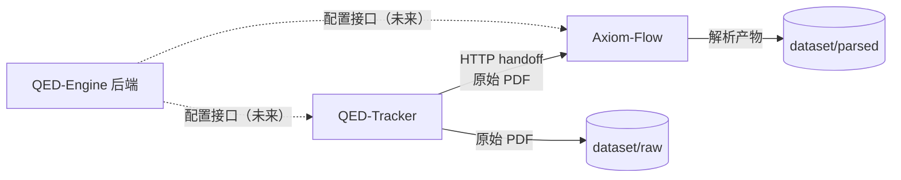

# 三项目对接规范

设计状态：Draft
实现状态：Not Started
最后更新：2026-08-04
关联代码：无（本轮仅定规范）
关联测试：无
关联 ADR：无

## 目的与边界

本文件定义 QED-Engine、Axiom-Flow、QED-Tracker 三个项目的对接点与边界。四服务各自的内部
细节以各项目自身文档为准；本文件只描述跨项目契约。

## 服务边界与数据流

| 对接点 | 现状 | 目标 |
| --- | --- | --- |
| QED-Tracker → Axiom-Flow | HTTP handoff：`axiom push`（默认 `http://127.0.0.1:8000`） | 保持 HTTP，地址由配置注入 |
| Axiom-Flow → dataset/parsed | 产物写入自身 `data/` | 写入根 `dataset/parsed/`（后续改造） |
| QED-Tracker → dataset/raw | 数据根指向自身 `data/` | 指向根 `dataset/raw/`（后续改造） |
| QED-Engine 后端 → 子项目 | 无 | 统一配置接口（未来：env 注入或 HTTP） |

## 独立性约定

- Axiom-Flow 与 QED-Tracker 未启动时，QED-Engine 前端对话/展示必须正常，管理界面显示服务离线。
- QED-Engine 后端离线时，前两者用本地默认配置降级运行。
- 三个项目各自独立部署、独立升级，不共享 Python 包、数据库或代码仓库。
- 跨项目传递只通过：HTTP 接口、共享 dataset 目录、环境变量（见
  [统一配置与密钥规范](configuration-and-secrets.md)）。

## 现状差距与后续改造

| 差距 | 影响 | 改造归属 |
| --- | --- | --- |
| 子项目数据目录指向自身 `data/`，未指向根 `dataset/` | 产物不集中 | 后续轮次，在各自仓库内改配置并遵守其门禁 |
| QED-Engine 后端未实现 | 无配置接口 | QED-Engine 建设轮 |
| 密钥未集中 | 各项目自行配置 | 本轮已在根 `.env` 集中（见配置规范） |

## 执行与验证

- 对接点变更（协议、地址、字段）必须先更新本文件并登记 ADR。
- 验证子项目对接时，以各自 README 与测试门禁为准。
