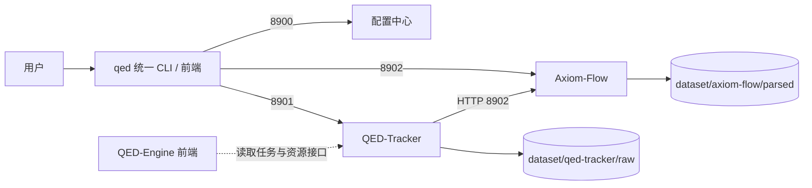

# 三项目对接规范

设计状态：Accepted
实现状态：In Progress
最后更新：2026-08-05
关联代码：子项目各自仓库（`Axiom-Flow/`、`QED-Tracker/`）、`scripts/load-env.ps1`、`src/qed_engine/tracker_client.py`（8901 客户端实现）
关联测试：`tests/test_api.py`、`tests/test_config.py`、`tests/test_tracker_client.py`、`tests/test_web.py`；子项目各自契约测试
关联 ADR：[ADR 0002](../adr/0002-frontend-and-port-centralization.md)

## 目的与边界

本文件定义 QED-Engine、Axiom-Flow、QED-Tracker 三个项目的对接点与边界。四服务各自的内部
细节以各项目自身文档为准；本文件只描述跨项目契约。

## 服务边界与端口

| 端口 | 服务 | 形态 | 状态 |
| --- | --- | --- | --- |
| 8900 | QED-Engine 配置中心 | FastAPI，`/api/v1` | 已运行 |
| 8901 | QED-Tracker 服务 | FastAPI，`/api/v1`；写操作为后台任务 + 轮询 | 服务化轮（尚未实现） |
| 8902 | Axiom-Flow 服务 | FastAPI（原 8000） | 端口迁移轮（当前 8000） |
| 8903 | QED-Engine 前端 | `web/`（学习+管理+审阅工作台） | 规划 |

## 对接点

| 对接点 | 现状 | 目标 |
| --- | --- | --- |
| QED-Tracker → Axiom-Flow | HTTP handoff：`axiom push`（默认 `http://127.0.0.1:8000`） | 地址默认 `http://127.0.0.1:8902`，由配置注入（`QED_AXIOM_URL`） |
| QED-Tracker → dataset/raw | 数据根指向自身 `data/` | 指向 `dataset/qed-tracker/`（Phase 2） |
| Axiom-Flow → dataset/parsed | 产物写入自身 `data/` | 写入 `dataset/axiom-flow/parsed/`（Phase 3） |
| QED-Engine 统一 CLI/前端 → 子项目 | 无 | HTTP 调用 8901/8902；地址默认 localhost 端口，可配置 |
| QED-Engine 配置中心 → 子项目 | 密钥直读根 `.env`（经 `load-env.ps1` 映射） | 子项目直读 `QED_*` 变量，映射层退役 |
| 三个项目 → MySQL | Axiom-Flow 用 `xqfm11` 库；QED-Tracker 无库 | 统一 MySQL 8 `qed` 库：QED-Tracker `qt_*`、Axiom-Flow `af_*`，`QED_DB_*` 唯一事实源 |
| QED-Tracker → 资源登记 | JSON `meta/resources/` | JSON 保留文件状态事实 + MySQL `qt_resources` 查询索引（双写） |

## 统一数据库（MySQL 8，qed 库）

2026-08-04 用户裁决、[ADR 0003](../adr/0003-shared-qed-database-independence.md) 登记：新建
MySQL 8 `qed` 库，三个项目共用同一实例与库（表命名空间隔离，属独立性铁律的明确例外）。

- 表命名空间隔离：QED-Tracker 使用 `qt_*` 前缀，Axiom-Flow 使用 `af_*` 前缀；互不读取对方表。
- 凭据与库名来自根 `.env` 的 `QED_DB_*`（唯一事实源，见
  [configuration-and-secrets.md](configuration-and-secrets.md)）；密码绝不下发到任何接口响应。
- 存量库 `xqfm11`（Axiom-Flow 运行库）不迁移、不改名；`qed` 库由各项目 Alembic 独立初始化，
  互不影响。
- 资源登记双写契约：QED-Tracker 下载登记时 `meta/resources/<sha256>.json` 保持为文件状态事实，
  MySQL `qt_resources` 为查询/展示索引；登记顺序为先落盘后登记，失败可重放（详见 QED-Tracker
  `docs/design/tracker-service.md`）。

## QED-Tracker 服务接口契约（8901，Phase 2 落地）

- 前缀 `/api/v1`；`GET /health` 存活检查。
- 只读查询（搜索、资源列表、选择报告、目录）同步返回；CORS 允许 `http://127.0.0.1:8903` 源
  （8903 下载工作台直连本服务，无代理）。
- 资源清单与状态机（2026-08-05 用户裁决，人机协同闭环；2026-08-06 QED-017 增补人工评估三态；
  2026-08-07 QED-020 增补评审建议）：
  - `GET /resources?status=&course_id=&kind=&language=`、`GET /resources/{id}` 同步查询；
  - 状态机 `candidate → confirmed → downloading → downloaded → approved / rejected`
    （+ `failed` 终态可重试；`pending_manual`/`not_found` 为登记辅助状态；
    `backup` 备选态：candidate→backup→{confirmed,rejected}，pending_manual 可直接转 backup）；
  - `GET /resources/{id}/file` 返回 PDF 预览流（仅 downloaded/approved 可访问，供 8903 验收台）；
  - `POST /resources/{id}/confirm`（candidate/backup→confirmed）、`POST /resources/{id}/backup`
    （candidate/pending_manual→backup，人工评估"备选"）、`POST /resources/{id}/approve`
    （downloaded→approved）、`POST /resources/{id}/reject {reason}`（candidate/backup 或
    downloaded→rejected；reason 必填；后者同步硬删文件，DB 记录保留留痕）——同步轻量写操作；
    confirm/backup/reject 三接口接受可选 `note` 参数（人工评审建议，落 `qt_resources.review_note`，
    资源查询返回该字段）；
  - 人工评估三态：**确定**=confirm、**备选**=backup（不下载，可转正/放弃）、**否定**=reject；
    中文教材候选确定优先，中文不可得时英文候选由人工决定；评估与下载后验收分离。
- 写操作（下载、论文推荐、目录批处理、扫描、Axiom 推送、**评估**）一律创建**后台任务**：
  - `POST /tasks/...` 立即返回 `task_id`；`GET /tasks/{id}` 轮询状态与结果；
  - 状态机 `queued → running → succeeded / failed`；进度字段 0–100；
  - 任务记录落盘 `meta/tasks/<task-id>.json`，服务重启后历史可见；
  - 下载任务完成后 `result.relative_path` 指向 `dataset/qed-tracker/raw/` 内成品路径；
  - 同 sha256 已登记时直接 `succeeded` 并复用既有记录（幂等）；
  - `POST /tasks/catalog/evaluate {course_id?}`：按课程批量评估任务（搜索源 → qwen 评估 →
    候选落库，candidate 状态；course_id 缺省=全目录；缺模型密钥时降级跳过评估仅落候选）；
    已评估目标（backup/approved/rejected 行）跳过不重复推荐。
- 该接口同时供统一 CLI（等待模式）与 QED-Engine 前端（轮询/展示模式）调用。

## 8903 QED-Engine 前端（web/）

原生静态单页应用（无构建步骤），`python -m http.server 8903 --directory web` 直接托管；
浏览器直连 8900（配置横幅）与 8901（资源/任务），无后端代理。

- 组成：`web/index.html`（页面外壳）、`web/app.js`（hash 路由与数据渲染）、`web/style.css`（样式）。
- 信息架构（hash 路由，2026-08-06 三期 + 四期 ARCH-004 + 五期 ARCH-005）：
  - `#/` 主体学习界面：**零后台痕迹**（五期）——品牌导航 + Hero 标语 + 三项入口卡片
    （知识点梳理 / 学习 / 刷题模式，建设中）+ 右上角「使用手册」按钮（内置弹窗，全模块短步骤）
    与「管理后台」入口；不展示任何服务状态（服务健康全部移入仪表盘）；
  - `#/admin` 管理后台（六期裁决：取消「模块总览」卡片墙）——**直达仪表盘**（#/admin 为
    #/admin/dashboard 别名路由），无中间层；
  - `#/admin/dashboard` 后台仪表盘（四期独立路由；五期重写）：
    **四阶段流水线**（十期起按课程统计：总课程数 = `/catalogs/math-qe` targets 去重 course_id
    **动态计算**，不硬编码）：
    - 发现下载（宽松口径）：课程下存在任一资源（candidate/backup/pending_manual/confirmed/
      not_found 等）即完成；
    - 评估确认（严格口径）：课程有资源 且 课程内无待评估资源（status ∉ candidate/pending_manual，
      confirmed/backup/rejected/not_found 均为评估终态）才算完成；
    - 阶段数字显示「已完成 X / N 课程」（不显示孤立数字），进度条 = X/N；
    - 解析/知识整理：无数据源显示「未启用」，8901 离线流水线整体离线提示）+
    **服务健康分组面板**（八期语义收敛）：
    - **后台服务**：QED-Tracker（文档下载服务）/ Axiom-Flow（文档解析服务）/
      QED 管理服务（后台管理服务，即 8900 配置中心）三服务健康探测；**在线仅绿点+名称
      （不写原因），离线附原因文案**；
    - **LLM配置**：只显示三个实际使用模型（8900 `/config/models` 路由表
      主模型 default / 视图模型 ocr / Embedding embedding 的 configured=true 项，
      如「主模型：qwen-plus」；切换档 glm/glm_ocr 与占位档 deepseek 不显示，
      不再逐 provider 展示联通状态）；
    - **数据库配置**：仅 MySQL（8900 `/config/database` 真实连接探测）；向量数据库未配置
      不展示占位；异常项展开问题文案；
    旧统计卡/环形图/条形图已移除；
  - `#/admin/downloads` **知识点**（四期下载管理，五期改名，十一期改版）：**三层知识链路树
    （领域 → 课程 → 书籍）**，无总根节点：
    - 领域层自适应（catalog_id → 学科映射 `CATALOG_DOMAIN_MAP`，当前 math-qe → 数学，
      未来多领域自动出现），显示课程数；
    - 课程层按**学习深度排序**（前端 `COURSE_ORDER`：01 数学分析 → 02 线性代数 → 03 拓扑 →
      04 实分析 → 05 复分析 → 06 泛函分析 → 07 常微分方程 → 08 偏微分方程 → 09 抽象代数 →
      11 概率论 → 12 随机过程 → 13 高维概率 → 10 考前综合；先学的在前、依赖后续的在后，
      未列入新课程排尾）；
    - 书籍层：**书名 + 作者 + 类型徽标**（kind：book→教材 / exercise→习题集 / 其他→资料），
      数据源 `/catalogs/math-qe`；
    - **课程完成判定**：≥1 本教材 + ≥1 本习题集均**验收通过（approved）** 才算完成——课程行
      显示「✅ 已完成」或进度「教材 a/b · 习题集 c/d」（03 拓扑/10 考前综合/13 高维概率
      当前无习题集，如实显示无法完成）；
    - **PyCharm 式树交互**：行式紧凑 + 缩进引导线；**箭头=展开/折叠（不触发选中）、
      名称=选中过滤面板**（领域/课程/书籍均可选）；
    - 树默认固定宽 **400px**（28 寸优先），**拖拽手柄 tree-resizer 调整 280–640px**，
      localStorage（键 `qed-tree-w`）记忆；
    面板展示选中范围资源事务（确认/备选/否定/转正/拒绝/验收/详情），**筛选器为按钮弹层
    （五期：领域/课程/状态，浅底深字，与树选择独立叠加 AND）** + 触发评估（范围跟随「课程」筛选，
    未选=全目录），评估任务列表并入面板（1s 轮询，任务按 状态/类型/课程 弹层筛选）；
    **十二期增强**：① 面板按范围展示**全部书籍**（领域/课程/书籍选中时：未生成候选的目标显示
    「待评估」虚线占位卡【书名+作者+类型徽标】，已评估目标显示资源卡片，按学习深度排序）；
    ② **树→筛选器单向联动**：点领域→领域筛选=该领域、课程清空；点课程→领域=所属领域、
    课程=该课程（`courseDomain` 映射），点书籍不改筛选；③ **课程筛选项随领域收窄**（领域已选时
    只列该领域课程）；
    **十三期：控制台化**——选中课程后面板顶部出现**课程操作条**（`course-console`）：「① 搜索书籍」
    按钮（按选中课程发起 AI 搜索评估，8901 `/tasks/catalog/evaluate`，不选课程提示先选课）+
    **步骤进度条**（搜索→确认→下载→验收，idle/进行/完成 三态，1s 任务轮询自动刷新）；
    工具栏全局「触发评估」按钮移除（评估以课程为单位操作）；树行点击已修复事件冒泡
    （点课程不再误选为领域，十三期回归守护）；
    **十四期（人工评审优化，ARCH-006）**：① 知识点界面尾部「评估任务」区块（任务卡片列表 +
    任务状态/类型/课程三个筛选器）移除（任务数据仅用于步骤条搜索态，`/tasks` 仍拉取）；
    ② 资源卡三态按钮（确定/备选/否定）旁新增**评审建议输入框**（`review-note`，选填），
     随三态一并提交 `note` 参数（8901 confirm/backup/reject 落 `qt_resources.review_note`），
     卡片与详情弹窗展示既有建议（`review_note` 字段）；
    **十五期（ARCH-007）**：① 界面名回归——侧边栏菜单与页面标题改回**「文档下载管理」**
     （树侧栏头保留「知识点」）；② 进入默认选中「数学」领域（`loadTree` 完成后无选择时
     `selectNode("domain", "数学")`）；③ 领域级右侧按课程分页（`PAGE_SIZE = 3`，`coursePagerHtml`
     翻页控件，左右两栏等高 align-items: stretch），课程级/书籍级保持现状；
     ④ 同课程配套教材+习题集（作者集排序后 join 相同）`paired-row` 并排同一行。
  - `#/admin/parsing` 解析进度、`#/admin/compare` 原始文档对照——**事务视图，无数据源时置空**
    （空态提示），数据管线就绪后填充（REQ-015 / ALN-006 / QED-012 前置）；**「追溯」界面
    （#/admin/trace）已随六期裁决移除**；
  - 侧边栏菜单（六期收敛为四项独立界面；十一期改名，十五期界面名回退）：仪表大盘 / 文档下载管理 /
    文档解析进度 / 原始文档对照。
- 详情弹窗（四期统一评估视角）：资源/任务详情标注 **课程→书籍（课程名+领域+目标标题）、
  类型/中英/来源（provider + page_url）、LLM 简介评分、下载详情（relative_path/page_count/sha256）、
  解析目标建议徽标（verdict + score）**；任务详情显示 params.course_id 对应的课程与领域。
- 横幅（三期粗粒度化；八期去向量库占位）：只显示「LLM评估模块连接：OK / MySQL数据库连接：OK」，
  不透露 provider 名单与主机细节。判定：LLM=任一已配置供应商可达（8900 `/config/llm-status` 探测）；
  MySQL=8900 `/config/database` 真实连接探测（pymysql）；未配置显示「未配置」，配置但不可达显示
  「不可用/连接失败」。
- 视觉规范（DeepSeek 蓝黑风格，非纯黑）：背景 `#0e1424` + 顶部蓝紫光晕；卡片
  `rgba(77,107,254,0.07)` + 边框 `rgba(148,163,255,0.12)`；主渐变 `#4d6bfe → #8b7bff`；
  在线 `#34d399` / 离线 `#f87171`；圆角 12-16px。
- 响应式（自适应窗口）：≥1024px 侧边栏 220px；768–1024px 图标栏（树固定 240px）；≤768px 汉堡抽屉 +
  单列卡片 + 下载布局单列（树置顶限高 320px，拖拽手柄隐藏）；仪表盘图表单列。
- 契约引用（`tests/test_web.py` 守护）：`/api/v1/health`、`/config/keys`、`/config/models`、`/config/database`、
  `/config/llm-status`（8900）；`/resources`、`/tasks`、`/tasks/catalog/evaluate`、`/confirm`、
   `/backup`、`/reject`、`/approve`、`/file`、`/tasks/books/download`、`/catalogs/math-qe`（8901）；
   路由 `#/admin`（别名直达仪表盘）、`#/admin/dashboard`、`#/admin/downloads`、`#/admin/parsing`、
   `#/admin/compare`；十四期守护：`review-note`/`review_note` 在 app.js、`task-list`/任务筛选器
   不在 index.html；十五期守护：`文档下载管理` 在 index.html（菜单+标题 ≥2 处）、`知识点` 保留
   树头、`selectNode("domain", "数学")`/`PAGE_SIZE = 3`/`renderPanelByCourses`/`pairedCourseTargets`
   在 app.js。
- 独立性：8901/8902 离线时各视图显示离线提示、状态卡变红，不白屏不报错（见下节）。
- **8900（QED 管理服务）角色判定（2026-08-06 架构评审结论：保留）**：浏览器无法直读 `.env`
  且密钥不下发，8900 是 `.env` 的唯一只读语义代理；角色收敛为三——① 配置语义代理
  （`/config/models` 模型路由表，前端与子项目「用哪个模型」的答案源）；② 状态探测中心
  （`/config/llm-status`、`/config/database` 真实可达性探测）；③ 子项目对接契约（未来
  Axiom-Flow OCR 多后端 REQ-008 / QED-Tracker 服务化经 `/config/models` 取路由，不感知密钥）。
  当前子项目零消费 8900（直读 `.env`），最小保留面为现有五端点。

## 独立性约定

- Axiom-Flow 与 QED-Tracker 未启动时，QED-Engine 前端对话/展示必须正常，管理界面显示服务离线。
- QED-Engine 后端离线时，前两者用本地默认配置降级运行；无根 `.env` 时使用内置最小默认值并输出提醒。
- 三个项目各自独立部署、独立升级，不共享 Python 包或代码仓库；MySQL 例外为共享 `qed` 库实例
  （[ADR 0003](../adr/0003-shared-qed-database-independence.md)），以 `qt_*`/`af_*` 表命名空间
  隔离，互不读写对方表，各自 Alembic 独立初始化。
- 跨项目传递只通过：HTTP 接口、共享 dataset 目录、环境变量与表隔离的共享 qed 库（见
  [统一配置与密钥规范](configuration-and-secrets.md)）。

## 现状差距与后续改造

| 差距 | 影响 | 改造归属 |
| --- | --- | --- |
| QED-Tracker 无常驻服务，CLI 直接调库 | 无法被前端/统一 CLI 经 HTTP 调用 | 教材下载轮，子仓库内（QED-008~016） |
| 子项目数据目录指向自身 `data/` | 产物不集中 | 教材下载轮，子仓库内（QED-009 / ALN-003） |
| Axiom-Flow 端口 8000 | 端口段不统一 | 教材下载轮，子仓库内（ALN-002） |
| 密钥经 `load-env.ps1` 映射 | 双变量名并存 | 教材下载轮后退役映射层（QED-009 / ALN-003） |
| 数据库不统一：Axiom 用 `xqfm11`、QED-Tracker 无库 | 无法集中登记与查询 | 教材下载轮：统一 `qed` 库（QED-012 / ALN-003），存量库不迁移 |
| QED-Tracker 无 MySQL 资源登记 | 前端只能读 JSON 清单 | 教材下载轮：`qt_resources` 登记表（QED-012） |

## 执行与验证

- 对接点变更（协议、地址、字段、端口）必须先更新本文件并登记 ADR。
- 验证子项目对接时，以各自 README 与测试门禁为准。
