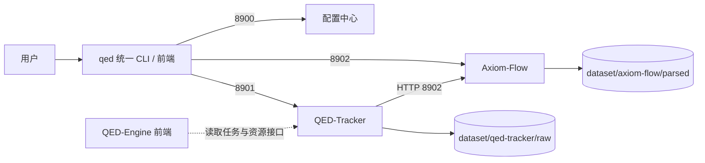

# 三项目对接规范

设计状态：Accepted
实现状态：In Progress
最后更新：2026-08-04
关联代码：子项目各自仓库（`Axiom-Flow/`、`QED-Tracker/`）与 `scripts/load-env.ps1`
关联测试：`tests/test_api.py`、`tests/test_config.py`；子项目各自契约测试
关联 ADR：[ADR 0002](../adr/0002-frontend-and-port-centralization.md)

## 目的与边界

本文件定义 QED-Engine、Axiom-Flow、QED-Tracker 三个项目的对接点与边界。四服务各自的内部
细节以各项目自身文档为准；本文件只描述跨项目契约。

## 服务边界与端口

| 端口 | 服务 | 形态 | 状态 |
| --- | --- | --- | --- |
| 8900 | QED-Engine 配置中心 | FastAPI，`/api/v1` | 已运行 |
| 8901 | QED-Tracker 服务 | FastAPI，`/api/v1`；写操作为后台任务 + 轮询 | 服务化轮（尚未实现） |
| 8902 | Axiom-Flow 服务 | FastAPI（原 8000） | 端口迁移轮（当前 8000） |
| 8903 | QED-Engine 前端 | `web/`（学习+管理+审阅工作台） | 规划 |

## 对接点

| 对接点 | 现状 | 目标 |
| --- | --- | --- |
| QED-Tracker → Axiom-Flow | HTTP handoff：`axiom push`（默认 `http://127.0.0.1:8000`） | 地址默认 `http://127.0.0.1:8902`，由配置注入（`QED_AXIOM_URL`） |
| QED-Tracker → dataset/raw | 数据根指向自身 `data/` | 指向 `dataset/qed-tracker/`（Phase 2） |
| Axiom-Flow → dataset/parsed | 产物写入自身 `data/` | 写入 `dataset/axiom-flow/parsed/`（Phase 3） |
| QED-Engine 统一 CLI/前端 → 子项目 | 无 | HTTP 调用 8901/8902；地址默认 localhost 端口，可配置 |
| QED-Engine 配置中心 → 子项目 | 密钥直读根 `.env`（经 `load-env.ps1` 映射） | 子项目直读 `QED_*` 变量，映射层退役 |

## QED-Tracker 服务接口契约（8901，Phase 2 落地）

- 前缀 `/api/v1`；`GET /health` 存活检查。
- 只读查询（搜索、资源列表、选择报告、目录）同步返回。
- 写操作（下载、论文推荐、目录批处理、扫描、Axiom 推送）一律创建**后台任务**：
  - `POST /tasks/...` 立即返回 `task_id`；`GET /tasks/{id}` 轮询状态与结果；
  - 状态机 `queued → running → succeeded / failed`；进度字段 0–100；
  - 任务记录落盘 `meta/tasks/<task-id>.json`，服务重启后历史可见；
  - 下载任务完成后 `result.relative_path` 指向 `dataset/qed-tracker/raw/` 内成品路径；
  - 同 sha256 已登记时直接 `succeeded` 并复用既有记录（幂等）。
- 该接口同时供统一 CLI（等待模式）与 QED-Engine 前端（轮询/展示模式）调用。

## 独立性约定

- Axiom-Flow 与 QED-Tracker 未启动时，QED-Engine 前端对话/展示必须正常，管理界面显示服务离线。
- QED-Engine 后端离线时，前两者用本地默认配置降级运行；无根 `.env` 时使用内置最小默认值并输出提醒。
- 三个项目各自独立部署、独立升级，不共享 Python 包、数据库或代码仓库。
- 跨项目传递只通过：HTTP 接口、共享 dataset 目录、环境变量（见
  [统一配置与密钥规范](configuration-and-secrets.md)）。

## 现状差距与后续改造

| 差距 | 影响 | 改造归属 |
| --- | --- | --- |
| QED-Tracker 无常驻服务，CLI 直接调库 | 无法被前端/统一 CLI 经 HTTP 调用 | Phase 2，子仓库内 |
| 子项目数据目录指向自身 `data/` | 产物不集中 | Phase 2/3，子仓库内 |
| Axiom-Flow 端口 8000 | 端口段不统一 | Phase 3，子仓库内 |
| 密钥经 `load-env.ps1` 映射 | 双变量名并存 | Phase 2 后退役映射层 |

## 执行与验证

- 对接点变更（协议、地址、字段、端口）必须先更新本文件并登记 ADR。
- 验证子项目对接时，以各自 README 与测试门禁为准。
