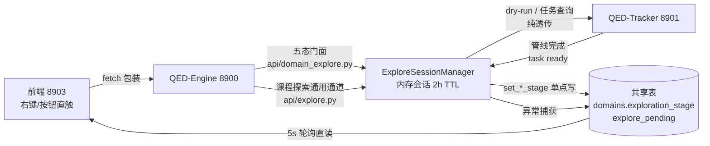

# 领域探索后端链路与端点契约（ARCH-019）

状态：In Progress
任务类型：A
最后更新：2026-09-08
关联 ADR：[ADR 0011](../../adr/v0.1/0011-pending-design-location.md)（待评审设计随计划承载，确定后迁 design/ 固定文档）
关联设计：[2026-08-27-download-ux-flow.md](../2026-08/2026-08-27-download-ux-flow.md)（PLAN-023，全流程交互规范主文档）、[2026-09-08-arch019-explore-ui-logic.md](2026-09-08-arch019-explore-ui-logic.md)（PLAN-033，前端 UI 逻辑配套）、[2026-08-27-exploration-download-flow.md2026-08-27-exploration-download-flow.md)（PLAN-022，技术架构参考）
关联 Tracker：docs/trackers/todo.md（本计划行 PLAN-034；ARCH-019、REQ-067；QED-Tracker 移交清单登记）
关联代码：backend/qed_engine/api/domain_explore.py、backend/qed_engine/api/explore.py、backend/qed_engine/services/explore_sessions.py、backend/qed_engine/services/shared_tables.py、backend/qed_engine/clients/tracker_client.py、backend/qed_engine/api/main.py、docs/architecture/api-contracts.md、tests/test_domain_explore.py（新建）、tests/test_explore_sessions.py（晋升 design/ 时按此行一次性切换 DesignRef）
归档判定：Merge 倾向——端点契约并入 docs/architecture/api-contracts.md（已登记部分直接生效），链路设计与写点矩阵并入 docs/design/ 领域探索固定文档，计划壳归档 history/plans/2026-09/

> **本文档定位**：领域探索后端链路（8900）与端点契约的设计事实源。覆盖 8900 双探索栈收敛、
> 终态写点矩阵、confirm-knowledge / explore-status 实装、契约登记、8901 缺口移交与冒烟方案。
> 前端 UI 逻辑见 [2026-09-08-arch019-explore-ui-logic.md](2026-09-08-arch019-explore-ui-logic.md)（PLAN-033）。

## 目标与成功标准

### 用户与场景

单管理员在文档下载管理页发起领域探索/导入后，8900 负责会话编排、状态落库与 8901 透传。
用户要求：等待可观测（5s 轮询可感知终态）、状态可恢复（刷新页面直读共享表）、失败可重试
（异常态落库 + 前端提示）。8900 对 8901 **纯透传 + 信任**：缺口不阻塞本侧，整理后移交 QED-Tracker。

### 本文档职责

1. 收敛 8900 **双探索栈**（`api/explore.py` 与未提交的 `api/domain_explore.py`）。
2. 落地**终态写点矩阵**：解决「全库无探索路径待确认写点」「confirm_domain_info 不写探索中」
   「失败不落库」「commit_import_courses 终态错写待确认」四个联调硬伤。
3. 实装 `confirm-knowledge`（现为 stub）与 `explore-status`（现不关联会话）。
4. 契约登记 5 端点至 api-contracts.md（解除 test_api_endpoint_inventory 红）。
5. 汇总 8901 缺口为**移交清单**，按跨项目协作规范登记。

### 成功标准

- 状态机六值（五态 + 失败）全部由 8900 写点驱动，前端零 exploration_stage 直写（配合 PLAN-033 §2.4）。
- `tests/test_domain_explore.py` 覆盖 5 端点全路径；`tests/test_explore_sessions.py` 回归不破。
- `conda run -n QED_env python -m pytest tests -q` 全绿，其中 test_api_endpoint_inventory 契约双向一致。
- 冒烟双路径通过（§11）。

## 范围与非目标

- **范围**：8900 领域探索相关端点（domain_explore.py 5 端点 + explore.py 会话通道）、
  explore_sessions.py 会话编排与写点、shared_tables.py 终态修正、契约登记、移交清单。
- **实现顺序（用户裁决 2026-09-08）**：先领域探索链路（确认领域 + 确认课程，到教程确认前）；
  教程批量下载/书籍生命周期操作依赖 8901 实现，本轮只做透传与降级提示。
- **非目标**：QED-Tracker（8901）侧任何代码改动；前端组件改造（PLAN-033）；书籍状态机 8 路由
  的补齐（移交）；LLM 网关与模型管理（ARCH-016 已完成域）。

## 前置条件

- [PLAN-023](../2026-08/2026-08-27-download-ux-flow.md) 状态机与操作规范为主文档；本文档状态口径与其 §3.2 一致
  （五态 + 失败）。
- `shared_tables.py` 已有六常量 `STAGE_NOT_STARTED/STAGE_GENERATED/STAGE_RUNNING/STAGE_PENDING/
  STAGE_COMPLETED/STAGE_FAILED` 与 `set_*_stage` 单点写入门面。
- 8901 API 信任清单（已有）：`POST /domains/{id}/dry-run-explore`、`GET /tasks/{task_id}`、
  `POST /knowledge/{id}/fetch`（202 批量下载任务）、书籍/教程/课程读端点。
- 内存会话栈（`ExploreSessionManager`，2h TTL）已承载 explore-sessions 5 端点并有 8 用例测试。

## 工作项

### §1 链路总图



要点：8900 是唯一写点；前端与 8901 之间无直连；共享表是唯一恢复源（8900 重启后轮询仍可直读
库态，内存会话丢失由 `active_session=false` 承接，不自动回写）。

### §2 端点×调用链总表 + 双栈收敛

双栈收敛裁决：**`api/domain_explore.py` 定位为「五态门面」**——面向领域探索状态机的五个操作端点，
内部委托 `ExploreSessionManager`（不重写编排逻辑）；**`api/explore.py` 保留为课程探索通用通道**
（explore-sessions 会话 CRUD，服务 ExploreFlowModal 课程流程）。两栈共用一个 Manager 实例与写点。

| 操作 | 8900 端点 | 内部函数 | 8901 上游 | 共享表写点 | 前端调用 |
| --- | --- | --- | --- | --- | --- |
| 发起探索 | `POST /api/v1/domains/{domain_id}/explore-knowledge` | domain_explore → `manager.start_domain_explore` | `POST /domains/{id}/dry-run-explore`（202） | 无（ready 时写） | `startDomainExplore` |
| 确认领域 | `POST /api/v1/domains/{domain_id}/confirm-domain` | domain_explore → 写点门面 | 无（本地决策） | `confirm_domain_info` 补写 RUNNING | `confirmDomainInfo` |
| 确认课程 | `POST /api/v1/domains/{domain_id}/confirm-knowledge` | domain_explore → apply 课程 | `GET /courses/{domain_id}` 校验 + PATCH 课程 | apply → COMPLETED；`commit_import_courses` 改 COMPLETED | `confirmCourseKnowledge` |
| 探索进度 | `GET /api/v1/domains/{domain_id}/explore-status` | domain_explore → 会话关联查询 | `GET /tasks/{task_id}`（兜底） | 读；active_session 标志 | 轮询辅助 |
| 导入领域 | `POST /api/v1/domains/import` | main（已有） | 8901 导入 / 本地 manual | `import_domain_manual` 写 GENERATED | DomainCard 导入 |

### §3 终态写点矩阵（核心裁决）

**全部写点经 `shared_tables.py` 的 `set_*_stage` 单点门面，前端禁写**（矩阵若评审有异议，只需改本表+写点函数）：

| 目标态 | 写入点（改后） | 现状差异（联调问题） |
| --- | --- | --- |
| 未开始 | 领域创建默认；失败重试入口（T1 补） | 重试写点现缺失 |
| 已生成 | `_finish_ready`（探索会话 ready）+ `import_domain_manual`（导入） | 已有，不变 |
| 探索中 | `confirm_domain_info` **补写 RUNNING**（确认领域即启动后台课程探索） | **现缺失**——确认领域后停在已生成，前端无法感知后台任务 |
| 待确认 | 会话 ready 时写 PENDING + `explore_pending={kind:'review_results', courses, domain_report}`；`_apply_domain` **由写 COMPLETED 改写 PENDING** | **现无探索路径写点**——管线完成后状态与库不一致，确认区无数据源 |
| 已完成 | `confirm_course_knowledge` → apply（显式确认）；`commit_import_courses` **由写 PENDING 改 COMPLETED** | 现 apply 直写完成但 commit 终态错写待确认，离线导入链路卡死在中间态 |
| 失败 | `_run_pipeline` 异常分支**补写 FAILED** + `explore_pending={kind:'failed', error}` | 现只改会话态不落库——重启后失败领域误显探索中 |

### §4 confirm-knowledge 实装（现 stub）

- **会话定位顺序**：显式 `session_id` → `_active_by_domain[domain_id]` 活跃会话 → 404
  （`_active_by_domain: dict[str, str]` 由 T1 在 start 时登记、ready/fail 时清理）。
- **payload**：`{selected: [course_name...]}`；**selected 缺省 = report 全量课程清单**（一键全收）。
- **行为**：① 校验会话态为 ready；② 对 selected 课程逐一 `PATCH /courses`（写 track/aliases/
  prerequisites/exploration_stage 等 8901 支持字段）；③ 8901 离线 → 409 降级：仅写本地
  `commit_import_courses` 语义（COMPLETED）+ `explore_pending` 留存，提示「离线已确认，8901 恢复后同步」；
  ④ apply 成功 → 写 COMPLETED + 清 explore_pending。
- **与导入链路的关系**：导入课程离线确认走同一函数（`explore_pending.kind='import_courses'` 分支），
  终态统一 COMPLETED（§3 矩阵行 5）。

### §5 explore-status 实装（现无会话关联）

响应扩展：

```json
{
  "domain_id": "...",
  "exploration_stage": "探索中",
  "active_session": true,
  "session_id": "sess_...",
  "session_state": "running",
  "task_id": "...",
  "explore_pending": null
}
```

- `active_session=false` 的判定：`_active_by_domain` 无该领域登记 **且** stage ∈ {探索中}。
  前端据此显示「探索会话已失效，请重试」（PLAN-033 §6），不做自动回写。
- 8901 离线兜底：跳过 task 查询，仅返回库态 + active_session（库态直读永远可用）。

### §6 前端配合项（实现归 PLAN-033，接口约束在此定格）

1. `explore-helpers.confirmCourseKnowledge` 的 `'current-session-id'` 占位作废：session_id 改为
   可选参数，缺省由后端活跃会话解析（§4 定位顺序）。
2. `tracker.ts` 中五个无调用方的 5 态封装（confirmDomainInfo 等）在此轮接线或删除。
3. 轮询消费 `active_session=false` 信号（PLAN-033 §4-B8）。

### §7 契约登记（api-contracts.md）

`api/domain_explore.py` 5 端点全部登记至 [docs/architecture/api-contracts.md](../../../architecture/api-contracts.md)
（领域探索小节，含 request/response 示例与错误码 404/409/202），解除 test_api_endpoint_inventory
双向守护红。登记完成后 `conda run -n QED_env python -m pytest tests/contract -q` 必绿。

### §8 测试补充

- 新建 `tests/test_domain_explore.py`：5 端点用例——①explore-knowledge 202 受理；②confirm-domain
  写 RUNNING；③confirm-knowledge 显式/缺省 selected 两分支 + 8901 离线 409 降级；④explore-status
  活跃/失效两态；⑤失败分支写 FAILED + explore_pending。
- `tests/test_explore_sessions.py` 回归（会话 TTL、ready 写点）不破。
- 契约测试：test_api_endpoint_inventory 全绿。

### §9 QED-Tracker（8901）移交清单

按 [跨项目协作铁律](../../../../AGENTS.md)：本仓库不产生 8901 代码改动，以下缺口整理移交 QED-Tracker 项目，
登记 todo.md 对应条目（完成后在证据列留 Tracker 侧锚点）：

| # | 缺口 | 现状影响 | 建议优先级 |
| --- | --- | --- | --- |
| 1 | **书籍状态机 8 路由**（decide/start/fail/retry/complete/verify/reject/supersede）未实现 | 8900 透传 404；书目下载/导入/确认/否定按钮不可用（PLAN-033 §3.4） | 高（教程确认轮前） |
| 2 | `PATCH /courses` 不支持 `exploration_stage` 字段 | 课程级探索状态无法落库，课程 3 态（PLAN-033 §2.5）降级为前端推导 | 中 |
| 3 | `GET /courses/{domain_id}` 单领域课程清单未透传 | confirm-knowledge 校验 selected 课程只能经全量列表过滤 | 中 |
| 4 | `explore_pending.kind` 双形态统一（在线 `review_results` vs 离线 `import_courses`） | 前端确认区需双分支消费；建议 8901 侧统一字段 schema | 低 |

### §10 降级链路规则

| 场景 | 8900 行为 |
| --- | --- |
| 8901 离线 + 导入领域 | `import_domain_manual` 本地落库 GENERATED（已有），explore_pending={kind:'import_courses'} |
| 8901 离线 + 确认课程 | §4 行为 ③：409 降级为本地 COMPLETED + 留存待同步 |
| 8901 离线 + explore-status | §5：库态直读兜底，active_session 照实返回 |
| dry-run 任务失败 | `_run_pipeline` 异常分支 → FAILED + explore_pending{kind:'failed', error} |
| 8900 重启（内存会话丢失） | 不自动回写；explore-status.active_session=false 承接；库态直读恢复感知 |

### §11 冒烟方案（双路径，用户裁决 2026-09-08）

环境：冷启动三服务（[操作指南](../../../guides/operations.md) 标准流程），`QED_DB_PASSWORD` 已配置。

**路径 A 真实 LLM 探索（物理学，无种子数据）**

| 步 | 操作 | 期望 |
| --- | --- | --- |
| A1 | 前端添加领域「物理学」 | 库行 stage=未开始 |
| A2 | 右键探索领域知识 | 202 受理；qed_llm_calls 增长 |
| A3 | 5s 轮询等待 | 会话 ready → stage=**已生成** |
| A4 | 确认领域 | stage=**探索中**（§3 行 3 写点生效） |
| A5 | 轮询至管线完成 | stage=**待确认** + explore_pending={kind:'review_results', courses:[...]} |
| A6 | 确认课程（缺省全选） | 8901 课程 PATCH + stage=**已完成**、explore_pending 清空 |

**路径 B 导入降级（计算机科学，`dataset/raw/computer-science/domains.json`）**

| 步 | 操作 | 期望 |
| --- | --- | --- |
| B1 | 在线导入（8901 活） | 8901 导入 + 本地 GENERATED；确认链路同 A4-A6 |
| B2 | 离线导入（停 8901） | `import_domain_manual` 本地 GENERATED + kind='import_courses' |
| B3 | 离线确认课程 | §4 行为 ③：409 降级本地 COMPLETED + 待同步提示 |
| B4 | 恢复 8901 | explore-status 直读库态正常，无悬挂 |

每步核对：`exploration_stage` 库值、前端 DomainCard 徽标与按钮、explore_pending 内容。
首步（B1 前）先验证 8901 `PATCH /domains` 对 `explore_pending` 字段的支持（风险 2）。

## 验证与验收

- [ ] §2/§3：终态写点矩阵六行全部落地（grep 无前端 exploration_stage 写点；`set_*_stage` 外无直接 UPDATE）
- [ ] §4/§5：confirm-knowledge 三分支（显式 selected / 缺省全选 / 离线 409）与 explore-status 双态经测试验证
- [ ] §7：api-contracts.md 登记 5 端点，test_api_endpoint_inventory 绿
- [ ] §8：`conda run -n QED_env python -m pytest tests -q` 全量绿（含 test_domain_explore 新建）
- [ ] §9：移交清单登记 todo.md，4 项均有 QED-Tracker 侧追踪口径
- [ ] §11：双路径冒烟步骤表全过，证据（库值截图/响应 JSON）留 todo 证据列
- [ ] 失败路径：人为制造管线异常（如断 8901 后探索），FAILED 落库且前端可重试

## 回滚

- 写点改造集中在 `explore_sessions.py` / `domain_explore.py` / `shared_tables.py` 三文件，按文件粒度
  revert；`shared_tables.py` 的 `commit_import_courses` 单行为最小回退单元。
- 契约登记为文档行级变更，revert 无代码面。
- 新建测试文件独立，删除即回退。
- 回退后系统回到「已生成止步」现状：探索链路停在 A3，不产生脏终态（写点门面保证无中间 UPDATE）。

## 关闭与归档

- 关闭条件：验收 checklist 全过 + 双路径冒烟签收 + 移交清单被 QED-Tracker 项目接收（或明确降级口径）。
- 归档动作：端点契约以 api-contracts.md 为准保留；链路设计与写点矩阵并入 docs/design/ 领域探索
  固定文档；DesignRef 切换 code-map.md 与源文件头部；plans/index.md 登记去处；todo.md PLAN-034 行收口。

---
*本文件为领域探索后端链路的设计事实源；前端 UI 逻辑见 [2026-09-08-arch019-explore-ui-logic.md](2026-09-08-arch019-explore-ui-logic.md)（PLAN-033）。*
