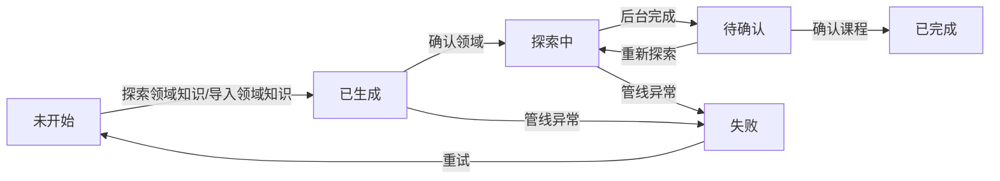

# 文档下载管理领域探索 UI 逻辑与展示规范（ARCH-019）

状态：In Progress
任务类型：A
最后更新：2026-09-08
关联 ADR：[ADR 0011](../../adr/v0.1/0011-pending-design-location.md)（待评审设计随计划承载，确定后迁 design/ 固定文档）
关联设计：[2026-08-27-download-ux-flow.md](../../../plans/2026-08-27-download-ux-flow.md)（PLAN-023，全流程交互规范主文档）、[2026-08-29-req067-downloads-optimization.md](../2026-08/2026-08-29-req067-downloads-optimization.md)（PLAN-025，§A 基座与 §B 承接）、[2026-08-27-exploration-download-flow.md](../../../plans/2026-08-27-exploration-download-flow.md)（PLAN-022，技术架构参考）、[2026-09-08-arch019-explore-backend-chain.md](2026-09-08-arch019-explore-backend-chain.md)（PLAN-034，后端链路配套）
关联 Tracker：docs/trackers/todo.md（本计划行 PLAN-033；ARCH-019、REQ-067、REQ-053）
关联代码：web-ui/src/pages/Downloads.tsx、web-ui/src/components/{DownloadsTree,DomainCard,ExploreFlowModal,DomainConfirmModal,CourseConfirmModal}.tsx、web-ui/src/stores/{downloads,explore,index}.ts、web-ui/src/api/{tracker,explore-helpers}.ts、web-ui/src/downloads.css（晋升 design/ 时按此行一次性切换 DesignRef）
归档判定：Merge 倾向——右侧展示规范与状态机交互并入 docs/design/web-frontend.md（或独立 design/ 固定文档），计划壳归档 history/plans/2026-09/

> **本文档定位**：领域探索前端 UI 逻辑（左侧树状态机交互 + 右侧四层展示规范）的设计事实源。
> 吸收合并 [2026-09-07-exploration-state-machine.md](2026-09-07-exploration-state-machine.md)
> 及其实施计划（两份已归档，见 §1）。全流程操作级规范仍以 PLAN-023 为主文档，冲突时以 PLAN-023 为准。

## 目标与成功标准

### 用户与场景

单管理员（图书馆管理员=项目本人），无多用户/权限区分。使用节奏低频、批量、有等待
（探索一轮数分钟、下载以人工登记为主）。设计取向沿用 PLAN-023：等待可观测、中断可恢复、
误操作有留痕。

### 本文档职责

1. **统一探索状态机口径**（四口径并存问题，见 §2）。
2. **定义右侧四层展示规范**：领域 / 课程 / 教程 / 书目的字段、详情弹窗与筛选关系（§3）。
3. **收敛 PLAN-025 §B 残余缺口**：现状盘点后仅存的改造项（§4）。
4. **先写后实现**：教程/书目 UI 规范在本章先定，实现随后续任务（本轮实现到「确认课程」为止）。

### 成功标准

- 用户不读文档也能凭界面提示走完「添加/导入领域 → 确认领域 → 确认课程」全链路（到教程确认前）。
- §2 状态机五态 + 失败全流转可命中统一裁决表；前端无 exploration_stage 直写。
- §3 四层展示字段与详情弹窗内容与规范一致；领域信息卡不受筛选影响恒显。
- 冒烟测试双路径通过（真实 LLM 探索 + 导入降级，与 PLAN-034 §冒烟联动）。

## 范围与非目标

- **范围**：文档下载管理页（`#/admin/downloads`）右侧四层展示规范与详情弹窗、领域探索状态机
  交互（5 态 + 失败）、右键菜单可用性、按钮状态机、5s 轮询、无弹窗直触、异常降级表现。
- **实现顺序（用户裁决 2026-09-08）**：先领域探索链路（确认领域 + 确认课程，到教程确认前）；
  教程/书目 UI 规范先写、实现随后续任务。
- **非目标**：8900 端点实现（PLAN-034）；QED-Tracker 侧改造（移交清单见 PLAN-034）；教程确认
  之后的下载/验收全流程实现；控制台/仪表盘/解析管理。

## 前置条件

- PLAN-023 为状态机与操作规范主文档（5 态含失败、无弹窗直触、8900 纯透传）；本文档是其
  §3.2/§4.2 的界面级细化。
- 后端端点就绪依赖 PLAN-034 交付（`explore-knowledge` / `confirm-domain` / `confirm-knowledge` /
  `explore-status` 实装 + 契约登记）；前端信任 8901 API，缺口移交。
- PLAN-025 §A 基座已实现并验证：Fixed 布局、右边栏 5 场景、书籍 4 组排序、课程头样式。
- 开发环境见 [本地开发环境](../../../standards/local-dev.md)（前端改动后必须 `npm run build` + `npm test`）。

## 工作项

### §1 吸收与归档声明

本文件吸收以下两份未登记文档的全部有效内容并取而代之（两份已归档至
`history/plans/2026-09/`，plans/index.md 已登记去处）：

| 被吸收内容 | 来源 | 处理 |
| --- | --- | --- |
| 领域 5 态定义 / 接口映射 / 右侧按钮状态机 / 右键菜单可用性 | 2026-09-07-exploration-state-machine.md §一 | 并入本文件 §2/§4，**补失败态口径**（原文缺） |
| 课程 3 态状态机 | 同上 §二 | 并入本文件 §2 |
| 无弹窗直触 / 轮询 5s / 状态刷新 / 异常处理 | 同上 §三/§四 | 并入本文件 §2/§6 |
| DomainCard / 菜单 / 探索 helpers 的任务分解 | 2026-09-07-exploration-state-machine-plan.md Task 1~5 | 已落地（DomainCard.tsx、explore-helpers.ts、菜单禁用逻辑、状态机测试均已实现），残余缺口收敛进 §4 |
| Task 6/7 探索流程完善与端到端验证 | 同上 Task 6~7 | 由本文件 §4 与 PLAN-034 冒烟承接 |

### §2 探索状态机（唯一口径）

#### 2.1 状态定义（领域层）

| 状态 | 字段值 | 含义 |
| --- | --- | --- |
| 未开始 | `exploration_stage=未开始` | 领域刚创建，尚未探索/导入 |
| 已生成 | `exploration_stage=已生成` | 领域知识已生成（探索或导入），等待人工确认 |
| 探索中 | `exploration_stage=探索中` | 课程知识正在后台生成 |
| 待确认 | `exploration_stage=待确认` | 课程知识生成完成，等待人工确认 |
| 已完成 | `exploration_stage=已完成` | 领域探索全流程完成（终态） |
| 失败 | `exploration_stage=失败` | 管线异常（异常态，可重试），`explore_pending={kind:'failed', error}` |

六值与 `backend/qed_engine/services/shared_tables.py` 的 `STAGE_*` 常量一一对应。

#### 2.2 状态流转

#### 2.3 操作×状态×接口统一表（四口径消解）

历史四口径：PLAN-023、PLAN-025 §B8、2026-09-07 文档（无失败态）、PLAN-028 实现（前端直写）。
统一裁决如下（留痕：PLAN-025 §B8 口径作废；PLAN-028 的前端直写作废，见 2.4）：

| 操作 | 起始状态 | 目标状态 | 前端调用 | 落库写点（PLAN-034） |
| --- | --- | --- | --- | --- |
| 探索领域知识（右键/按钮） | 未开始 / 待确认（重探） | 已生成（名称确认时）/ 探索中 | `startDomainExplore(domainId)` → `POST /domains/{id}/explore-knowledge` | 会话 ready → 已生成 |
| 导入领域知识 | 未开始 | 已生成 | 文件选择器 → `POST /domains/import` | `import_domain_manual` / 8901 导入 |
| 确认领域（按钮/弹窗） | 已生成 | **探索中** | `confirmDomainInfo(domainId)` → `POST /domains/{id}/confirm-domain` | `confirm_domain_info` 补写 RUNNING |
| 后台完成 | 探索中 | **待确认** | 5s 轮询感知 | 会话 ready 写 PENDING + `explore_pending={kind:'review_results'}` |
| 确认课程（按钮/弹窗） | 待确认 | **已完成** | `confirmCourseKnowledge(domainId)` → `POST /domains/{id}/confirm-knowledge` | apply 成功写 COMPLETED |
| 导入课程提交确认 | 已生成（import_pending） | 待确认 → 已完成 | DomainConfirmModal → CourseConfirmModal | `commit_import_courses`（PLAN-034 改 COMPLETED） |
| 管线异常 | 探索中 / 已生成 | 失败 | 轮询感知 | `_run_pipeline` 异常分支写 FAILED + explore_pending |

#### 2.4 前端禁写原则

前端**禁止**直写 `exploration_stage`。现 `DomainConfirmModal`（提交时 `updateDomain({exploration_stage: …})`）
与 `CourseConfirmModal`（手工模式写已完成）的阶段直写**作废**，改为调用确认端点（PLAN-034 实装后），
`exploration_stage` 一律由 8900 写点驱动。`PATCH /domains` 仍允许更新描述/学科知识/课程方向等维护字段。

#### 2.5 课程层状态机（3 态）

| 状态 | 含义 | 探索课程 | 导入课程知识 |
| --- | --- | --- | --- |
| 未开始 | 课程刚创建 | 可用 | 可用 |
| 探索中 | 课程教程知识生成中 | 无操作（轮询） | 可用 |
| 已完成 | 课程探索完成 | 禁用 | 禁用 |

课程「探索中→已完成」由 `dry_run_course_explore` 会话 ready 感知（沿用现有探索会话轮询）。

### §3 右侧四层展示规范（核心）

#### 3.1 层级×字段×组件（表 3-1）

| 层 | 必展示字段 | 数据源 | 承载组件 | 详情入口 | 可用操作 |
| --- | --- | --- | --- | --- | --- |
| 领域 | 名称、描述、探索阶段徽标、探索按钮 | `DomainSystem{name, description, exploration_stage, explore_pending}` | `DomainCard`（场景 2/3 挂载点） | 无独立弹窗（信息卡即详情） | 探索/确认领域/确认课程（按状态机 §2） |
| 课程 | **名称、描述、详情按钮** | `CourseRecord{name, description, stage, track, aliases, prerequisites, exploration_stage}` | 课程头（`dl-course-head`）扩展 | **详情按钮 → `CourseDetailModal`（新建）** | 编辑/探索/导入/删除（左树右键） |
| 教程 | **名称、状态、描述、详情按钮** | `KnowledgeRecord{name, status, textbook_intro, exercise_intro, materials_intro}` + `KnowledgeDetail.books` | `KnowledgeSection` 扩展 | **详情按钮 → `TutorialDetailModal`（新建）** | 确认/否定/过时/补建书行（按状态） |
| 书目 | **书名、作者、版本、语言**、状态 | `BookRecord{title, authors, edition, year, language, status, holding}` | `BookCard` 扩展 + `BookDetailModal`（已存在） | 详情按钮（已有） | **下载 / 导入 / 确认（验收）/ 否定** + 现有生命周期按钮 |

#### 3.2 领域恒显规则（用户裁决 2026-09-08）

领域信息卡**无论筛选如何选择都始终显示**（选中领域或其子节点时）。确认并延续 PLAN-025 §C2
结论：筛选隐藏只发生在教程级与课程级，不作用于领域层。

#### 3.3 筛选与展示关系（表 3-2）

| 筛选项 | 作用层 | 规则 |
| --- | --- | --- |
| 领域筛选 | 树 + 课程/教程/书目 | 选定后树聚焦该领域；领域信息卡仍恒显 |
| 课程筛选 | 课程/教程/书目 | 选定后只显示匹配课程的下游内容 |
| 状态筛选（书籍阶段） | 教程/书目 | 无匹配书籍的教程整行隐藏；无匹配教程的课程整组隐藏 |
| 汇总行 | — | 「当前选择：领域/课程 ×」「筛选结果 N 条教程」（rejected/superseded 由数据层隐藏） |

#### 3.4 详情弹窗内容清单（表 3-3）

**CourseDetailModal（新建）**

| 项 | 内容 |
| --- | --- |
| 字段 | 课程名、描述、所属阶段（stage）、学术方向（track）、别名（aliases）、先修（prerequisites）、探索状态徽标 |
| 数据 API | `GET /courses`（已有 store 数据，不额外请求） |
| 按钮 | 「编辑」→ TreeFormModal(edit-course)；「探索课程」（状态机 §2.5）；关闭 |
| 空态 | 描述缺失显示「暂无描述」 |
| 降级 | 8901 离线时探索/导入禁用 + 提示 |

**TutorialDetailModal（新建）**

| 项 | 内容 |
| --- | --- |
| 字段 | 教程名（name/教程N）、状态徽标（draft/confirmed/completed）、描述（textbook_intro/exercise_intro/materials_intro）、书籍清单（勾选列表：书名/作者/状态） |
| 数据 API | `GET /knowledge/{id}`（含 books，已有 details store） |
| 按钮 | **「批量下载未下载书目」→ `fetchKnowledgeBooks(knowledge_id)`（POST /knowledge/{id}/fetch，202 任务，自动排除已下载）**；默认勾选未下载书目；任务反馈沿用 `GET /tasks/{task_id}` 轮询；「确认教程」（draft 态） |
| 空态 | 无书籍时「暂无书籍。确认教程后将按决定引用自动生成候选册」 |
| 降级 | 8901 离线时批量下载禁用 + 提示 |

**BookDetailModal（已存在，补操作按钮）**

| 项 | 内容 |
| --- | --- |
| 字段 | 已有：状态/kind/roles/作者/版本（edition·year）/语言/页数/sha256/路径/否定原因/渠道列表 |
| 补充按钮 | **「下载」→ `fetchBook(book_id)`（POST /books/{id}/fetch）**；**「导入」→ `importBookPdf(book_id)`（本地 PDF 导入）**；**「确认（验收）」→ `verifyBook(book_id)`**；**「否定」→ `rejectBook(book_id, reason)`（原因必填，ReasonModal）** |
| 按钮可见性 | 下载：candidate/decided/failed；导入：candidate/decided/failed；确认：downloaded；否定：candidate/decided/downloaded |
| 依赖说明 | verify/reject/decide/start 等书籍状态机路由 8901 未实现（PLAN-034 §移交清单），按钮先接 8900 端点、上游 404 时透出「QED-Tracker 未实现该操作」提示 |

### §4 交互改造项（PLAN-025 §B 现状盘点后残余缺口）

现状盘点（2026-09-08 实测，更正 todo 中「B1-B8 全部待开发」的过时记载）：

| 项 | 现状 | 残余缺口 |
| --- | --- | --- |
| B1 右键菜单 5 项 | 已实现（`DownloadsTree.tsx` domainMenu） | 口径对齐 §2 统一表（explore 触发条件、探索中除删除外禁用） |
| B2 无弹窗直触 | 已实现（`startDomainExplore` 直触） | 进度观测衔接 `startPolling`（5s 轮询已存在）；`ExploreFlowModal` 仅保留 `variant='course'`（§C5 已裁决） |
| B3 导入 JSON | 已实现（文件选择器 + 校验） | 名称确认走 explore_pending（§4-B7） |
| B4 修改领域分态 | 已实现（edit-domain 表单含 stages/classic_tracks/scope） | 无 |
| B5 新增课程前置+扩展字段 | 表单字段已有 | 阶段/方向选项从自由 Input 改 `domain.stages` / `classic_tracks[].name` 下拉 |
| B6 DomainInfoCard 按钮 | 5 态按钮已实现 | **失败态缺失**（`'失败'` 落 default 分支误显「开始探索」）→ 补 danger「重试」；探索中改禁用+文案（非 loading）；读 `explore_pending` 显示提示条 |
| B7 名称确认 UI | 两个 ConfirmModal 已实现（弹窗形态） | 数据源扩展：`explore_pending.kind` 三种（`name_confirm` / `import_courses` / `review_results`）统一消费；去 stage 直写（§2.4）。弹窗形态保留、DomainCard 内嵌提示条引导（评审裁决项） |
| B8 5s 轮询 | 已实现（`stores/downloads.ts` startPolling） | 补 `explore_pending` 变化检测；「探索中但无活跃会话」失效提示（配合 `GET /domains/{id}/explore-status` 的 `active_session`） |

### §5 教程/书目 UI 规范（先写后实现）

本轮实现到「确认课程」为止；以下规范先定，实现随后续任务（教程确认轮）：

1. 教程详情弹窗勾选规则：默认勾选未下载（`holding` 非 owned）书目，可手动增删；批量下载
   每教程单任务（同教程活动任务 409 → 提示「已有下载任务进行中」）。
2. 批量下载反馈：202 受理 → toast「已提交批量下载任务」→ 任务进度经 `GET /tasks/{task_id}`
   轮询展示（复用任务面板语义），部分失败不中断并在任务结果中列明。
3. 书目详情操作与 8901 回执联动：verify/reject 端到端依赖 PLAN-034 §移交清单第 1 项回执，
   回执前按钮禁用 + Tooltip「QED-Tracker 未实现该操作」。
4. 教程行「详情」按钮与行内操作并存：详情弹窗是浏览/批量视角，行内按钮保留单册生命周期操作。

### §6 异常与降级

| 场景 | 用户可见行为 |
| --- | --- |
| 8900 不可达 | 页面顶部错误横幅 + 重试（现有） |
| 8901 离线（降级模式） | 「降级模式」横幅（现有 isDegraded）；树/领域维护/导入可用，探索与教程/书目操作禁用 |
| 探索会话失效（8900 重启，内存会话丢失） | `explore-status.active_session=false` → 提示「探索会话已失效，请重试」，不做自动回写 |
| 管线失败 | `explore_pending.kind='failed'` → DomainCard 红色提示条 + 失败原因 + 「重试」按钮 |
| 刷新页面 | 未终态领域由 5s 轮询自动恢复感知（`exploration_stage` 直读共享表，不依赖弹窗） |
| API 失败 | toast 透出服务端 detail；乐观更新禁用，以服务端返回为准 |

## 验证与验收

- [ ] §2 状态机：五态 + 失败全流转命中 2.3 统一表；前端无 exploration_stage 直写（grep 无 `exploration_stage:` 写入于 updateDomain 调用）
- [ ] §3 展示：领域信息卡不受筛选影响恒显；课程头含描述与详情按钮；教程行含状态徽标与详情按钮；书目含书名/作者/版本/语言
- [ ] §3 弹窗：CourseDetailModal / TutorialDetailModal 字段与表 3-3 一致；BookDetailModal 补齐下载/导入/确认/否定四操作
- [ ] 教程详情弹窗批量下载：默认勾选未下载书目，202 受理后任务反馈可见
- [ ] §4：DomainCard 失败态显示 danger 重试按钮；explore_pending 三种 kind 均有对应确认区
- [ ] §4 轮询：5s 感知终态变化并 toast；会话失效提示；组件卸载停止轮询
- [ ] 右键菜单禁用矩阵与 §2.3/§2.5 一致（含失败态）
- [ ] 测试-实现错位清零：DownloadsTree.explore.test / DownloadsTree.state.test 断言与实现一致
- [ ] 门禁：`npx tsc --noEmit` 零错 + `npm test` 全绿 + `npm run build` 成功
- [ ] 冒烟：双路径通过（物理学院真实探索 + 计算机科学导入，与 PLAN-034 §冒烟联动）

## 回滚

- 按组件粒度独立提交可 revert：DomainCard / Downloads.tsx / DownloadsTree.tsx / 各弹窗 / stores / explore-helpers。
- 状态机改造（§2.4 去 stage 直写）回退不影响 PLAN-025 §A 布局成果（独立提交）。
- 详情弹窗为纯新增组件，回退即删除，无数据面。

## 关闭与归档

- 关闭条件：本 checklist 全部通过 + 用户浏览器验收确认 + PLAN-034 端点就绪。
- 归档动作：交互规范并入 docs/design/web-frontend.md（或独立 design/ 固定文档）；DesignRef
  同步切换 code-map.md 与上述源文件头部；plans/index.md 登记去处；todo.md PLAN-033 行收口。

---
*本文件为领域探索前端 UI 逻辑的设计事实源（吸收 2026-09-07 状态机设计）；后端链路与端点契约见 [2026-09-08-arch019-explore-backend-chain.md](2026-09-08-arch019-explore-backend-chain.md)（PLAN-034）。*
