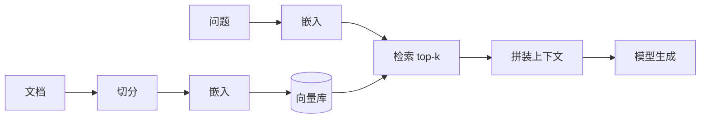

# RAG（检索增强生成）笔记

个人学习资料，不参与工程治理。

## 是什么

RAG = 检索 + 生成：先从知识库中检索相关片段，再把片段拼进提示词交给大模型回答。解决
"模型不知道私有/最新知识"与"模型胡编"两个问题——回答有出处、可追溯。

## 基本流程

## 检索增强的关键点（RAG 质量从哪来）

1. **切分粒度**（见 [chunking 笔记](chunking-notes.md)）：块要自包含、语义完整。
2. **检索召回**：top-k 是否把真正相关的段落找出来（向量 + 关键词混合检索更稳）。
3. **上下文拼装**：块排序（相关度高的靠近）、去重、限长。
4. **引用溯源**：回答必须能指回原文位置（页码/段落），这是质量审阅的基础。
5. **评估闭环**：用冻结问题集测"命中率 + 回答质量"，不靠感觉调参。

## 进阶变体

| 变体 | 思路 | 适用 |
| --- | --- | --- |
| 混合检索 | 向量 + BM25 关键词并行，再融合 | 专有名词、公式、编号 |
| 重排序（Rerank） | 粗召回后用小模型精排 | 提高 top-k 精度 |
| 查询改写 | 把复杂问题拆成子查询 | 多跳问题 |
| 图增强 | 关系图谱投影辅助检索 | 概念关系型知识（Axiom-Flow RET-001 方向） |

## 与 QED 项目的关系

- QED 的学习交互（知识点讲解、温故知新）本质是"数学知识库 + RAG + 对话"。
- Axiom-Flow 已具备解析产物（PDF → 结构化文本/公式/图表），是 RAG 的知识源；RET-001 负责
  向量化与检索；PRD-001 负责学习交互闭环。
- 关键约束：回答要有原始文档追溯（这是 QED 质量审阅的立身之本）。

## 落地检查清单

1. 检索命中是否真的有上下文价值（抽查）。
2. 回答是否给出来源并可点击溯源。
3. 检索不到时模型是否诚实"不知道"，而不是编造。
4. 知识更新后向量库是否增量更新而非全量重建。
