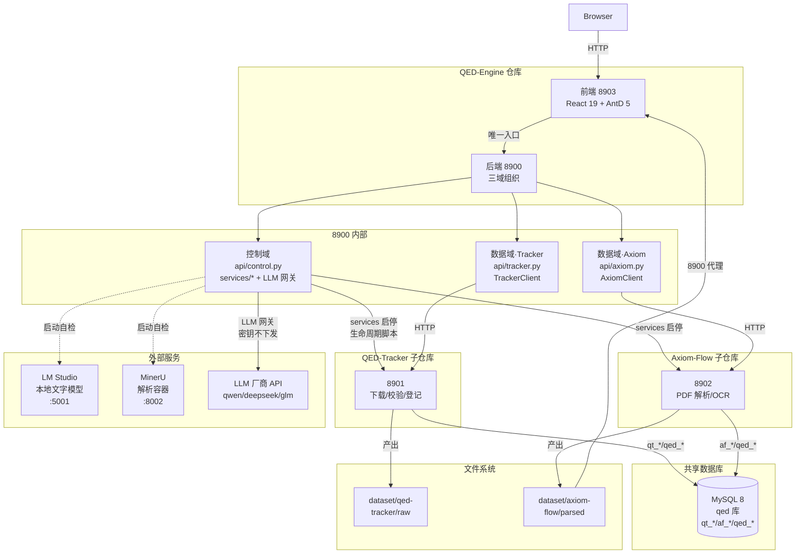
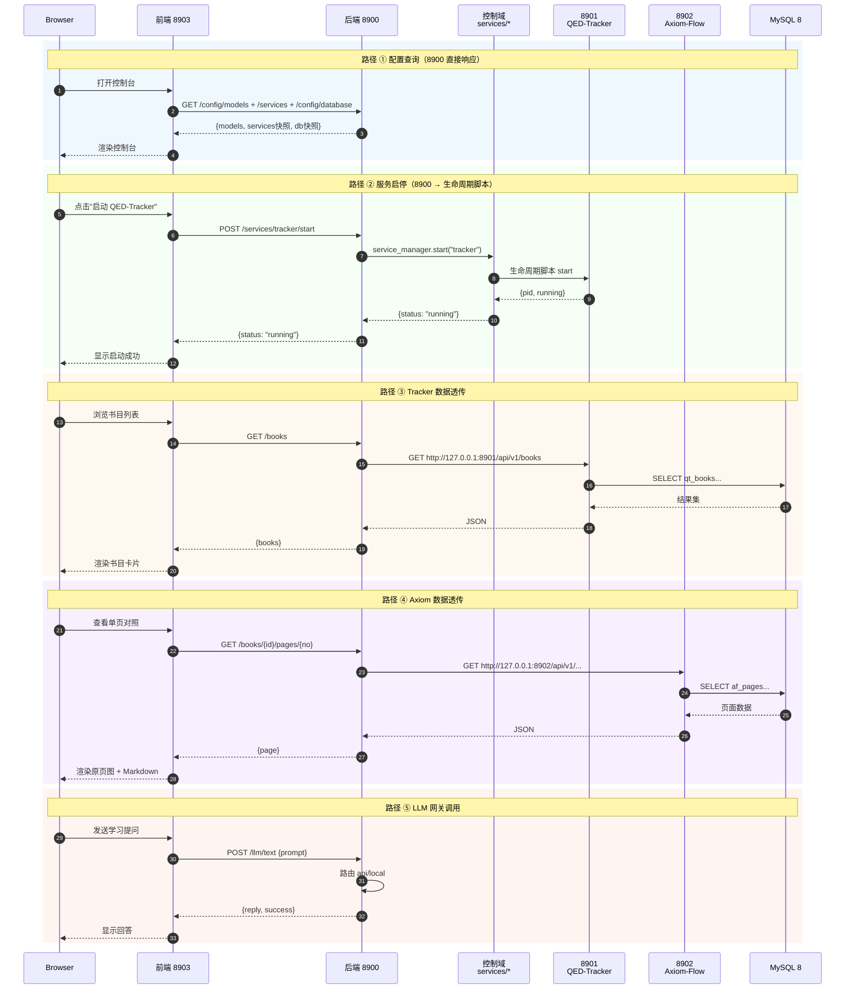
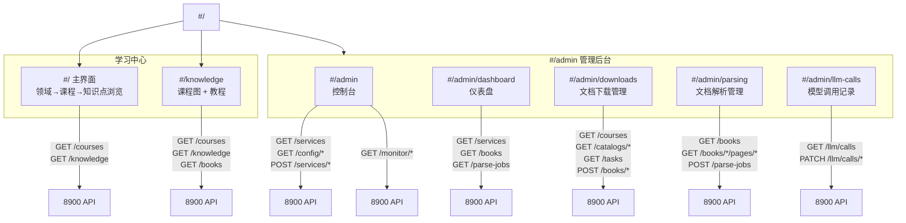

# 架构文档 Mermaid 图设计计划

状态：Accepted
最后更新：2026-08-31
任务类型：D
关联 ADR：[ADR 0011](../history/adr/v0.1/0011-pending-design-location.md)
关联设计：`../architecture/four-service-architecture.md`、`../architecture/backend-architecture.md`、`../architecture/frontend-architecture.md`
关联 Tracker：docs/trackers/todo.md
归档判定：用户确认后合并至三份 architecture/ 固定文档，计划壳归档

## 目标与成功标准

为三份架构文档补充缺失的经典图表，提升文档的可读性和新人上手效率。

成功标准：
1. 四服务总体架构：新增全景组件架构图（现有 flowchart 保留不变）
2. 后端架构：新增请求生命周期全景时序图（sequenceDiagram）
3. 前端架构：新增页面路由拓扑图（flowchart TD）
4. 三图 Mermaid 语法正确（可渲染）
5. 不改变三份文档的元数据字段（状态/日期等按需微调）

## 范围与非目标

**范围**：为 four-service-architecture.md、backend-architecture.md、frontend-architecture.md 三份文档各补充一张 Mermaid 图表。

**非目标**：不修改现有内容；不新增架构文档；不涉及代码变更。

## 前置条件

1. 三份目标文档已存在且结构稳定
2. 用户已确认图表内容与插入位置

## 工作项

1. 绘制全景组件架构图（flowchart TD）
2. 绘制后端请求生命周期时序图（sequenceDiagram）
3. 绘制前端页面路由拓扑图（flowchart TD）
4. 用户审阅确认
5. 合并至目标文档
6. 运行 Mermaid 语法门禁验证

## 验证与验收

1. `pytest tests/contract/test_architecture_documents.py -q` 通过
2. 三图 Mermaid 语法正确可渲染

## 回滚

将三图从目标文档中移除，恢复原始内容。

## 关闭与归档

用户确认后合并至三份 architecture/ 固定文档，计划壳归档至 `../history/plans/2026-08/`。

## 图 1：全景组件架构图

**目标文档**：`four-service-architecture.md`
**插入位置**：§服务视图（现有 flowchart）之后、§服务职责与端口 之前
**新增章节标题**：`## 全景组件架构图`

## 图 2：后端请求生命周期时序图

**目标文档**：`backend-architecture.md`
**插入位置**：§三域组织 之后、§分层与依赖 之前
**新增章节标题**：`## 请求生命周期`

## 图 3：前端页面路由拓扑图

**目标文档**：`frontend-architecture.md`
**插入位置**：§信息架构（hash 路由）之后、§与后端的交互 之前
**新增章节标题**：`## 页面路由拓扑`

## 实施步骤

1. **确认阶段**（当前）：用户审阅三图内容与位置
2. **合并阶段**：用户确认后，将三图分别插入目标文档的指定位置
3. **门禁阶段**：运行 `pytest tests/contract/test_architecture_documents.py -q` 验证 Mermaid 语法
4. **归档**：计划壳归档至 `../history/plans/2026-08/`
