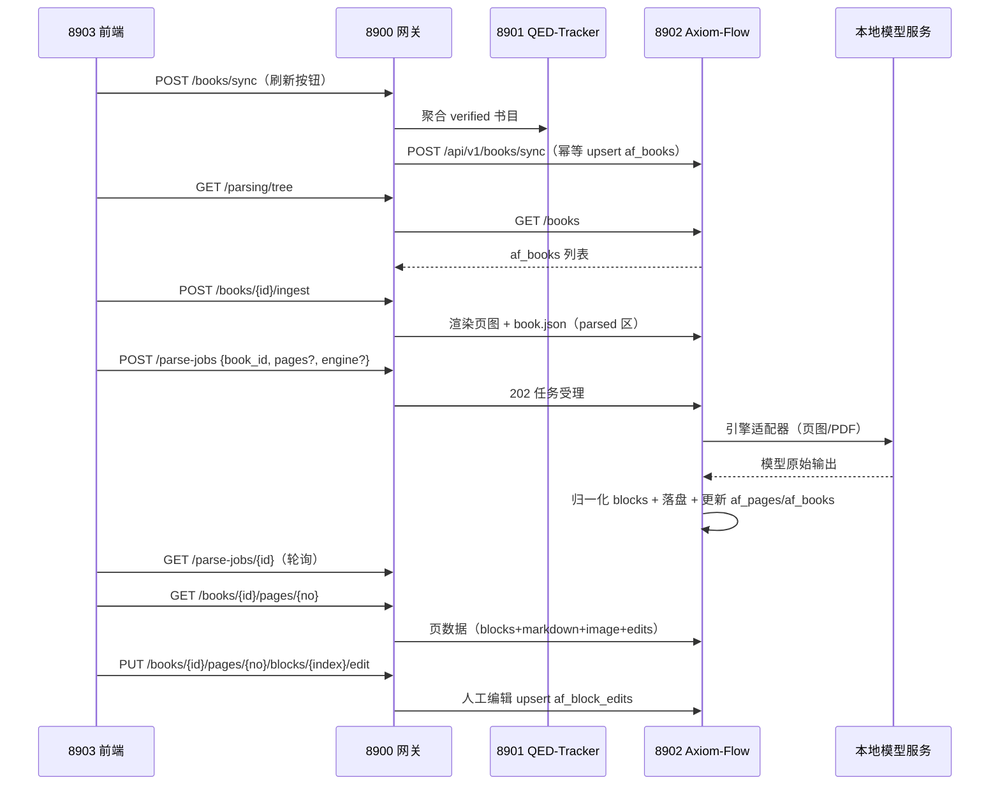

# 文档解析管理·与 Axiom-Flow 交互全链路

状态：In Progress
任务类型：A
最后更新：2026-09-20
关联 ADR：[ADR 0014](../adr/0014-parsing-ownership-and-model-boundary.md)（解析能力归属与模型边界）
关联设计：[dataset-conventions.md](../design/dataset-conventions.md)（数据根三区）、
[local-model-management.md](../design/local-model-management.md)（模型生命周期与槽位）、
[llm-gateway.md](../design/llm-gateway.md)（网关与调用记录）、
[解析管理 UI 设计](../design/parsing-ui.md)（界面消费）
关联 Tracker：docs/trackers/todo.md（PLAN-044）
归档判定：Retain（设计确定后按 ADR 0011 晋升 `design/`；本轮暂留 `plans/`）

## 目标与成功标准

**目标**：定义「文档解析管理」后端全链路——8900（模型生命周期 + 数据域适配）、8902
Axiom-Flow（解析管线）、本地模型服务（MinerU 等）三方的职责边界、数据流、产物格式、
`af_*` 表结构与 8902 API 契约，作为初版模块的实现基线。

**成功标准**：

1. 三方职责边界无歧义：模型选择/预处理/后处理在 Axiom-Flow，模型运维在 8900；
2. 全链路数据流闭环：同步 → ingest → 解析（逐页/全本）→ 对照 → 编辑；
3. 解析产物格式（`parsed/` 布局 + 统一 blocks schema）与 `af_*` 四表 DDL 冻结——**af_* 四表
   已达成**（2026-09-20：迁移 `20260917_0001` 本机 qed 库落地，与本节 DDL 逐列一致，REQ-027
   关闭；产物布局版本划分约定另由 REQ-080 承接）；
4. 8902 API 契约冻结（数据查询 / 解析结果与对照两组）；
5. Axiom-Flow 不感知模型（引擎可配置）；8900 离线时 Axiom-Flow 仍可解析；
6. 至少完成一个教程（Rudin）端到端解析并经用户确认。

## 范围与非目标

**范围**：8900 数据域·Axiom 适配层与模型生命周期；8902 Axiom-Flow 的书目同步/CRUD、
ingest、解析编排、引擎适配、产物落盘、对照供给、编辑落库；`qed` 库 `af_*` 表；
`QED_DATA_ROOT/parsed` 产物布局；引擎适配（MinerU / PaddleOCR-VL / qwen-vl）。

**非目标**：前端界面（见[解析管理 UI 设计](../design/parsing-ui.md)）；
切分与召回（探索轮）；Milvus 向量库；`axiom`/`xqfm` 库删除与 dataset 物理清理
（D 类数据操作，另立计划）。

## 前置条件

1. [ADR 0014](../adr/0014-parsing-ownership-and-model-boundary.md) 已 Accepted；
2. QED-Tracker 8901 提供 verified 书目（`qt_books`，`file_path` 为数据根相对路径）；
3. MinerU 容器可用（`scripts/image-model/`，端口 5002）；
4. `qed` 库为主库（`QED_DB_NAME=qed`）。

## 工作项（设计正文）

### 1. 职责边界

| 服务 | 职责 |
| --- | --- |
| 8900 后端 | ① 前端唯一入口（ADR 0007）：Axiom 数据域适配透传 8902；② 共享表读取（领域→课程，`GET /parsing/tree`）；③ **OCR 模型生命周期**：模型槽位、`/models/{name}` 启停、探针、资源互斥；④ 控制台依赖组件展示。`/llm/vision` 降级为控制台测试与通用视觉用途 |
| 8902 Axiom-Flow | **完整解析管线**：af_books 同步/CRUD、ingest（PDF→页图）、解析编排（任务/页状态/重试/质量信号）、**引擎适配器**（直连模型服务）、后处理归一化、产物落盘（`parsed/`）、对照数据供给、人工编辑落库 |
| 本地模型服务 | MinerU 容器 5002（现成）；PaddleOCR-VL 服务（预留）；云端 qwen-vl（api 档位） |

参考范式（RAGFlow `deepdoc`、Docling `DocumentConverter` + 统一文档模型、MinerU 自身）：
**统一中间表示 + 可插拔引擎适配器 + 页级增量处理**。

### 2. 全链路数据流



### 3. 解析产物布局（`QED_DATA_ROOT/parsed/`）

```text
<QED_DATA_ROOT>/parsed/<domain_id>/<course_id>/<book_id>/
├── book.json            # BookMeta：book_id/title/authors/page_count/sha256/source_file/engine/ingested_at
├── manifest.json        # 产物清单（路径 + 大小 + SHA-256）
└── pages/
    ├── p0001.png        # 原页图（150 DPI，对照左栏 + bbox 基准）
    ├── p0001.md         # 页级 Markdown（$$...$$ / $...$ 内嵌公式）
    └── p0001.blocks.json# 统一 blocks（结构化，含 bbox）
```

- `source_file`：源 PDF 的数据根相对路径（同源 `qt_books.file_path`），源 PDF 只读不复制；
- 页图渲染与产物落盘在 Axiom-Flow（[ADR 0014](../adr/0014-parsing-ownership-and-model-boundary.md) 决定 2）；
- 目录结构遵循 [dataset-conventions.md](../design/dataset-conventions.md)（`parsed/` 区写入方 Axiom-Flow）；
- **解析版本划分（2026-09-20 用户裁决登记）**：每次解析 job 产物原子独立落
  `<book_id>/versions/<job_id>/`，book_id 根目录保持「当前生效版本」视图（读取方与端点契约
  不变），实施方 Axiom-Flow（REQ-080），约定正文见 [dataset-conventions.md](../design/dataset-conventions.md)。

### 4. 统一 blocks schema（页级）

```json
{
  "page": 1,
  "image_size": [1240, 1754],
  "source": "mineru",
  "blocks": [
    {"index": 0, "type": "heading", "level": 1, "text": "1. The Real and Complex Number Systems",
     "bbox": [72, 54, 540, 80], "order": 0, "confidence": 0.97},
    {"index": 1, "type": "formula", "latex": "x + y = y + x", "display": true,
     "bbox": [72, 150, 540, 175], "order": 1, "confidence": 0.97}
  ],
  "quality": {"empty_block_ratio": 0.0, "avg_formula_confidence": 0.95,
              "table_count": 1, "text_length_ratio": 0.98}
}
```

- 块类型沿用 10 种：`heading / paragraph / formula / table / image / list / caption / header /
  footer / page_number`；按类型强制必需字段（heading.text+level、formula.latex、table.html、
  image.path、list.items、其余 text）；
- `bbox`：原页图像素坐标 `[x0, y0, x1, y1]`（左上原点），基准为 `pages/pXXXX.png`；模型坐标系
  差异由适配层按 `image_size` 缩放归一；
- `order`：阅读顺序（0 基）；`source`：实际引擎标识（mineru / paddleocr-vl / qwen-vl）；
- 人工编辑不入文件（文件为模型产物事实源），由 `af_block_edits` 覆盖层承载，API 返回时合并。

### 5. 数据库表（`qed` 库，`af_*` 命名空间，Axiom-Flow Alembic 建表维护）

> **落地状态（2026-09-20）**：四表已随 Axiom-Flow 迁移 `20260917_0001_create_af_tables.py`
> 在本机 qed 库 `alembic upgrade head` 建表（ARCH-020-C 收尾，E2E ingest 486 页实证），
> 列/默认值/注释/PK/UNIQUE/索引与下方 DDL 一致；结构事实源为 Axiom-Flow
> `docs/architecture/database-design.md`，根仓库总纲已转正（规划→已落地）。

```sql
CREATE TABLE af_books (
  book_id       VARCHAR(100) NOT NULL,          -- PK：同源 qt_books.book_id
  domain_id     VARCHAR(32)  NOT NULL DEFAULT '',
  course_id     VARCHAR(64)  NOT NULL DEFAULT '',
  course_name   VARCHAR(200) NOT NULL DEFAULT '',
  knowledge_id  VARCHAR(100) NOT NULL DEFAULT '',
  title         VARCHAR(500) NOT NULL DEFAULT '',
  part          VARCHAR(32)  NOT NULL DEFAULT '',
  display_title VARCHAR(500) NOT NULL DEFAULT '',
  authors       JSON         NOT NULL,          -- list[{name, role}]
  file_path     VARCHAR(512) NOT NULL DEFAULT '',-- 数据根相对路径（同源 qt_books.file_path）
  page_count    INT          NULL,              -- ingest 时计算
  sha256        VARCHAR(64)  NOT NULL DEFAULT '',-- ingest 时计算
  ingest_status VARCHAR(16)  NOT NULL DEFAULT 'none',   -- none/ingesting/ingested/failed
  parse_status  VARCHAR(24)  NOT NULL DEFAULT 'pending',-- pending/parsing/completed/failed
  pages_done    INT          NOT NULL DEFAULT 0,
  notes         TEXT         NULL,
  synced_at     DATETIME     NOT NULL,
  updated_at    DATETIME     NOT NULL,
  PRIMARY KEY (book_id),
  KEY ix_af_books_course (course_id),
  KEY ix_af_books_status (parse_status)
) ENGINE=InnoDB DEFAULT CHARSET=utf8mb4 COMMENT='书目同步表：QED-Tracker 已验证书目的只读快照 + ingest/解析进度（Axiom-Flow 私有）';

CREATE TABLE af_parse_jobs (
  job_id      VARCHAR(64)  NOT NULL,            -- PK
  book_id     VARCHAR(100) NOT NULL,
  pages       JSON         NULL,                -- NULL = 全书；否则页码数组
  engine      VARCHAR(24)  NOT NULL DEFAULT 'mineru',
  status      VARCHAR(16)  NOT NULL,            -- queued/running/completed/failed
  progress    JSON         NOT NULL,            -- {"parsed":N,"total":M,"error":""}
  error       VARCHAR(500) NOT NULL DEFAULT '',
  created_at  DATETIME     NOT NULL,
  started_at  DATETIME     NULL,
  finished_at DATETIME     NULL,
  PRIMARY KEY (job_id),
  KEY ix_af_parse_jobs_book (book_id)
) ENGINE=InnoDB DEFAULT CHARSET=utf8mb4 COMMENT='解析任务表：逐页/全本解析任务状态与进度（Axiom-Flow 私有）';

CREATE TABLE af_pages (
  book_id   VARCHAR(100) NOT NULL,
  page_no   INT          NOT NULL,
  status    VARCHAR(16)  NOT NULL DEFAULT 'pending', -- pending/parsed/failed
  source    VARCHAR(24)  NOT NULL DEFAULT '',
  quality   JSON         NULL,
  error     VARCHAR(500) NOT NULL DEFAULT '',
  parsed_at DATETIME     NULL,
  PRIMARY KEY (book_id, page_no)
) ENGINE=InnoDB DEFAULT CHARSET=utf8mb4 COMMENT='页状态表：逐页解析状态与质量信号（Axiom-Flow 私有）';

CREATE TABLE af_block_edits (
  edit_id        VARCHAR(100) NOT NULL,         -- PK：ed_<md5(book_id:page_no:block_index)>
  book_id        VARCHAR(100) NOT NULL,
  page_no        INT          NOT NULL,
  block_index    INT          NOT NULL,
  block_type     VARCHAR(24)  NOT NULL DEFAULT '',
  verdict        VARCHAR(8)   NOT NULL DEFAULT '',  -- ''=未判定 / ok / bad
  note           VARCHAR(1000) NOT NULL DEFAULT '',
  corrected_text TEXT         NULL,             -- 文字修正（公式为 LaTeX 源码）
  corrected_bbox JSON         NULL,             -- [x0,y0,x1,y1] 修正范围
  edited_at      DATETIME     NOT NULL,
  updated_at     DATETIME     NOT NULL,
  PRIMARY KEY (edit_id),
  UNIQUE KEY uq_af_block_edits_pos (book_id, page_no, block_index)
) ENGINE=InnoDB DEFAULT CHARSET=utf8mb4 COMMENT='块编辑表：对照视图中人工判定/备注/文字与范围修正（Axiom-Flow 私有）';
```

- 同步幂等键 `book_id`；`af_books` 为快照语义，qt_books 变更/删除不影响已同步行；
- 进度自持：`ingest_status`/`parse_status`/`pages_done` 由 Axiom-Flow 维护；
- 共享 `qed_*` 表只读；表结构变更先登记 [database-design.md](../architecture/database-design.md)。

### 6. 8902 API 契约（Axiom-Flow 事实源）

**① 生命周期与健康**：`GET /health` + `scripts/axiom_flow_service.py {start|stop|restart|status}`（不变）。

**② 数据查询（af_\*）**：

| 端点 | 语义 | 请求/响应要点 |
| --- | --- | --- |
| `GET /api/v1/books` | af_books 列表 | `BookMeta[]`（含课程归属/进度/ingest 状态） |
| `GET /api/v1/books/{id}` | 单书目 | `BookMeta`；404 |
| `PATCH /api/v1/books/{id}` | 修改书目（`notes` 等 Axiom-Flow 自有字段） | 200 更新后 `BookMeta`；404 |
| `DELETE /api/v1/books/{id}` | 删除 af_books 行（`?purge=true` 同时删 `parsed/` 产物） | 200；404 |
| `POST /api/v1/books/sync` | 幂等 upsert 已验证书目 | `[{book_id,domain_id,course_id,course_name,knowledge_id,title,part,authors,file_path}]` → `{synced,updated,books}` |
| `POST /api/v1/books/{id}/ingest` | 渲染页图 + book.json（不调模型） | 200 `{book_id,page_count,sha256,ingest_status}`；404 |

**③ 解析结果与对照**：

| 端点 | 语义 | 请求/响应要点 |
| --- | --- | --- |
| `GET /api/v1/books/{id}/manifest` | 产物清单 | `ManifestEntry[]` |
| `GET /api/v1/books/{id}/pages/{no}` | 单页完整数据 | `{blocks, markdown, image_url, edits}`（edits 已合并） |
| `GET /api/v1/books/{id}/pages/{no}/image` | 原页图 | `image/png` |
| `PUT /api/v1/books/{id}/pages/{no}/blocks/{index}/edit` | 块编辑 upsert | `{verdict?, note?, corrected_text?, corrected_bbox?}` → 编辑记录 |
| `GET /api/v1/books/{id}/pages/{no}/edits` | 页内编辑列表 | `EditRecord[]` |
| `POST /api/v1/parse-jobs` | 提交解析（逐页/全本） | 202 `{book_id,pages?,engine?}` → `ParseJob` |
| `GET /api/v1/parse-jobs/{id}` | 任务状态与进度 | `ParseJob`（queued/running/completed/failed） |

**错误语义**：400 参数非法；404 book/page/job 不存在；503 模型服务或依赖不可用（中文提示）。

### 7. 8900 适配与模型生命周期

- 数据域适配：8900 透传 8902 上表全部端点（前端只连 8900，ADR 0007）；新增
  `GET /parsing/tree`（共享表领域/课程 + 8902 af_books 聚合，8902 离线降级为领域→课程）。
- 模型生命周期：`/models/{name}` 启停/重启（`name ∈ {qwen, mineru}`，PaddleOCR-VL 接入时新增
  `paddleocr`）；`GET /monitor/mineru` 等探针；模型槽位 `model/mineru/`（PaddleOCR-VL 预留
  `model/paddleocr-vl/`）+ `manifest.json`；资源互斥 `QED_RESOURCE_GUARD`。
- 规划中的 8900/8902 端点（本表所列）在实现前只登记于本设计文档；`api-contracts.md` 以
  「规划契约」非解析表登记，实施后转正（见 [code-document-traceability.md](../standards/code-document-traceability.md)）。

### 8. 引擎适配（模型无感知）

- 引擎由 Axiom-Flow 配置选择：`AXIOM_OCR_ENGINE=mineru|paddleocr-vl|qwen-vl`（默认 `mineru`）；
- 适配器统一输入（页图字节 / PDF 字节 + 页码）与输出（页级 blocks+markdown+bbox），模型差异
  （MinerU `content_list`/`middle.json`、PaddleOCR-VL JSON、qwen-vl markdown）在适配层归一；
- 逐页解析：页图 → 引擎单页识别；全本解析：PDF → 引擎整本解析（跨页表格/阅读序更优）→ 逐页结果；
- 模型服务地址可配置（默认直连本地服务；部署形态需要时可指向 8900 代理地址，契约不变）；
- 直连成功路径由 Axiom-Flow 自写 `qed_llm_calls`（`service=axiom_flow`、`provider=<engine>`、
  `endpoint=vision`）。

### 9. 降级与独立性

- 8902 离线 → 8900 返回 503，前端降级显示；配置域不受影响；
- 8901 离线 → `POST /books/sync` 返回 503（取数失败），其余端点不受影响；
- 模型服务离线 → 解析任务 `failed`（`error` 记原因），只读端点正常；
- 8900 离线 → 前端错误横幅；Axiom-Flow 可经脚本手动启停模型并独立解析（[ADR 0014](../adr/0014-parsing-ownership-and-model-boundary.md) 决定 5）。

## 验证与验收

- 契约测试：8900 `tests/test_api.py`（新适配端点 + `parsing/tree`）；Axiom-Flow
  `tests/contract/test_api_v1_contract.py`（新端点结构）；
- Axiom-Flow 单元/集成：sync 幂等、ingest 页图与 sha256、归一化（mock 引擎）、任务状态机；
- 端到端冒烟（8902 在线）：Rudin 教程（`kt-mathanalysis-3`：`mathanalysis-b05` +
  `mathanalysis-b11`）同步 → ingest → 逐页/全本解析 → 对照 → 编辑 → 刷新回显；
- 质量：抽查公式 LaTeX 可被 KaTeX 渲染 ≥ 90%，块类型无错乱；用户确认解析效果。

## 回滚

- 设计文档回滚：删除本文件与[解析管理 UI 设计](../design/parsing-ui.md)，
  恢复 [ADR 0014](../adr/0014-parsing-ownership-and-model-boundary.md) 前的模型形态；
- 实施回滚：`af_*` 表 Alembic 降级；8902 端点移除；`parsed/` 产物为可再生数据，可清理。

## 关闭与归档

关闭条件：设计经用户确认 + 端到端验收通过 + 契约冻结；按 ADR 0011 评估晋升 `design/`
（解析管理设计位），届时现状壳退役。归档至 `history/plans/2026-09/`。
