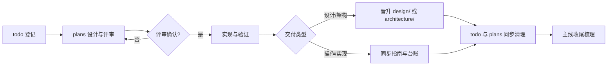

# 文档治理规范

状态：Current
最后更新：2026-09-10
确认状态：已确认
治理对象：文档分类与事实边界、确认状态、文档生命周期、任务与文档绑定、写作命名索引元数据、归档与删除
依据 ADR：`../history/adr/v0.1/0001-root-contract-tests.md`、`../history/adr/v0.1/0010-documentation-versioning.md`、`../history/adr/v0.1/0011-pending-design-location.md`
关联测试：`tests/contract/test_document_structure.py`、`tests/contract/test_markdown_links.py`、`tests/contract/test_standard_governance.py`

## 目的与边界

本标准规定根仓库（QED-Engine）文档链路：每类文档保存什么事实、处于什么状态（暂定/已确认）、
新建与晋升路径，以及何时归档或删除。agent 与项目开发**优先读取已确认文档**（`standards/` 的
确认标准、`architecture/` 与 `design/` 的确认文档），暂定文档可读可执行但地位低于已确认文档。

**职责划分**：本文档只治理文档**共性**链路（分类边界、确认状态、生命周期、命名、元数据、
归档总纲）。各文档类型的**专项机制**由专项标准承接：计划状态机与关闭判定→
[任务生命周期](task-lifecycle.md)（暂定），ADR 准入/编号/状态/取代→[ADR 治理规范](adr-governance.md)（暂定），
测试分层与门禁→[测试架构与门禁](testing.md)（暂定）；本文档不复制其正文。

具体任务状态查 [任务台账](../trackers/todo.md)，长期决策查 [ADR 索引](../adr/index.md)，
项目管理办法总入口见[规范索引](index.md)。指南只维护可重复操作；新文档遵守对应 standard，
再参考最近一份仍有效的同类文档组织内容。

子项目（Axiom-Flow、QED-Tracker）各自维护独立的文档体系与规范，不适用本标准；进入子项目工作
前以其自身 `AGENTS.md` 和 `docs/standards/` 为准。

## 强制规则

### 文档分类与事实边界

| 位置 | 唯一职责 |
| --- | --- |
| 根 `README.md` | 面向用户和新开发者的项目定位、三项目总览、四服务、快速启动入口（用户手册）。 |
| 根 `AGENTS.md` | Agent 执行总纲：仓库结构、服务边界、协作流程摘要、**变更分级与边界**（AI 开发守则，ADR 0012）与文档入口。指引与边界入口，不保存流程细则与契约正文（细则见 `guides/development.md`）。 |
| `docs/index.md` 与各目录 `index.md` | 只导航当前文件，不保存正文事实。 |
| `architecture/` | **固定架构文档**：①三项目四服务总体架构；②架构设计图（项目组件、分层、前端/后端技术栈）；③API 设计文档；④数据库设计文档（只写共享表设计）；⑤code-map（按主流程和测试流程、按模块划分）；⑥前端项目设计（代码架构）；⑦后端项目设计（代码架构）。类目确定如现状，新增类目必须经 todo + plans/ 文档阐明原因和修改影响。 |
| `design/` | **固定设计文档**，按模块划分：知识探索、课程学习、课后练习、控制台、仪表盘、文档下载管理（进行中）、文档解析管理等。**只有 plans/ 下评审确认完毕才晋升**为 design/ 文档；此前只在 plans/ 列计划与讨论。变更分级（大改 vs 小修/bug）见下方「变更分级」节。 |
| `standards/` | **项目管理办法**（工程治理规则唯一事实源）：[本地开发环境](local-dev.md)（机器标识与环境依赖）与本文档（文档链路治理）为**确认文档**；其余标准暂定，经各自评审轮确认后转正。 |
| `adr/` | 长期决策登记，当前按 [ADR 治理规范](adr-governance.md)（暂定）约束。 |
| `guides/` | 人类可读的**操作文档**与**开发文档**（介绍项目怎么开发、怎么运维），可包含架构信息；为人类设计，由人类判断何时整理，agent 开发时不主动涉及。例外（ADR 0012）：`development.md` 的「开发流程」节由人类授权承载 agent 开发流程细则。 |
| `plans/` | **临时计划**：进行中任务的讨论与计划，todo 任务结束即归档。**规范文档**：整理完成后晋升、替代或合并进 `architecture/`、`standards/`、`design/` 固定文档。例外：长期滚动文档（[AI Agent 知识收件箱](../plans/ai-agent-knowledge-inbox.md)、[设计类小修与 bug 修复台账](../plans/design-bugfix-log.md)）常驻本目录，豁免清单由 `test_plan_governance.py::STANDING_DOCS` 守护。 |
| `trackers/` | 任务台账（todo，按主线及分支 + 长期拆分）、实时状态快照（project-status，主线完成或长期任务重大变化时记录）、能力路线图（**在第五轮主线·学习中心轮 ARCH-022 后结束并归档**，结论写入固定文档）、关闭台账。 |
| `history/` | 选择性保留的长期审计证据、旧基线文档和 Git 锚点。 |
| `learning/` | QED-Engine 独有的个人学习资料，不参与工程治理，内容自由组织。 |

一个事实只设一个维护位置，其他文档使用链接。标准不得复制操作命令、设计契约或 ADR 决策理由。
`dataset/` 是下载内容与中间产物的存储目录（原始文档、解析产物等），数据文件本身不入库
（见根 `.gitignore`）。目录结构见 [dataset 约束](../design/dataset-conventions.md)；数据根边界、
`tmp/` 生命周期、原子落盘与测试隔离规则见[临时目录与数据存储规范](storage-conventions.md)。

### 变更分级（AI 开发守则，ADR 0012）

改动实施前按根 `AGENTS.md`「变更分级与边界」定级，未定级不实施：

- **大修改**：`architecture/`（固定架构）任何改动、`design/` 大变更——必须先建 todo 任务 +
  `plans/` 改造计划，评审后才动文档与代码；
- **阻止项**：`docs/` 目录结构变化（新建/删除/移动目录或治理类目，判例：`docs/superpowers/`）
  ——默认阻止，仅人类明确同意且建 todo + plans 改造计划后方可执行；
- **小修改**：`design/` 小修改或 bug——登记[设计类小修与 bug 修复台账](../plans/design-bugfix-log.md)
  并补充设计文档，不单独立项；
- **豁免**：一般小改（措辞、链接、错别字、无行为修正）——差异与验证记录承接。

工作流程细则见 [开发指南·开发流程（六步）](../guides/development.md)；standards 实质规则
变更仍按「变更与取代」节先立 ADR。

### 确认状态

- 所有受治理文档（`architecture/`、`design/`、`standards/` 正文文档）声明 `确认状态：暂定 | 已确认`。
- **已确认**：经评审通过的事实源，agent 与项目开发优先读取；**暂定**：可读可执行、待评审，
  地位低于已确认文档。
- 初始登记：`standards/doc-governance.md`、`standards/local-dev.md` 为**已确认**；现有其余
  `architecture/`、`standards/`、`design/` 文档全部为**暂定**，随设计评审/主线轮分批转正。
- 转正评审：设计按模块确认后晋升 design/ 并标已确认；标准按各自评审轮确认后转正。

- **冲突优先级**：同一事实的多份文档内容冲突时，按优先级取舍：已确认 > 暂定；`architecture/` >
  `design/` > `plans/`；同类文档以最后更新时间较新者为准（但不得以此绕过评审流程）。冲突无法
  自动判定时必须询问用户。
- **「可读可执行」的边界**：暂定文档允许 agent 基于其内容执行实现任务（写代码、建计划），但：
  - 不得将暂定文档的措辞提升为已确认标准；
  - 实现完成后若暂定文档仍为暂定状态，应在提交信息中标注「基于暂定设计实现，待评审确认」；
  - 已确认文档与暂定文档冲突时，以已确认为准实现，同时记录冲突并在 todo 中登记待解决项。
- **转正评审触发条件**（满足任一）：
  1. 用户在对话中明确说「确认/通过/批准」该文档；
  2. 该文档关联的主线任务（todo）状态变为 Completed 且门禁通过；
  3. 该文档已通过相关契约测试（architecture/ 和 design/ 的元数据测试 + 链接测试）且无 pending
     评审标注。
  转正操作：将 `确认状态：暂定` 改为 `确认状态：已确认`，更新 `最后更新` 日期。转正后若发现
  严重事实错误，可由用户发起回退（改回暂定并标注原因）。

### 版本与固定文档

- 当前项目版本为 v0.1（跑通完整服务）；`adr/index.md` 声明当前版本，ADR 是当前版本的架构
  决策登记（决策阶段字段保持决定首次形成的阶段）。版本节奏由人类规划（例如 v0.1 在
  `trackers/roadmap.md` 完成时结束），agent 不自行判定版本切换。
- **版本末期**（用户确认升版本时）：将本版本 ADR 决策合并进 `architecture/` 或其他固定文档，
  `history/` 记录前版本；API 接口文档与数据库设计文档的变更设计先在 `plans/`（不确定文档）
  中进行，版本末期确认更新后落 `architecture/`，更新前旧版本进 `history/`。
- **新设计的目录流转**（ADR 0011）：新增设计契约与待评审设计与计划同入 `plans/`，经用户
  评审完全确定后以稳定名称迁入 `design/` 或合并进 `architecture/`；被否决内容随计划关闭，
  不进 `design/`；存量 Draft 文档豁免就地保留。
- `architecture/` 中活跃文档不绑定产品版本号（见下文命名规则）；版本差异由 history/ 归档与
  ADR 决策阶段体现。
- 每次主线 TODO 任务完成后梳理一遍文档一致性：① `guides/` 由人类判断是否需要更新过时内容
  或新增说明（agent 不主动整理 guides/）；② 检查主线涉及模块在 `architecture/`、`design/`
  中的相关文档是否需要新增、修改或删除；③ 检查相关 todo 任务的证据列是否完整，确保文档与
  代码实现保持一致；④ 完成的任务从 todo 移入 `completed.md`。

### 文档生命周期

- 新建文档链路：todo 登记 → 在 `plans/` 建计划（临时）→ 按计划实现（TDD）→ 验证与代码评审 →
  设计/契约晋升为 `design/` 或 `architecture/` 固定文档，或操作结果同步 `guides/` 与 `trackers/`。
- todo 完成时**同时清理 todo 任务与对应 plans/ 文档**（临时计划归档至 `history/plans/` 或删除）；
  规范文档整理完成后晋升/替代/合并进固定文档，计划壳随之归档或删除。
- 主线完成或长期任务重大变化在 `trackers/project-status.md` 记录；能力路线图在 ARCH-022 后
  结束并归档（结论写入固定文档）。

#### plan 晋升流程

plan 状态机到达 `Completed` 且 `关闭结果：Achieved`，且该 plan 包含设计/契约内容（非纯操作
计划）时，按以下步骤执行晋升：

1. **判定晋升目标**：由用户在 plan 关闭时指定（或 plan 的「归档判定」字段已写明）——迁入
   `design/`（设计文档）或合并进 `architecture/`（架构文档）。
2. **创建/更新目标文档**：
   - 迁入 `design/` 时：以稳定功能名命名文件（不保留 plan 的
     日期前缀），设计状态标为 `Accepted`，确认状态初始为 `暂定`（待转正评审），补齐 `design/`
     元数据全集（关联代码、关联测试、关联 ADR、确认状态）；
   - 合并进 `architecture/` 时：更新已有 architecture 文档，不新建文件。
3. **同步 DesignRef**：按上方「DesignRef 同步规则」更新 code-map.md 和源码头部。
4. **清理 plan**：
   - plan 文件按归档判定走 Retain 或 Delete（见「归档与删除」节）；
   - `todo.md` 中移除该 plan 的镜像行；
   - `plans/index.md` 中从活跃计划列表移除，在已归档列表登记去处。
5. **同步相关文档**：更新受影响的 architecture/design 文档中的「关联设计」引用（如果 plan 原来
   被引用为设计事实源）。

**文件名映射**：plan 文件名（`YYYY-MM-DD-<类型>-<slug>.md`）晋升为 `design/` 文档时，`<slug>`
部分作为新文件名的基础（如 `exploration-download-flow` → `exploration-download-flow.md`），
不保留日期前缀。若 `<slug>` 与已有 `design/` 文件重名，由用户裁定合并或重命名。

### 任务与文档绑定

- 每个 todo 任务可关联一个或多个 `plans/` 文档；关联为单向关系，只在 todo 中写明计划链接，
  plan 文件无需反向引用 todo ID。设计好了再操作，确认流程正确后按计划实现。
- 豁免：小改动（用户判定，如纯措辞/错别字/无行为修正）或本就不入 todo 的任务无需计划，
  以差异、验证与提交记录承接。
- 长期任务（无单一终态）关联专门文档跟进，不一定是 `plans/` 文档（如项目状态快照或长期任务
  档案）。执行细节由[任务生命周期](task-lifecycle.md)（暂定，待评审轮对齐）承接。

### 写作、命名与索引

- 中文说明使用短句和明确主语；标识符、API 字段和外部协议名称保留英文。
- 文件名使用小写英文和连字符；活跃架构、设计、标准和指南使用稳定名称，不绑定产品版本。
- `plans/` 计划文件名格式：`YYYY-MM-DD-<类型>-<slug>.md`（完整日期前缀 + 全小写连字符，
  类型如 `arch019`、`req067`；常驻豁免文档与少数例外见计划治理豁免清单）。
- 文档目录入口统一为小写 `index.md`；`docs/**/README.md` 禁止存在，根 README 是唯一例外。
- 内部链接显式指向文件或 `index.md`，不依赖托管平台目录解析。
- Mermaid 图与说明在同一正文维护，不提交由 Mermaid 派生的 PNG、SVG 或第二份图源。
- `learning/` 不受命名与索引规则约束，内容自由组织，可包含中文文件名。

### 元数据

- 架构和设计声明设计状态、实现状态、最后更新、关联代码、关联测试和关联 ADR，并声明**确认状态**。
- 标准声明状态、最后更新、治理对象、依据、关联测试和**确认状态**，并使用统一公共章节。
- 计划、ADR 的字段和值分别由任务生命周期和 ADR 治理规定。
- 指南、索引和 tracker 至少声明 `状态` 与 `最后更新`。
- 架构/设计的设计状态只允许 `Draft`、`Proposed`、`Accepted`、`Rejected`、`Superseded`、
  `Historical`；实现状态只允许 `Not Started`、`In Progress`、`Implemented`、`Verified`、
  `Blocked`、`Completed`；确认状态只允许 `暂定`、`已确认`。

`Implemented` 表示实现和本地定向门禁完成；`Verified` 还要求适用全量与远端门禁通过；`Blocked`
必须声明证据、恢复条件和责任位置。

**设计状态与确认状态的关系**：两者是正交的两个维度——设计状态描述设计方案本身的成熟度与
命运（是否被采纳、是否被取代），确认状态描述文档作为事实源的权威性（agent 应优先遵循哪份）。

| 设计状态 | 确认状态 | 含义 |
| --- | --- | --- |
| Draft / Proposed | 暂定 | 新设计，待评审（计划中的设计文档常见状态） |
| Accepted | 暂定 | 设计已被采纳但文档尚未经过事实源评审（plan 刚迁入 design/ 时） |
| Accepted | 已确认 | 设计已被采纳且文档是权威事实源（设计评审完成） |
| Superseded | 暂定/已确认 | 被取代，但作为历史事实源仍可能被引用 |
| Rejected | 暂定/已确认 | 被否决，通常已移入 `history/` |

禁止组合：`Historical` + `暂定`（历史文档若保留应标已确认，否则不应保留）。

plan 迁入 `design/` 时的初始状态：设计状态标 `Accepted`（用户评审通过才迁入），确认状态标
`暂定`（迁入后需单独的转正评审），随转正流程变为 `已确认`。

创建新文档时，standard 的字段、状态和章节规则优先于任何现有示例。参考同类文档只能借用组织
方式，必须重新确认编号、状态、关联、范围和项目事实。

### 归档与删除

- Rejected/Superseded ADR 永久进入 `history/adr/<version>/`，具体路径和取代关系由 ADR 治理规定。
- **关闭计划两态判定**（专指 todo 任务结束时对 `plans/` 文档的处理；状态机由
  [任务生命周期](task-lifecycle.md) 承接，此处只规定去向）：
  - **用户判定**：由用户在 todo 关闭时指定 Retain 或 Delete；若用户未指定，agent 按以下默认
    规则建议，由用户确认后执行；
  - **Retain（归档 `history/plans/<year-month>/`）**：仅当记录已执行数据操作、迁移/发布里程碑、
    事故复盘或不可替代外部证据，按年份月份归档保留；
  - **Delete（删除）**：其余计划在事实已并入固定文档（architecture/、standards/、design/）或
    同步于 tracker，且 Git 锚点有效后删除，不保留计划壳；
  - 两态均需同步 todo 镜像（移除对应 Plan 行），并在 plans/index.md 登记去处。
- `design/` 文档三态梳理：设计内容已并入 architecture/ 固定文档的标 Superseded 并删除（内容由
  固定文档承接）；已完成使命的存档文档移入 `history/`（如 `history/baselines/`）；仍具契约价值
  且任务未完成或后续轮继续使用的保持原状并更新实现状态。
- 被整体替换的起源文档（如原始 QED 设计文档）进入 `history/baselines/`，标注范围、失效原因和
  不可变 Git commit 摘要，不复制旧代码或文档树。
- 失效指南默认删除，旧操作从 commit 或 tag 恢复。
- `learning/` 内容不适用归档规则，可长期保留或按个人意愿删除。
- 选择性保留的历史正文保持当时结论，只允许补充 Historical 声明、反向关系或修复链接。

#### DesignRef 同步规则

plan 晋升为 design/ 文档，或 design/ 文档合并、删除进 architecture/ 时，必须同步更新两处引用：

1. `docs/architecture/code-map.md` 中受影响模块行的「设计文档」列，指向新路径；
2. 受影响源文件（`backend/qed_engine/` 和 `tests/`）头部的 `设计关联（DesignRef）` 行，改为新路径。

同步前先用 `rg "旧路径" docs tests backend` 搜索全库残余引用，确认全部替换后方可提交。

- **plan 晋升**：plan 文件头的 `设计关联（DesignRef）` 不变（仍指向 plan 原路径），但晋升目标 design/
  文档的源码头部和 code-map 必须指向新 design/ 路径；plan 归档或删除后 DesignRef 链接自然断裂，
  因此晋升操作与 DesignRef 同步必须在同一变更中完成。
- **design/ 合并或删除**：若该文档曾是 code-map 某模块的 DesignRef，必须将 code-map 对应行的「设计
  文档」列改为承接文档路径，源码头部同步更新。未完成此同步前不得删除文件。
- **新建 plan 涉及新代码模块**：plan 文件头部的 `关联代码` 中声明目标模块路径，便于晋升时一次性
  切换 DesignRef。

## 执行与门禁

- 新建或移动文档前先确认其唯一事实归属；删除前搜索全部引用并验证 Git 锚点可读。
- 仍含唯一事实、决策依据或审计证据的文件必须归档；精确重复、空草稿或已有高优先级承接事实的
  文件可以删除。
- 根仓库文档治理规则由 `tests/contract/` 契约测试守护（目录结构、元数据、链接与标准一致性）；
  每次文档变更在提交前运行 `tests/contract/` 全部契约测试并完成人工复核（门禁规则见
  [测试架构与门禁](testing.md)）。
- 涉及子项目边界的文档变更，先确认子项目自身 `AGENTS.md` 与规范，不越权修改其内容。

## 变更与取代

改变文档分类、事实归属、确认状态、强制元数据、索引入口或归档条件属于 standards 实质规则变更，
按 [ADR 治理规范](adr-governance.md) 先新增 ADR。措辞、勘误、链接和
不改变语义的结构整理可直接修改。活跃标准和指南不保留版本副本；旧内容按本节规则进入 History
或从 Git 恢复。
