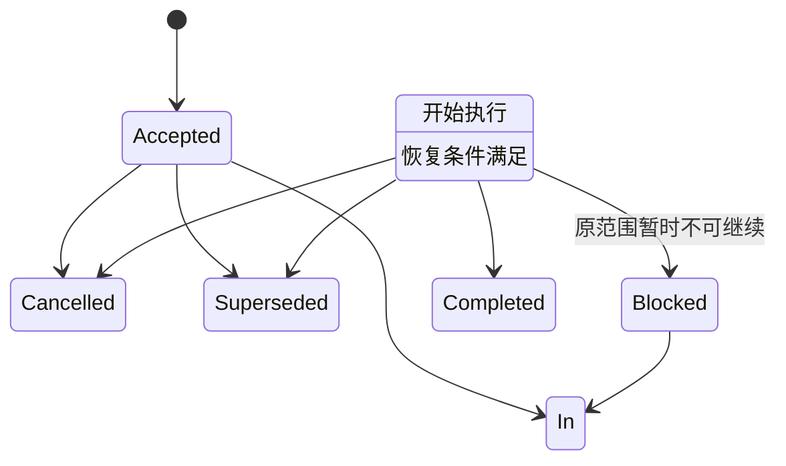
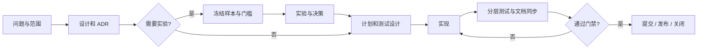

# 任务生命周期

状态：Current
最后更新：2026-08-20
治理对象：任务分类、计划准入、tracker 状态、实施门禁与关闭交付
依据 ADR：`docs/adr/0001-root-contract-tests.md`
关联测试：`tests/contract/test_plan_governance.py`、`tests/contract/test_tracker_governance.py`

## 目的与边界

本标准规定根仓库工作何时需要计划、如何按风险分类、计划如何流转，以及任务何时可以关闭。
设计契约查 `docs/design/`，决策准入查 [ADR 治理](adr-governance.md)，文档归档查
[文档规范](documentation.md)。子项目任务生命周期以各自标准为准；本标准的治理模式参照
Axiom-Flow `docs/standards/task-lifecycle.md` 并适配根仓库三仓库结构。

## 强制规则

### 任务分类

| 类型 | 适用工作 | 必须门禁 |
| --- | --- | --- |
| A 文档/低风险维护 | 中文说明、链接、无行为重命名 | 文档审阅、定向检查。 |
| B 确定性实现 | 状态机、API、迁移代码、重构 | 设计/ADR、测试设计、实现、分层测试。 |
| C 实验性决策 | 模型、提示词、解析路由、供应商选型 | 冻结实验、评分、ADR，再进入 B。 |
| D 发布/数据操作 | 标签、Release、部署、受保护环境、正式迁移或数据变更 | 备份/回滚、全量门禁、人工复核。 |

普通分支或 `main` 的源码提交与推送是原任务的交付步骤，不单独建立 D 类计划；创建或移动标签、
GitHub Release、部署、受保护环境变更、正式数据操作等按既有操作流程执行，以 git 提交/标签与
台账证据列留痕。

### 任务层级（todo 类别列）

任务台账按**层级**分为三类（与上述 A/B/C/D 风险分类正交）：

| 类别 | 定义 | 示例 |
| --- | --- | --- |
| 主线 | 大类目标，由活跃计划或大任务承载，聚合多条支线 | 课程收集（ARCH-002）、前端 8903（REQ-006）、文档重构轮（ARCH-008，2026-08-10 完结归档） |
| 支线 | 主线任务的细则，可独立完成（请求类与期次计划为主） | 跨项目请求 REQ-xxx、前端期次计划 |
| 长期 | 持续存在、无单一终态，随项目演进持续生效 | 文档治理（REQ-002）、大变动同步（REQ-021）等流程类 |

- 归属原则：支线在任务描述中体现挂靠的主线；一个任务只属于一个类别；类别随任务形态变化
  调整（如支线成长为独立大类时升级为主线）。
- **主线轮次**：主线由轮次承载（ID 顺序编号，如 ARCH-018），每轮聚焦一个大类目标并聚合
  其支线；支线行在证据列或任务描述中标注归属主线 ID。
- **主线收尾**：每次主线 TODO 任务完成后梳理一遍——完成的任务从 todo 原子移除并写入
  completed.md；支线未随主线完成的仍独立跟踪，不随主线隐去。
- 主线关闭后其未完成支线仍独立跟踪，不随主线隐去。

### 计划准入与分拆

- B、C 类必须在 `docs/plans/` 建立独立计划；跨模块、跨会话或需要显式回滚的非平凡 A 类也必须
  建立计划；简单措辞、链接和局部无行为修正由差异、验证与提交记录承接。
- D 类（发布/数据操作）不建立独立计划：影响面小且由 git 提交/标签机制天然留痕，操作记录保留
  在提交信息与任务台账证据列；D 类门禁（备份/回滚、全量门禁、人工复核）仍适用于操作本身。
- 每份计划只有一个 `任务类型`。C 输出冻结实验、报告和决策 ADR；B 实现已接受的确定性契约；
  B、C 分别关闭。
- todo 使用稳定 ID 保存全部未关闭任务（类型清单见[任务台账](../trackers/todo.md)规则节）。
  候选任务具备范围、前置条件、验证和成功标准后升级为 Plan 并链接 Accepted 计划；缺陷证据与
  关联计划可使用不同 ID 互相引用。
- 涉及子项目改造的请求在根仓库 todo 登记（标注"请求"与目标仓库），子项目在自己的 todo 承接并
  遵守其门禁；根仓库不直接修改子项目文件。

### 计划契约与状态

活跃计划必须声明 `状态`、`任务类型`、`最后更新`、`关联 ADR`、`关联设计`、`关联 Tracker` 和
`归档判定`，并包含目标与成功标准、范围与非目标、前置条件、工作项、验证与验收、回滚、关闭与
归档。Blocked 计划还必须写阻塞证据、恢复条件、责任位置和复核触发点。

计划只使用以下状态：

`Accepted`、`In Progress`、`Blocked` 可留在活跃 Plans；`Completed`、`Cancelled`、`Superseded`
是终态。终态另写 `关闭结果：Achieved | Rejected | Partial | Not Applicable`。需要新候选、重新
设计或新 ADR 时应关闭旧计划并以新 ID 返回 todo，不得长期维持不可恢复的 Blocked。

### 状态导航

- 计划正文是状态事实源；`trackers/todo.md` 镜像全部活跃计划的标题、链接和状态。
- `plans/index.md` 只解释目录边界并链接 todo，不维护第二张计划状态表。
- 计划不复制通用命令、设计正文、实验结果或逐日工作日志，只链接对应事实源。
- 长期能力依赖只在 roadmap 维护且不写任务状态；任务终态时从 todo 原子移除并写入 completed。

## 执行与门禁

- 计划实施前必须声明定向测试、适用回归或端到端样本，以及不能自动化的人工验收和责任位置。
- 共享模型、状态机、路由或跨领域流程变更必须追加全量回归；阶段关闭追加固定样本端到端验收。
- 测试使用隔离数据和假外部供应商；外部模型质量必须通过冻结评测回答，不能用单元测试替代。
- 可复现失败以 Defect ID 登记 todo 并补回归测试；外部依赖失败保存证据、恢复条件和责任位置。
- 关闭计划按[文档规范](documentation.md#归档与删除)执行 `Retain` 或 `Delete`；自动规则由
  Plan 与 tracker 治理测试守护。

## 变更与取代

改变任务类型、计划准入、状态、tracker 事实边界或关闭门禁时必须先新增 ADR。措辞、链接和不
改变语义的流程整理可直接修改本标准。标准保持稳定文件名；旧规则由 ADR 和 Git 历史恢复，不在
standards 内保存版本副本。
